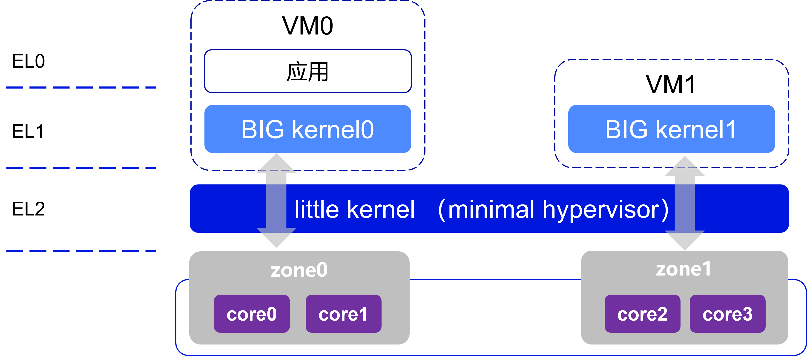
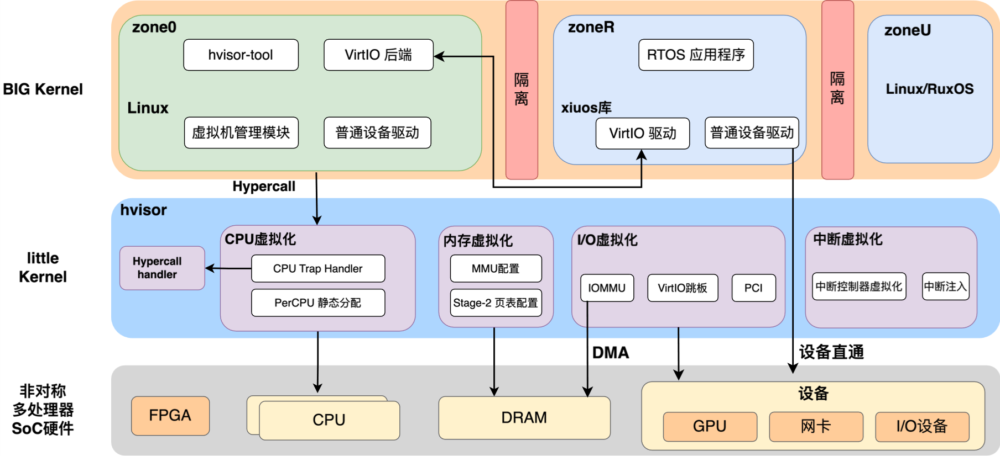

	

# 欢迎使用 hvisor!

[hvisor](https://github.com/syswonder/hvisor)是一款轻量级Type-1虚拟机监控器，使用Rust语言编写，其目标是在异构多核 SoC 平台上提供高效、安全、低开销的虚拟化能力。作为一个直接运行在裸机上的虚拟机监控器，Hvisor 具备快速启动、跨平台支持以及良好的内存安全特性，特别适合嵌入式、边缘计算、车载和工业控制等对性能与安全有严格要求的场景。Hvisor 的设计理念深受 Little.BIG 二元内核架构 启发，通过“轻量内核 + 完整内核”的方式，实现了硬件分区、虚拟化支持与多操作系统并行运行。

特点
1. **跨平台支持**：支持ARMv8，RISC-V，LoongArch, X86等多种架构。
2. **轻量级**：专注于核心虚拟化功能，避免了传统虚拟化解决方案中的不必要复杂性，适合资源受限的环境。
3. **高效**：直接运行在硬件上，无需通过操作系统层，提供接近原生的性能。
4. **安全性**：Rust语言以其内存安全性和并发编程模型著称，有助于减少内存泄漏、数据竞争等常见的系统级编程错误。
5. **快速启动**：设计简洁，启动时间短，适合需要快速部署虚拟化的场景。同时具备良好的可移植性，移植过程快捷、周期短。

主要功能

1. **虚拟机管理**：提供创建、启动、停止和删除虚拟机的基本管理功能。
2. **资源分配与隔离**：支持对CPU、内存和I/O设备的高效分配和管理，通过虚拟化技术确保不同虚拟机之间的隔离，提升系统安全性和稳定性。

使用场景

1. **边缘计算**：适合在边缘设备上运行，为IoT和边缘计算场景提供虚拟化支持。
2. **开发和测试**：开发者可以快速创建和销毁虚拟机环境，用于软件开发和测试。
3. **安全研究**：提供一个隔离环境，用于安全研究和恶意软件分析。

## Little.BIG 架构理念

### 架构思想

Little.BIG 二元内核架构将系统分为两类核心组件：
- Little Kernel（轻量内核）：极简的 Type-1 Hypervisor，运行在裸机上，负责硬件分区与隔离，提供 CPU、内存、I/O 等的最小化虚拟化支持。
- BIG Kernel（大内核）：运行在不同 zone 内的完整操作系统内核，如 Linux、RTOS、Unikernel 等，用于承载应用程序和系统服务。

	

这种架构模式通过 little kernel 提供安全隔离与虚拟化支撑，再由 big kernel 提供丰富 OS 功能，实现了性能与安全性的平衡。

## Hvisor 整体架构

Hvisor 作为 Little.BIG 理念的实现，其整体架构分为三层：
1. BIG Kernel 层（Zone 层）：在 Little.BIG 架构下，硬件被划分为多个 zone，每个 zone 独立运行自己的 OS 与应用：

	zone0：运行 Linux，提供虚拟机管理、设备驱动、VirtIO 后端等。

	zoneR：运行 RTOS，通过 xiUOS 库和 VirtIO 驱动支持实时应用。

	zoneU：运行 Linux/RuxOS，支持单一应用优化。

2. Little Kernel 层（Hvisor）：提供 Hypercall 接口供 BIG kernel 调用。

	CPU 虚拟化：Trap 处理、PerCPU 静态分配。

	内存虚拟化：MMU 配置、Stage-2 页表映射。

	I/O 虚拟化：IOMMU、VirtIO 跳板、PCI 支持。

	中断虚拟化：中断控制器模拟与中断注入。

3. 硬件层：支持 DMA 与设备直通，提高性能。

	异构 SoC 硬件，包括 CPU、DRAM、GPU、FPGA、网卡及 I/O 设备。

	

