# 基于 rk3568 的 Dayu200 快速上手 (OpenHarmony 虚拟机)
本文档旨在为开发者详细介绍在 Dayu200 开发板上部署并启动 OpenHarmony 虚拟机的完整流程。

## Dayu200 开发板介绍

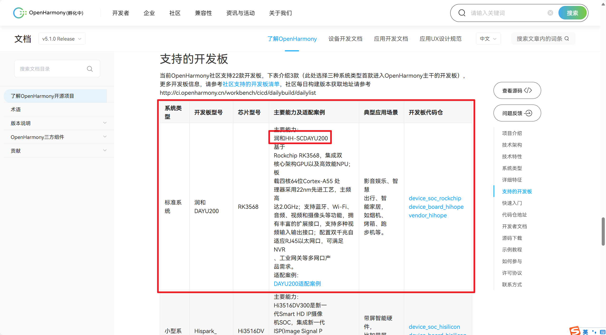

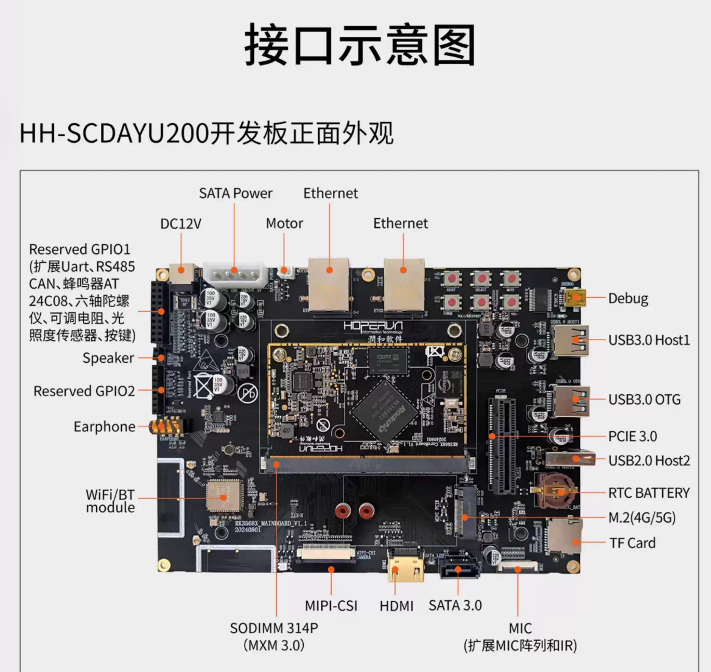

上述需要用到的接口有：DC12V电源、Debug串口（用于Serial串口）、USB3.0接口（用于传输文件）、Ethernet接口（用于连接网线）

为进行设备调试与查看启动日志，需要通过开发板发货提供的数据线，通过电脑的USB接口连接到开发板的调试串口。

默认串口参数如下：

| 参数项 | 参数值 |
| - | - |
| **波特率 (Baud Rate)** | `1500000` |
| **数据位 (Data Bits)** | `8` |
| **停止位 (Stop Bits)** | `1` |
| **校验位 (Parity)** | `None` |

## OpenHarmony系统准备

准备Ubuntu20.04的VMware虚拟机环境（在WSL中无法编译）

```shell
sudo apt-get update; sudo apt-get install binutils; sudo apt-get install binutils-dev; sudo apt-get install git; sudo apt-get install git-lfs; sudo apt-get install gnupg; sudo apt-get install flex; sudo apt-get install bison; sudo apt-get install gperf; sudo apt-get install build-essential; sudo apt-get install zip; sudo apt-get install curl; sudo apt-get install zlib1g-dev; sudo apt-get install gcc-multilib; sudo apt-get install g++-multilib; sudo apt-get install libc6-dev-i386; sudo apt-get install libc6-dev-amd64; sudo apt-get install lib32ncurses5-dev; sudo apt-get install x11proto-core-dev; sudo apt-get install libx11-dev; sudo apt-get install lib32z1-dev; sudo apt-get install ccache; sudo apt-get install libgl1-mesa-dev; sudo apt-get install libxml2-utils; sudo apt-get install xsltproc; sudo apt-get install unzip; sudo apt-get install m4; sudo apt-get install bc; sudo apt-get install gnutls-bin; sudo apt-get install python3.9; sudo apt-get install python3-pip; sudo apt-get install ruby; sudo apt-get install genext2fs; sudo apt-get install device-tree-compiler; sudo apt-get install make; sudo apt-get install libffi-dev; sudo apt-get install e2fsprogs; sudo apt-get install pkg-config; sudo apt-get install perl; sudo apt-get install openssl; sudo apt-get install libssl-dev; sudo apt-get install libelf-dev; sudo apt-get install libdwarf-dev; sudo apt-get install u-boot-tools; sudo apt-get install mtd-utils; sudo apt-get install cpio; sudo apt-get install doxygen; sudo apt-get install liblz4-tool; sudo apt-get install openjdk-8-jre; sudo apt-get install gcc; sudo apt-get install g++; sudo apt-get install texinfo; sudo apt-get install dosfstools; sudo apt-get install mtools; sudo apt-get install default-jre; sudo apt-get install default-jdk; sudo apt-get install libncurses5; sudo apt-get install apt-utils; sudo apt-get install wget; sudo apt-get install scons; sudo apt-get install python3.9-distutils; sudo apt-get install tar; sudo apt-get install rsync; sudo apt-get install git-core; sudo apt-get install libxml2-dev; sudo apt-get install lib32z-dev; sudo apt-get install grsync; sudo apt-get install xxd; sudo apt-get install libglib2.0-dev; sudo apt-get install libpixman-1-dev; sudo apt-get install kmod; sudo apt-get install jfsutils; sudo apt-get install reiserfsprogs; sudo apt-get install xfsprogs; sudo apt-get install squashfs-tools; sudo apt-get install pcmciautils; sudo apt-get install quota; sudo apt-get install ppp; sudo apt-get install libtinfo-dev; sudo apt-get install libtinfo5; sudo apt-get install libncurses5-dev; sudo apt-get install libncursesw5; sudo apt-get install libstdc++6; sudo apt-get install gcc-arm-none-eabi; sudo apt-get install vim; sudo apt-get install ssh; sudo apt-get install locales; sudo apt-get install libxinerama-dev; sudo apt-get install libxcursor-dev; sudo apt-get install libxrandr-dev; sudo apt-get install libxi-dev
```

将python和python3软链接到3.8
```shell
sudo update-alternatives --install /usr/bin/python3 python3 /usr/bin/python3.8 1
sudo update-alternatives --install /usr/bin/python python /usr/bin/python3.8 1
```

```shell
mkdir ohos5
cd ohos5
repo init -u git@gitee.com:openharmony/manifest.git -b refs/tags/OpenHarmony-v5.1.0-Release --no-repo-verify
repo sync -c
repo forall -c 'git lfs pull'
```

安装hb编译工具

```shell
python3 -m pip install --user build/hb
vim ~/.bashrc
export PATH=~/.local/bin:$PATH
source ~/.bashrc
```

在容器中**源码目录执行**：

```shell
bash build/prebuilts_download.sh
```

使用命令行脚本编译：

```shell
./build.sh -p rk3568
```
如果期间存在
```
[OHOS INFO] [NINJA] [0/1] Regenerating ninja files
[OHOS INFO] [NINJA] [0/2] Regenerating ninja files
[OHOS INFO] [NINJA] [0/3] Regenerating ninja files
[OHOS INFO] [NINJA] [0/4] Regenerating ninja files
```
重复Regenerating ninja files的问题，修复所有文件的时间戳

```shell
find . -type f -exec touch {} +
```

然后重新编译成功，13900HX 花费3.5个小时编译OpenHarmony标准系统的rk3568

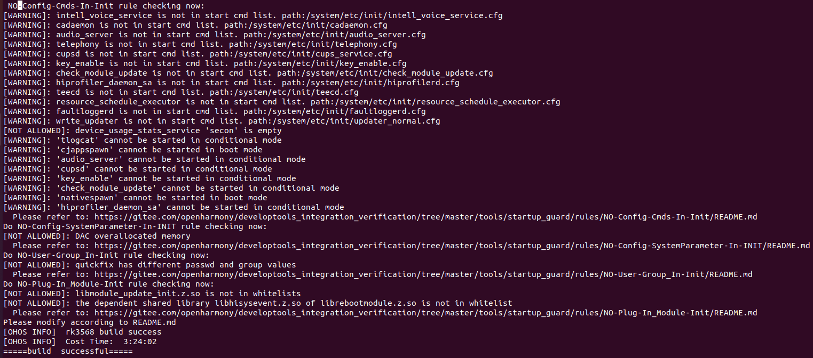

在这里[HiHope_DAYU200/烧写工具及指南/windows/RKDevTool.exe · HiHope开源社区/Docs - 码云 - 开源中国](https://gitee.com/hihope_iot/docs/tree/master/HiHope_DAYU200/烧写工具及指南)下载烧录工具

安装对应的驱动程序，电脑连接开发板后，显示发现一个MASKROM设备
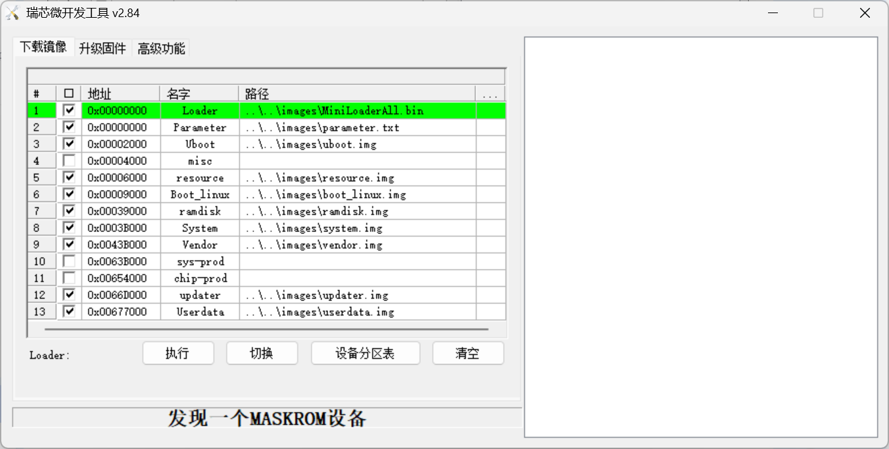

按住VOL-/RECOVERY 按键（图中标注的①号键） 和 RESET 按钮（图中标注的②号键）不松开， 烧录工具此时显示“没有发现设备” ；

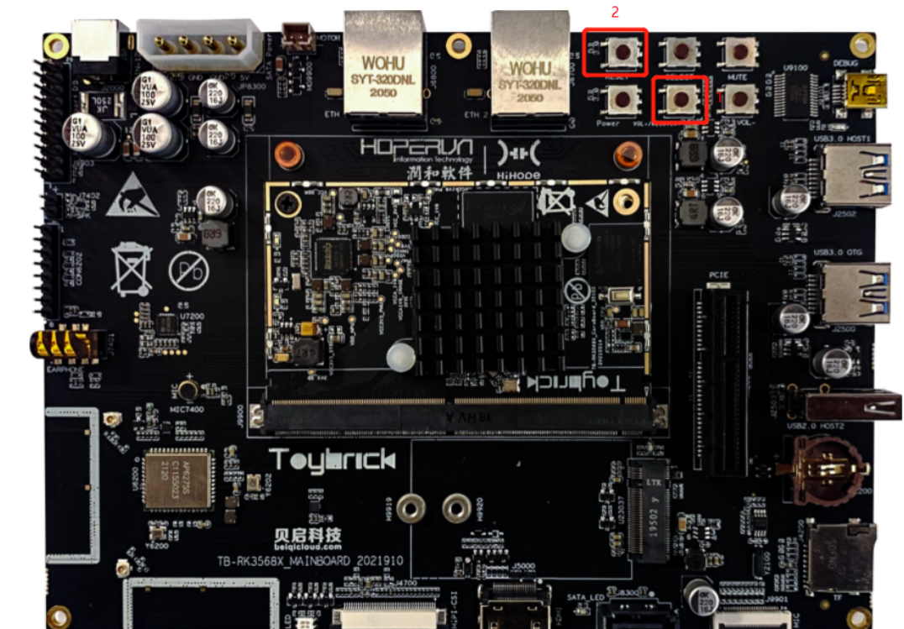

松开 RESET 键， 烧录工具显示“发现一个 LOADER 设备”， 说明此时已经进入烧写模式，点击执行开始烧录
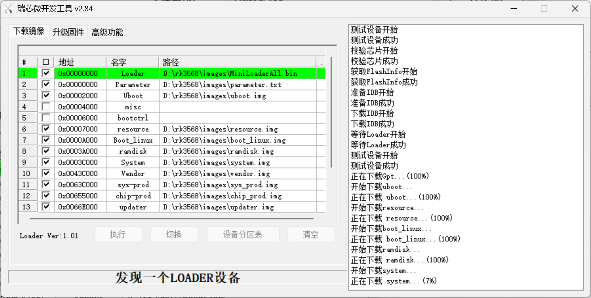

这样就能在开发板上运行原始的OpenHarmony系统了。
以下是OpenHarmony编译出来的产物
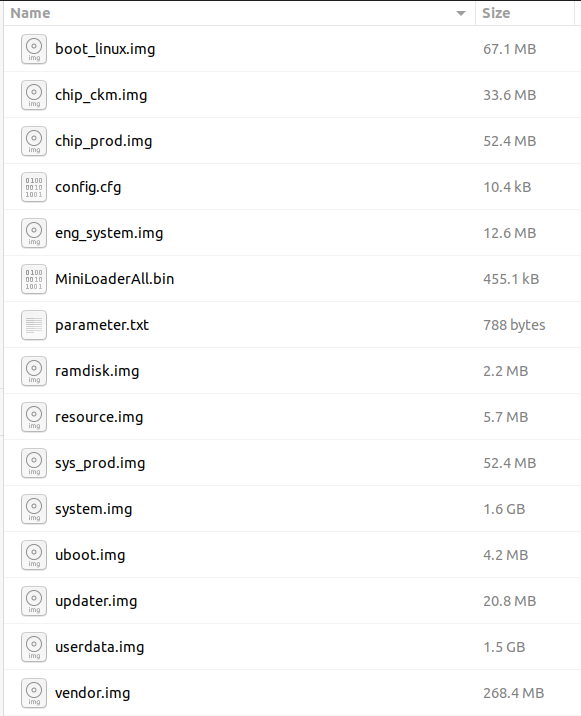

核心流程：**U-Boot → 从存储设备加载 boot_linux.img → 解析并加载内核、设备树、ramdisk → 设置启动参数（bootargs）→ 启动 Linux 内核**

在 RK3568 平台上，对应的启动镜像是 `boot_linux.img`，一个**打包镜像**，它把启动系统所需的多个组件打包在一起，方便 U-Boot 一次性加载。它包含以下三个核心部分：

| 文件               | 作用                                                        | 来源                                                         |
| ------------------ | ----------------------------------------------------------- | ------------------------------------------------------------ |
| **`Image`**        | Linux 内核镜像（未压缩的可执行镜像）                        | 由 kernel 源码编译生成，路径通常是 `out/kernel/.../Image`    |
| **`toybrick.dtb`** | 设备树二进制文件（Device Tree Blob），描述硬件信息          | 由 `.dts` 文件编译生成，如 `rk3568-toybrick.dts` → `toybrick.dtb` |
| **`ramdisk.img`**  | 初始化内存盘镜像，包含最基础的根文件系统（如 `/init` 脚本） | 由 OpenHarmony 编译系统生成，使用 `cpio` 格式打包            |

生成`boot_linux.img`的脚本代码在`device/soc/rockchip/common/sdk_linux/scripts/mkimg`这个路径下，使用的是 **`mkbootimg` 工具**，生成的是 Android 格式镜像，略不同于`mkimage`工具。两种格式的镜像都能被uboot启动

u-boot 启动时，会设置 `bootargs` 字符串，类似这样

```shell
setenv bootargs "initrd=0x84000000,0x292e00 init=/init blkdevparts=mmcblk0:1M(boot),15M(kernel),200M(system)... hardware=Hi3516DV300 root=/dev/ram0 rootfstype=ext4 default_boot_device=soc/1010000.himci.eMMC"
```

| 名称                      | 示例                                                         | 说明                                                         |
| ------------------------- | ------------------------------------------------------------ | ------------------------------------------------------------ |
| `initrd`                  | `0x84000000,0x292e00`                                        | 指定 initramfs 的地址和大小                                  |
| `init`                    | `/init`                                                      | 指定内核启动后运行的第一个程序                               |
| `blkdevparts`             | mmcblk0:1M(boot),15M(kernel),<br />200M(system),200M(vendor),<br />2M(misc),20M(updater),-(userdata) | 告诉内核 eMMC / SD 卡上的分区是怎么划分的                    |
| `hardware`                | `Hi3516DV300`, `rk3568` 等                                   | 告诉内核当前硬件平台                                         |
| `root`                    | `/dev/ram0`, 或 `root=PARTUUID=...`                          | 告诉内核从哪个设备加载根文件系统                             |
| `rootfstype`              | `ext4`                                                       | 根文件系统的类型                                             |
| `default_boot_device`     | `soc/1010000.himci.eMMC`                                     | 默认启动设备路径，示例中这是一个设备树节点路径，指向 SoC 上的 eMMC 控制器 |
| `ohos.required_mount.xxx` | /dev/block/platform/soc/1010000.himci.eMMC/by-name/xxx@usr@ext4@ro,barrier=1@wait,required | OpenHarmony 定义的一些必须挂载的分区，比如 `system`, `vendor`, `userdata` 等。 |

**`init` 进程在系统启动初期，必须先找到并挂载 `system`、`vendor` 等关键分区，才能继续启动系统。**


### OpenHarmony通过TFTP裸启动

首先在电脑上配置好TFTP的运行环境，接下来尝试按照TFTP和定制设备树直接启动OpenHarmony
```shell
setenv serverip 192.168.1.10;
setenv ipaddr 192.168.1.20;
setenv loadaddr 0x61000000;
setenv fdt_addr 0x60000000;
setenv ramdisk_addr 0x0A200000;
tftp ${fdt_addr} zone0.dtb;
tftp ${loadaddr} Image;
tftp ${ramdisk_addr} uInitrd;
booti ${loadaddr} ${ramdisk_addr}:0x400000 ${fdt_addr}
```

其中zone0.dtb在hvisor的dayu200 platform配置路径下。
Image为OpenHarmony的系统在Obj/linux6.6下的编译镜像产物。
uInitrd为ramdisk(OpenHarmony的编译产物)经过了改装，U-Boot 在解析 ramdisk 时会先查找镜像头：

- **如果有 U-Boot 镜像头**，它认为是一个合法的 ramdisk。
- **如果只是 gzip 压缩的 cpio（没有 U-Boot header）**，就会报错

ramdisk.img只是标准的 `initramfs` 文件，**没有 U-Boot 镜像头**， U-Boot 的 `booti` 不认，所以还需要执行
`mkimage -A arm64 -O linux -T ramdisk -C gzip -d ramdisk.img uInitrd`

ramdisk镜像大小只有2.14MB，而ramdisk的扇区大小是4MB，OpenHarmony在运行过程中需要sync一些数据到扇区的后面，因此booti命令还需要指定扇区的长度为`0x400000`。


## OpenHarmony 前置工作准备

### 编译Hvisor-tool

OpenHarmony内核会强制验证模块签名，内核开启了 `CONFIG_MODULE_SIG` 并且强制 (`CONFIG_MODULE_SIG_FORCE=y`)，而 `hvisor.ko` 没有用内核信任的私钥签名。

每次编译都会生成不同的密钥，即使命令完全一样。
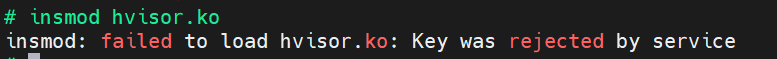
修改编译配置，使用脚本将下面的编译选项禁用：
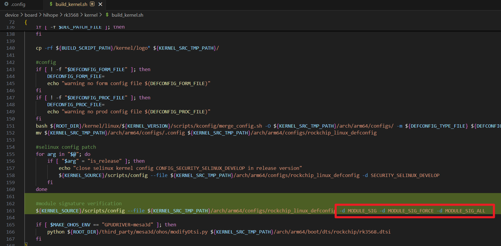
```shell
#module signature verification
${KERNEL_SOURCE}/scripts/config --file ${KERNEL_SRC_TMP_PATH}/arch/arm64/configs/rockchip_linux_defconfig -d MODULE_SIG -d MODULE_SIG_FORCE -d MODULE_SIG_ALL
```
还需要修改代码，如果不存在signing_key.pem就跳过
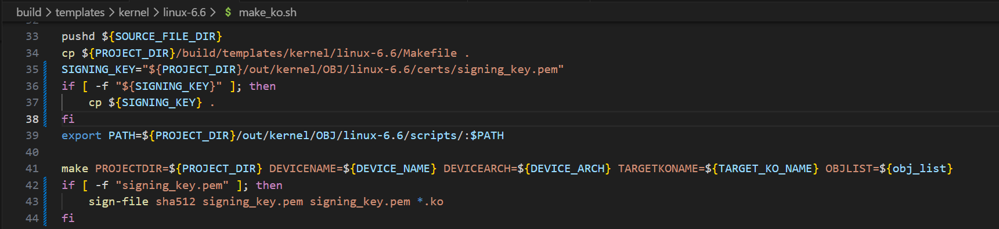
```shell
SIGNING_KEY="${PROJECT_DIR}/out/kernel/OBJ/linux-6.6/certs/signing_key.pem"
if [ -f "${SIGNING_KEY}" ]; then
    cp ${SIGNING_KEY} .
fi
export PATH=${PROJECT_DIR}/out/kernel/OBJ/linux-6.6/scripts/:$PATH

make PROJECTDIR=${PROJECT_DIR} DEVICENAME=${DEVICE_NAME} DEVICEARCH=${DEVICE_ARCH} TARGETKONAME=${TARGET_KO_NAME} OBJLIST=${obj_list}
if [ -f "signing_key.pem" ]; then
    sign-file sha512 signing_key.pem signing_key.pem *.ko
fi
```

此外，Hvisor使用了mmap `/dev/mem`，用于把 kernel/DTB 镜像写入物理内存。而OpenHarmony内核开启了 `CONFIG_STRICT_DEVMEM`，它会阻止通过 `/dev/mem` 访问 RAM 区域，mmap 直接返回 `EPERM`。因此需要再将此选项禁用。否则会出现如下错误：
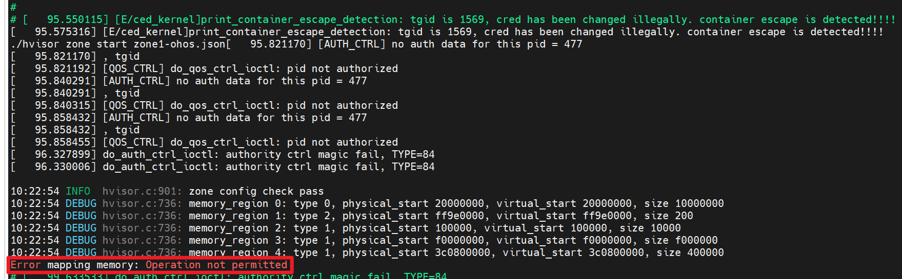

另外，还需要修改OpenHarmony的编译脚本，加上如下命令`modules_prepare`，这样才能针对OpenHarmony编译自定义模块也就是hvisor.ko：
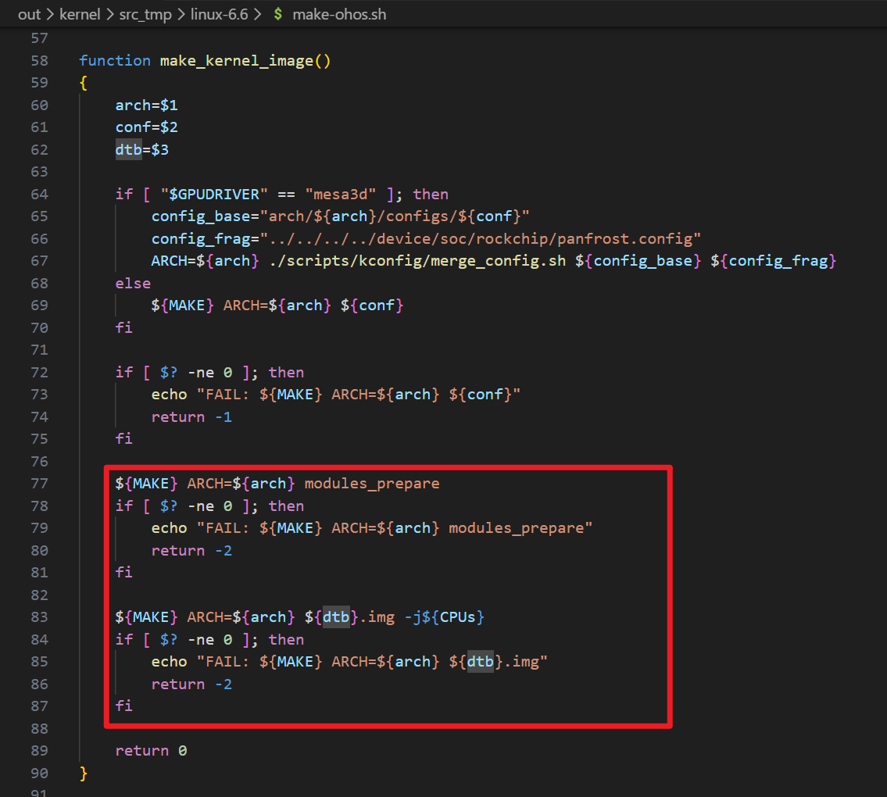
否则会出现如下报错：
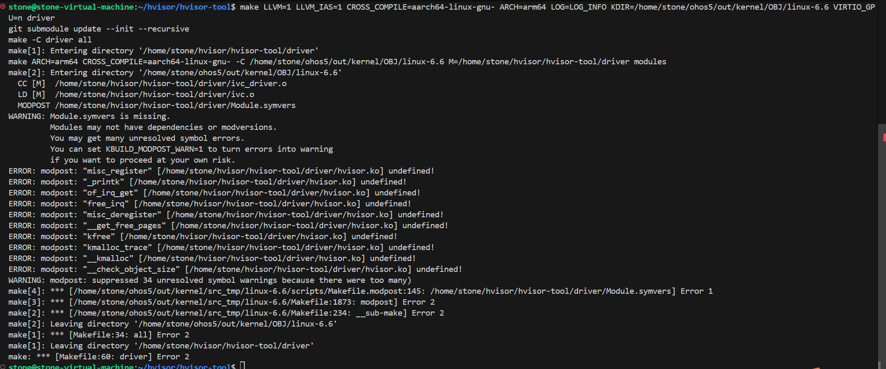


OpenHarmony使用LLVM编译，并且需要使用OpenHarmony提供的LLVM编译器，并且指定KDIR路径，下面是编译Hvisor-tool的命令：
```shell
export PATH=/home/stone/ohos5/prebuilts/clang/ohos/linux-x86_64/llvm/bin/:$PATH
export PATH=/home/stone/ohos5/prebuilts/develop_tools/pahole/bin/:$PATH
make LLVM=1 LLVM_IAS=1 CROSS_COMPILE=aarch64-linux-gnu- ARCH=arm64 LOG=LOG_INFO KDIR=/home/stone/ohos5/out/kernel/OBJ/linux-6.6 VIRTIO_GPU=n driver
make LLVM=1 LLVM_IAS=1 CROSS_COMPILE=aarch64-linux-gnu- ARCH=arm64 LOG=LOG_INFO KDIR=/home/stone/ohos5/out/kernel/OBJ/linux-6.6 VIRTIO_GPU=n tools
```
请将`home/stone/ohos5`替换为OpenHarmony的项目路径。

### Openharmony SD卡配置

目前zone1的文件系统存放在SD卡上，对应的设备树节点为
```
dwmmc@fe2b0000 {
    compatible = "rockchip,rk3568-dw-mshc\0rockchip,rk3288-dw-mshc";
    reg = <0x00 0xfe2b0000 0x00 0x4000>;
    interrupts = <0x00 0x62 0x04>;
    clocks = <0x24 0xb0 0x24 0xb1 0x24 0x18a 0x24 0x18b>;
    clock-names = "biu\0ciu\0ciu-drive\0ciu-sample";
    fifo-depth = <0x100>;
    max-frequency = <0x8f0d180>;
    resets = <0x24 0xd4>;
    reset-names = "reset";
    status = "okay";
    supports-sd;
    bus-width = <0x04>;
    cap-mmc-highspeed;
    cap-sd-highspeed;
    disable-wp;
    no-1-8-v;
    pinctrl-names = "default";
    pinctrl-0 = <0xc5 0xc6 0xc7 0xc8>;
};
```

准备一张SD卡，接入Linux系统中，然后清除现有的分区表`sudo sgdisk -Z /dev/sdb`。

创建SD卡分区
```shell
sudo sgdisk \
  -n 1:8192:16383       -c 1:uboot        -t 1:8300 \
  -n 2:16384:24575      -c 2:misc         -t 2:8300 \
  -n 3:24576:28671      -c 3:bootctrl     -t 3:8300 \
  -n 4:28672:40959      -c 4:resource     -t 4:8300 \
  -n 5:40960:237567     -c 5:boot_linux   -t 5:8300 -u 5:a2d37d82-51e0-420d-83f5-470db993dd35 \
  -n 6:237568:245759    -c 6:ramdisk      -t 6:8300 \
  -n 7:245760:4440063   -c 7:system       -t 7:8300 -u 7:614e0000-0000-4b53-8000-1d28000054a9 \
  -n 8:4440064:6537215  -c 8:vendor       -t 8:8300 \
  -n 9:6537216:6639615  -c 9:sys-prod     -t 9:8300 \
  -n 10:6639616:6742015 -c 10:chip-prod   -t 10:8300 \
  -n 11:6742016:6807551 -c 11:updater     -t 11:8300 \
  -n 12:6807552:6840319 -c 12:eng_system  -t 12:8300 \
  -n 13:6840320:6873087 -c 13:eng_chipset -t 13:8300 \
  -n 14:6938624:7069695 -c 14:chip_ckm    -t 14:8300 \
  -n 15:19955712:0      -c 15:userdata    -t 15:8300 \
  /dev/sdb
```
把bootable标志位设置为1。
```shell
sudo sgdisk -A 5:set:2 /dev/sdb
sudo partprobe /dev/sdb
sudo sgdisk -i 5 /dev/sdb
```

SD卡烧录，其中数据源为 OpenHarmony 的编译产物（执行前千万注意核对 `/dev/sdb` 是否为你的 SD 卡设备）：
```shell
sudo dd if=MiniLoaderAll.bin of=/dev/sdb seek=64 conv=notrunc status=progress
sudo dd if=uboot.img of=/dev/sdb1 status=progress
sudo dd if=misc.img of=/dev/sdb2 status=progress
sudo dd if=bootctrl.img of=/dev/sdb3 status=progress
sudo dd if=resource.img of=/dev/sdb4 status=progress
sudo dd if=boot_linux.img of=/dev/sdb5 status=progress
sudo dd if=ramdisk.img of=/dev/sdb6 status=progress
sudo dd if=system.img of=/dev/sdb7 status=progress
sudo dd if=vendor.img of=/dev/sdb8 status=progress
sudo dd if=sys_prod.img of=/dev/sdb9 status=progress
sudo dd if=chip_prod.img of=/dev/sdb10 status=progress
sudo dd if=updater.img of=/dev/sdb11 status=progress
sudo dd if=eng_system.img of=/dev/sdb12 status=progress
sudo dd if=eng_chipset.img of=/dev/sdb13 status=progress
sudo dd if=chip_ckm.img of=/dev/sdb14 status=progress
sudo dd if=userdata.img of=/dev/sdb15 status=progress
```

弹出SD卡：
```shell
sudo eject /dev/sdb
```

### 编译适配OpenHarmony的busybox

OpenHarmony自带的shell功能过于简陋，而busybox提供了很多诸如网络、串口相关的配置功能，因此需要使用 OpenHarmony 仓库内已经准备好的 ARM64 交叉编译工具链，生成一个可在 OpenHarmony ARM64 环境中直接使用的静态链接 BusyBox。

```shell
git clone https://github.com/mirror/busybox.git
export TOOLCHAIN_PREFIX=/home/stone/ohos5/prebuilts/gcc/linux-x86/aarch64/gcc-linaro-7.5.0-2019.12-x86_64_aarch64-linux-gnu/bin/aarch64-linux-gnu-
make CROSS_COMPILE="$TOOLCHAIN_PREFIX" menuconfig
```
该命令可以打开配置界面，将下列config配置设为y
```
CONFIG_STATIC=y
CONFIG_STATIC_LIBGCC=y
CONFIG_PREFIX="./_install"
CONFIG_FEATURE_INSTALLER=y
CONFIG_INSTALL_APPLET_SYMLINKS=y
CONFIG_SH_IS_ASH=y
CONFIG_ASH=y
CONFIG_FEATURE_EDITING=y
CONFIG_FEATURE_TAB_COMPLETION=y
# 网络相关配置：
CONFIG_IFCONFIG=y
CONFIG_ROUTE=y
CONFIG_IP=y
CONFIG_PING=y
CONFIG_NETSTAT=y
CONFIG_UDHCPC=y
CONFIG_TFTP=y
CONFIG_TFTPD=y
CONFIG_WGET=y
CONFIG_NC=y
CONFIG_TELNET=y
CONFIG_TELNETD=y
CONFIG_TUNCTL=y
```

编译命令：
```shell
cd /home/stone/ohos5/busybox

export TOOLCHAIN_PREFIX=/home/stone/ohos5/prebuilts/gcc/linux-x86/aarch64/gcc-linaro-7.5.0-2019.12-x86_64_aarch64-linux-gnu/bin/aarch64-linux-gnu-

make CROSS_COMPILE="$TOOLCHAIN_PREFIX"
make CROSS_COMPILE="$TOOLCHAIN_PREFIX" install
```

得到的编译结果里`busybox/busybox` 是 ARM64 静态链接可执行文件，将其传输到OpenHarmony的文件系统中。

### 编译针对OpenHarmony的picocom串口工具

OpenHarmony的zone0系统通过picocom与zone1进行连接，这里针对OpenHarmony环境自己写了一个脚本程序

```c
// SPDX-License-Identifier: MIT
/*
 * A tiny picocom-compatible terminal connector for OpenHarmony board bring-up.
 *
 * This is not a full upstream picocom replacement. It implements the small
 * subset needed to connect zone0 to hvisor-tool's virtio-console PTY:
 *
 *   picocom --nolock --noinit --noreset -b 115200 /dev/pts/0
 *
 * Exit with Ctrl-a Ctrl-x.
 */
#define _GNU_SOURCE

#include <errno.h>
#include <fcntl.h>
#include <signal.h>
#include <stdbool.h>
#include <stdio.h>
#include <stdlib.h>
#include <string.h>
#include <sys/select.h>
#include <termios.h>
#include <unistd.h>

#define ARRAY_SIZE(a) (sizeof(a) / sizeof((a)[0]))

static volatile sig_atomic_t g_stop;

struct options {
    const char *device;
    int baud;
    bool noinit;
    bool noreset;
};

struct baud_entry {
    int value;
    speed_t speed;
};

static const struct baud_entry g_baud_table[] = {
    {50, B50},         {75, B75},         {110, B110},
    {134, B134},       {150, B150},       {200, B200},
    {300, B300},       {600, B600},       {1200, B1200},
    {1800, B1800},     {2400, B2400},     {4800, B4800},
    {9600, B9600},     {19200, B19200},   {38400, B38400},
#ifdef B57600
    {57600, B57600},
#endif
#ifdef B115200
    {115200, B115200},
#endif
#ifdef B230400
    {230400, B230400},
#endif
#ifdef B460800
    {460800, B460800},
#endif
#ifdef B921600
    {921600, B921600},
#endif
#ifdef B1000000
    {1000000, B1000000},
#endif
#ifdef B1500000
    {1500000, B1500000},
#endif
};

static void on_signal(int sig)
{
    (void)sig;
    g_stop = 1;
}

static void usage(FILE *out, const char *argv0)
{
    fprintf(out,
            "usage: %s [--nolock] [--noinit] [--noreset] [-b BAUD] DEVICE\n"
            "\n"
            "Tiny picocom-compatible connector for /dev/pts/N or a serial TTY.\n"
            "Exit with Ctrl-a Ctrl-x.\n",
            argv0);
}

static int parse_baud(const char *text)
{
    char *end = NULL;
    long value;

    errno = 0;
    value = strtol(text, &end, 10);
    if (errno != 0 || end == text || *end != '\0' || value <= 0 ||
        value > 4000000) {
        fprintf(stderr, "invalid baud rate: %s\n", text);
        return -1;
    }
    return (int)value;
}

static speed_t baud_to_speed(int baud)
{
    size_t i;

    for (i = 0; i < ARRAY_SIZE(g_baud_table); i++) {
        if (g_baud_table[i].value == baud) {
            return g_baud_table[i].speed;
        }
    }
    return (speed_t)0;
}

static int parse_args(int argc, char **argv, struct options *opts)
{
    int i;

    opts->baud = 115200;

    for (i = 1; i < argc; i++) {
        if (strcmp(argv[i], "-h") == 0 || strcmp(argv[i], "--help") == 0) {
            usage(stdout, argv[0]);
            exit(0);
        } else if (strcmp(argv[i], "--nolock") == 0) {
            continue;
        } else if (strcmp(argv[i], "--noinit") == 0) {
            opts->noinit = true;
        } else if (strcmp(argv[i], "--noreset") == 0) {
            opts->noreset = true;
        } else if (strcmp(argv[i], "-b") == 0 ||
                   strcmp(argv[i], "--baud") == 0) {
            if (i + 1 >= argc) {
                fprintf(stderr, "%s requires an argument\n", argv[i]);
                return -1;
            }
            opts->baud = parse_baud(argv[++i]);
            if (opts->baud < 0) {
                return -1;
            }
        } else if (strncmp(argv[i], "-b", 2) == 0 && argv[i][2] != '\0') {
            opts->baud = parse_baud(argv[i] + 2);
            if (opts->baud < 0) {
                return -1;
            }
        } else if (strncmp(argv[i], "--baud=", 7) == 0) {
            opts->baud = parse_baud(argv[i] + 7);
            if (opts->baud < 0) {
                return -1;
            }
        } else if (argv[i][0] == '-') {
            fprintf(stderr, "unsupported option: %s\n", argv[i]);
            return -1;
        } else if (opts->device == NULL) {
            opts->device = argv[i];
        } else {
            fprintf(stderr, "unexpected argument: %s\n", argv[i]);
            return -1;
        }
    }

    if (opts->device == NULL) {
        usage(stderr, argv[0]);
        return -1;
    }
    return 0;
}

static int set_raw_stdin(struct termios *saved)
{
    struct termios raw;

    if (tcgetattr(STDIN_FILENO, saved) != 0) {
        perror("tcgetattr(stdin)");
        return -1;
    }

    raw = *saved;
    cfmakeraw(&raw);
    if (tcsetattr(STDIN_FILENO, TCSANOW, &raw) != 0) {
        perror("tcsetattr(stdin)");
        return -1;
    }
    return 0;
}

static int set_raw_device(int fd, int baud, struct termios *saved)
{
    struct termios raw;
    speed_t speed;

    if (tcgetattr(fd, saved) != 0) {
        perror("tcgetattr(device)");
        return -1;
    }

    raw = *saved;
    cfmakeraw(&raw);
    raw.c_cflag |= CLOCAL | CREAD;
    raw.c_cflag &= ~CRTSCTS;

    speed = baud_to_speed(baud);
    if (speed == (speed_t)0) {
        fprintf(stderr, "unsupported baud rate: %d\n", baud);
        return -1;
    }
    cfsetispeed(&raw, speed);
    cfsetospeed(&raw, speed);

    if (tcsetattr(fd, TCSANOW, &raw) != 0) {
        perror("tcsetattr(device)");
        return -1;
    }
    return 0;
}

static int write_all(int fd, const unsigned char *buf, size_t len)
{
    size_t off = 0;

    while (off < len) {
        ssize_t n = write(fd, buf + off, len - off);
        if (n < 0) {
            if (errno == EINTR) {
                continue;
            }
            return -1;
        }
        if (n == 0) {
            return -1;
        }
        off += (size_t)n;
    }
    return 0;
}

static int pump(int dev_fd)
{
    bool escaped = false;
    unsigned char buf[512];

    while (!g_stop) {
        fd_set rfds;
        int maxfd = dev_fd > STDIN_FILENO ? dev_fd : STDIN_FILENO;
        int ret;

        FD_ZERO(&rfds);
        FD_SET(STDIN_FILENO, &rfds);
        FD_SET(dev_fd, &rfds);

        ret = select(maxfd + 1, &rfds, NULL, NULL, NULL);
        if (ret < 0) {
            if (errno == EINTR) {
                continue;
            }
            perror("select");
            return -1;
        }

        if (FD_ISSET(dev_fd, &rfds)) {
            ssize_t n = read(dev_fd, buf, sizeof(buf));
            if (n < 0) {
                if (errno == EINTR || errno == EAGAIN) {
                    continue;
                }
                perror("read(device)");
                return -1;
            }
            if (n == 0) {
                fprintf(stderr, "\r\n[device closed]\r\n");
                return 0;
            }
            if (write_all(STDOUT_FILENO, buf, (size_t)n) != 0) {
                perror("write(stdout)");
                return -1;
            }
        }

        if (FD_ISSET(STDIN_FILENO, &rfds)) {
            ssize_t n = read(STDIN_FILENO, buf, sizeof(buf));
            ssize_t i;

            if (n < 0) {
                if (errno == EINTR || errno == EAGAIN) {
                    continue;
                }
                perror("read(stdin)");
                return -1;
            }
            if (n == 0) {
                return 0;
            }

            for (i = 0; i < n; i++) {
                unsigned char c = buf[i];

                if (escaped) {
                    escaped = false;
                    if (c == 0x18 || c == 'x' || c == 'X') {
                        fprintf(stderr, "\r\n[exiting]\r\n");
                        return 0;
                    }
                    if (c != 0x01 &&
                        write_all(dev_fd, (const unsigned char *)"\001", 1) !=
                            0) {
                        perror("write(device)");
                        return -1;
                    }
                } else if (c == 0x01) {
                    escaped = true;
                    continue;
                }

                if (write_all(dev_fd, &c, 1) != 0) {
                    perror("write(device)");
                    return -1;
                }
            }
        }
    }

    return 0;
}

int main(int argc, char **argv)
{
    struct options opts = {0};
    struct termios saved_stdin;
    struct termios saved_dev;
    bool stdin_saved = false;
    bool dev_saved = false;
    int fd;
    int ret;

    if (parse_args(argc, argv, &opts) != 0) {
        return 2;
    }

    signal(SIGINT, on_signal);
    signal(SIGTERM, on_signal);
    signal(SIGHUP, on_signal);

    fd = open(opts.device, O_RDWR | O_NOCTTY);
    if (fd < 0) {
        perror(opts.device);
        return 1;
    }

    if (!opts.noinit) {
        if (set_raw_device(fd, opts.baud, &saved_dev) != 0) {
            close(fd);
            return 1;
        }
        dev_saved = true;
    }

    if (set_raw_stdin(&saved_stdin) != 0) {
        if (dev_saved && !opts.noreset) {
            tcsetattr(fd, TCSANOW, &saved_dev);
        }
        close(fd);
        return 1;
    }
    stdin_saved = true;

    fprintf(stderr, "connected to %s, exit with Ctrl-a Ctrl-x\r\n",
            opts.device);
    ret = pump(fd);

    if (stdin_saved) {
        tcsetattr(STDIN_FILENO, TCSANOW, &saved_stdin);
    }
    if (dev_saved && !opts.noreset) {
        tcsetattr(fd, TCSANOW, &saved_dev);
    }
    close(fd);
    return ret == 0 ? 0 : 1;
}
```

使用如下命令对picocom进行编译

```shell
#!/usr/bin/env bash
set -euo pipefail

SCRIPT_DIR="$(cd "$(dirname "${BASH_SOURCE[0]}")" && pwd)"
OHOS_ROOT="$(cd "$SCRIPT_DIR/.." && pwd)"
TOOLCHAIN_PREFIX="${TOOLCHAIN_PREFIX:-$OHOS_ROOT/prebuilts/gcc/linux-x86/aarch64/gcc-linaro-7.5.0-2019.12-x86_64_aarch64-linux-gnu/bin/aarch64-linux-gnu-}"

if [[ ! -x "${TOOLCHAIN_PREFIX}gcc" ]]; then
  echo "missing compiler: ${TOOLCHAIN_PREFIX}gcc" >&2
  exit 1
fi

cd "$SCRIPT_DIR"
make clean
make TOOLCHAIN_PREFIX="$TOOLCHAIN_PREFIX"
make TOOLCHAIN_PREFIX="$TOOLCHAIN_PREFIX" install

file output/picocom
ls -l output/picocom

```

将编译产物复制到OpenHarmony的`/data/zone`目录下。后续通过该脚本控制连接zone1的串口终端。

将下列文件通过OpenHarmony开发者工具hdc，从主机电脑拷贝到OpenHarmony的EMMC文件系统上（需要通过开发板上的蓝色调试线连接）：

```shell
hdc file send "D:\rk3568\configs\zone1-ohos.dtb" /data/zone
hdc file send "D:\rk3568\configs\zone1-ohos.json" /data/zone
hdc file send "D:\rk3568\configs\zone1-ohos-virtio.json" /data/zone
hdc file send "D:\rk3568\configs\zone1-ohos.kernel" /data/zone
hdc file send "D:\rk3568\configs\zone1-ohos.ramdisk" /data/zone
hdc file send "D:\rk3568\configs\hvisor.ko" /data/zone
hdc file send "D:\rk3568\configs\busybox" /data/zone
hdc file send "D:\rk3568\configs\picocom" /data/zone
```
其中`zone1-ohos.kernel`就是OpenHarmony编译出来的Image文件，`zone1-ohos.ramdisk`也是OpenHarmony的编译产物ramdisk。

## OpenHarmony root zone 启动

在hvisor项目路径下执行`make BID=aarch64/dayu200 all`，编译适配dayu200开发板的hvisor。
编译的产物在`cp target/aarch64-unknown-none/debug/hvisor.bin`路径下

使用如下命令启动OpenHarmony root zone：
```shell
setenv serverip 192.168.1.10; 
setenv ipaddr 192.168.1.20; 
setenv loadaddr 0x40400000; 
setenv board_dtb_addr 0x08300000; 
setenv zone0_kernel_addr 0x61000000; 
setenv zone0_fdt_addr 0x60000000;
setenv ramdisk_addr 0x0A200000;
tftp ${loadaddr} ${serverip}:hvisor.bin;tftp ${board_dtb_addr} ${serverip}:zone0.dtb; tftp ${zone0_kernel_addr} ${serverip}:Image; tftp ${zone0_fdt_addr} ${serverip}:zone0.dtb;tftp ${ramdisk_addr} ramdisk_emmc.img; bootm ${loadaddr} - ${board_dtb_addr};
```

## OpenHarmony guest zone 启动

当前有两个网段：

**外侧物理网段**：192.168.1.0/24
Windows 主机：192.168.1.10
zone0 物理网口 eth0：192.168.1.20

**内侧虚拟网段**：192.168.200.0/24
zone0 虚拟网卡 tap0：192.168.200.1
zone1 虚拟网卡 eth0：192.168.200.2

zone0 在这里扮演两个角色：

1. 它是 root zone，负责启动 zone1。
2. 它也是 zone1 出网的网关和 NAT 路由器。

zone1 并没有直接拿到物理网卡。zone1 看到的 `eth0` 是 virtio-net 虚拟网卡，不是 dayu200 的真实以太网硬件。

为了让zone1能够访问不是本地网段 192.168.200.0/24 的地址，也就是外侧网段如Windows主机地址，需要加上默认路由，把包发给网关 192.168.200.1，并且从 eth0 这个接口发出去。

对于zone1：eth0 = zone1 的 virtio-net 前端网卡，192.168.200.1 = zone0 的 tap0
接下来在zone0的终端输入如下命令：

```shell
# Start dayu200 zone1 OpenHarmony with virtio-net and virtio-console.

echo "4 4 1 7" > /proc/sys/kernel/printk
cd /data/zone
mount -t proc proc /proc
mount -t sysfs sysfs /sys

# zone0/root OpenHarmony: create tap0 and NAT it through the real NIC.
# U-Boot TFTP uses board 192.168.1.20 <-> host 192.168.1.10, but OpenHarmony
# should configure the runtime NIC address again after boot.
ifconfig -a
ifconfig eth0 192.168.1.20 netmask 255.255.255.0 up
ping 192.168.1.10
mkdir -p /dev/net
mknod /dev/net/tun c 10 200
/data/zone/busybox tunctl -d tap0
tunctl -d tap0
tunctl -d -T tap0
/data/zone/busybox tunctl -t tap0
cat /sys/class/net/tap0/type
/data/zone/busybox ifconfig tap0 192.168.200.1 netmask 255.255.255.0 up
sysctl -w net.ipv4.ip_forward=1
netstat -rn
iptables -t nat -D POSTROUTING -s 192.168.200.0/24 -o eth0 -j MASQUERADE
iptables -t nat -A POSTROUTING -s 192.168.200.0/24 -o eth0 -j MASQUERADE

chmod 755 hvisor && chmod 644 hvisor.ko
insmod hvisor.ko
mkdir -p /dev/pts
mount -t devpts devpts /dev/pts

rm -f nohup.out
nohup ./hvisor virtio start zone1-ohos-virtio.json &
sleep 2
./hvisor zone start zone1-ohos.json
```

接着在zone1的命令行输入如下命令

```shell
# zone1/non-root OpenHarmony: configure the virtio-net interface.
echo "4 4 1 7" > /proc/sys/kernel/printk
mount -t proc proc /proc
mount -t sysfs sysfs /sys
ifconfig eth0 192.168.200.2 netmask 255.255.255.0 up
/data/zone/busybox route add default gw 192.168.200.1 dev eth0
ping 192.168.200.1
ping 192.168.1.10
```

可以看到zone1能成功通过virtio-net访问外网
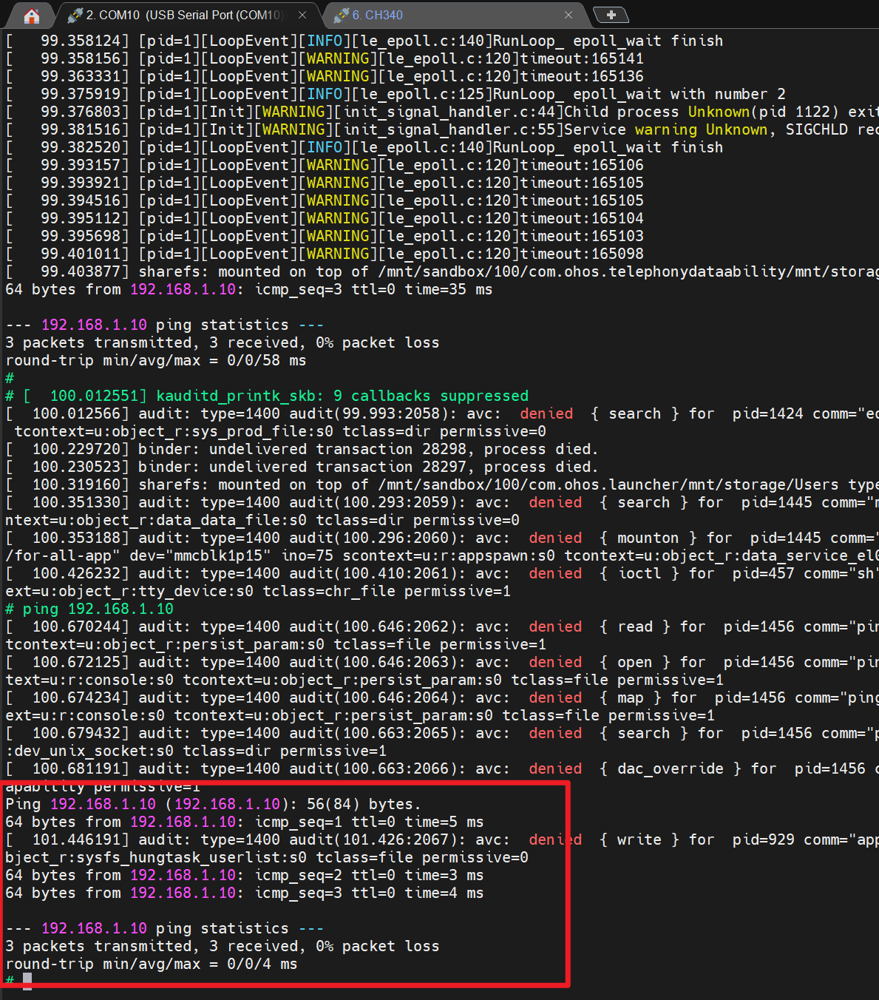

并且在zone0中可以通过picocom建立与zone1的串口链接，在zone0中控制zone1的串口。
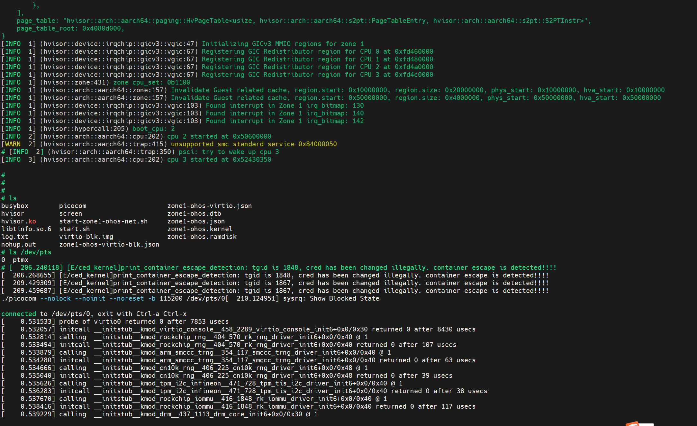