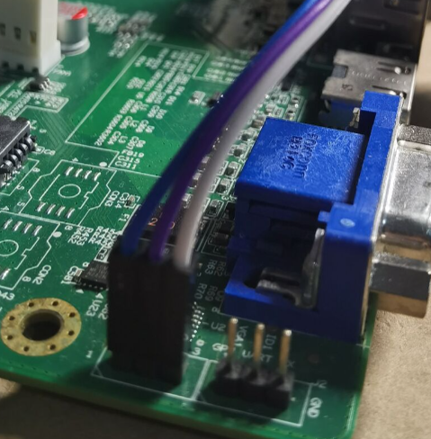
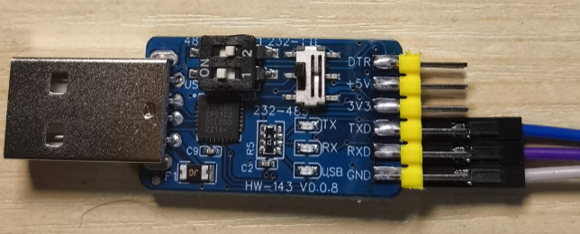

# 在龙芯 3A5000主板（7A2000）上启动 hvisor

wheatfox <wheatfox17@icloud.com>

更新时间：2025.6.9

## 第一步：获取 hvisor 源码并进行编译

首先需要安装龙芯新世界 ABI 的 `loongarch64-unknown-linux-gnu-` 工具链，请从 <https://github.com/sunhaiyong1978/CLFS-for-LoongArch/releases/download/8.0/loongarch64-clfs-8.0-cross-tools-gcc-full.tar.xz> 下载并解压到本地，然后请将 `cross-tools/bin` 目录添加到你的 `PATH` 环境变量中，保证 `loongarch64-unknown-linux-gnu-gcc` 等工具可以被 shell 直接调用。

然后克隆代码到本地：

```bash
git clone https://github.com/enkerewpo/hvisor
make BID=loongarch64/ls3a5000
```
编译完成后在 `target` 目录下可以找到 strip 之后的 `hvisor.bin` 文件。

## 第二步（不自己编译 buildroot/linux 等）：获取 rootfs/内核镜像

请从 <https://github.com/enkerewpo/linux-hvisor-loongarch64/releases> 下载最新发布的 hvisor 默认龙芯 linux 镜像（包括 root linux kernel+root linux dtb+root linux rootfs，其中 root linux rootfs 中包括 non root linux+nonroot linux dtb+nonroot linux rootfs）。rootfs 中已打包好 nonroot 的启动 json 以及 hvisor-tool、内核模块等。


## 第二步（自己编译 buildroot/linux 等）：完整编译 rootfs/内核镜像

如果你需要自己编译，这个流程将会较为复杂，接下来将介绍相关细节：

### 1. 准备好环境

创建一个工作目录（可选）：

```bash
mkdir workspace && cd workspace

git clone https://github.com/enkerewpo/hvisor
git clone https://github.com/enkerewpo/buildroot-loongarch64
git clone https://github.com/enkerewpo/linux-hvisor-loongarch64 hvisor-la64-linux
git clone https://github.com/enkerewpo/hvisor-tool
git clone https://github.com/enkerewpo/hvisor_uefi_packer
```
### 2. 准备 buildroot 环境

因为 buildroot 在找不到需要编译的 package 时会从各个地方下载源码压缩包，这里我准备好了一个预下载的镜像：

<https://pan.baidu.com/s/1sVPRt0JiExUxFm2QiCL_nA?pwd=la64>

下载后将 `dl` 目录放在 buildroot-loongarch64 根目录即可，或者你也可以不下载，让 buildroot 自动下载（可能会非常慢）。如果你在解压了 `dl` 目录后发现编译时仍然有软件包需要下载，也是正常现象。

### 3. 编译 buildroot

```bash
cd buildroot-loongarch64
make loongson3a5000_hvisor_defconfig

make menuconfig # 请将 Toolchain/Toolchain path prefix 设置为你本地的 loongarch64 工具链路径和前缀
# 然后选择右下角 save 保存到 .config 文件

make -j$(nproc)
```

<div class="warning">
    <h3>请注意</h3>
    <p> 这个过程可能持续数小时，取决于你的机器性能和网络环境。</p>
</div>

编译完成后，在 output/images 中可以找到 `rootfs.cpio.gz` 文件，请牢记这个文件的路径，这是一个基本的 rootfs。
下一步请手动将这个路径（设为 `ROOTFS_CPIO_GZ_PATH`）软连接到 `hvisor-la64-linux/rootfs/buildroot/rootfs.cpio.gz`，该位置存放的 rootfs 文件将通过 `./build nonroot_setup` 命令生成一个精简版的 nonroot rootfs。
如果你希望自己制作 root 和 nonroot 的 rootfs，可以不进行这一步，请注意这会导致 make world 流程中无法自动生成 nonroot rootfs。

### 4. 第一次编译 linux（为后续 make world 做准备）

一些前置知识：

1. linux 源码目录内 `arch/loongarch/configs` 为 defconfig 目录，你可以在仓库中找到 root 和 nonroot 分别的 defconfig。
2. linux 源码目录内 `arch/loongarch/boot/dts` 为 dts 目录，你可以在仓库中找到 root 和 nonroot 分别的 dts 文件，其中带 `linux1.dts` 等字样的文件为通过下面 `./build zone ...` 命令使用的以 zone name 为索引来进行 dts 内嵌，`linux1`, `linux2`, `linux3` 为默认的三个 nonroot zone name。

```bash
cd hvisor-la64-linux
echo "6.11.6" > chosen_root # 选择 linux-6.11.6 目录作为 root linux 的编译源码
echo "6.13.7" > chosen_nonroot # 选择 linux-6.13.7 目录作为 nonroot linux 的编译源码，
# 你也可以选择其他版本例如 6.11.6 git，请保证对应的 linux-{suffix} 目录存在
./build def root/nonroot # 生成默认 root linux 的 defconfig
./build menu root/nonroot # 进入 menuconfig 配置 root linux 的配置
./build kernel root # 编译 root linux
./build zone {type} {name} {entry}
# type=root/nonroot name=zone_name（此name也用于选择对应加载的{zone_name}.dts 文件）
# entry=vmlinux 的 entry 地址，用于 DMA 支持
```
对于 build 脚本支持的更多命令（例如后文 make world 流程中涉及到的动态修改 linkerscript load addr 以及配置 target output 的 zone name 等功能，请运行 `./build --help` 查看）。

请注意，目前仓库的默认 defconfig 均关闭了 initramfs 的 rootfs 内嵌选项，你可能需要检查一下 configs 目录中的 root 和 nonroot defconfig 并按你的需求进行修改（通过 `./build def root/nonroot` 命令生成后再运行 `./build menu root/nonroot` 进行修改，请注意如果你之后要使用 make world，这里必须保存一次 defconfig `./build save root/nonroot` 将 `.config` 文件保存到 configs 目录下，供后续 make world 使用，因为make world会直接从configs目录下读取 defconfig，如果不运行 save 的话将会导致你的临时 .config 被覆盖）。

请注意，目前仓库的默认 dts 可能不适合你本地的环境，其中对于 UART 节点请根据需要进行修改（例如 3A6000 支持主板背板的 COM1，则你可以 enable COM1 节点并让 zone 使用，或者使用 3A5000 和 3A6000 均支持的主板 DEBUG pin 底座接 UART0 输出）。

<div class="warning">
    <h3>请注意</h3>
    <p> 编译内核过程可能持续几十分钟，取决于你的机器性能。</p>
</div>

附：如何通过 menuconfig 配置 initramfs 并添加 rootfs：
1. 在 hvisor-la64-linux 目录下运行 `./build def root/nonroot` 生成 defconfig，然后运行 `./build menu root/nonroot` 进入 menuconfig 配置。
2. 在 menuconfig 中找到 General setup 中的 `Initial RAM filesystem and RAM disk (initramfs/initrd) support` 选项，启用。
3. 此时会多出一个 `Initramfs source file(s)` 选项，在这里输入你想要添加的 rootfs 路径，例如 `PATH_TO_ROOTFS/rootfs.cpio.gz`。
4. 保存退出，然后运行 `./build kernel root/nonroot` 编译内核，运行 `./build save root/nonroot` 保存 defconfig 到仓库。

附：如何控制 console 是使用 virtio-console 还是走默认的 UART（UART0、COM1）：
请检查或修改你的 root 或 nonroot 的 rootfs，进入 /etc 目录，其中需要有两个关键文件：
1.  `inittab` 文件，对于 root 和 nonroot 的一些示例见 <https://github.com/enkerewpo/buildroot-loongarch64/tree/master/board/loongson/ls3a5000/rootfs_ramdisk_overlay/etc>
2. `profile` 文件，你可以在这里控制 shell login 时运行哪些初始化脚本，一个参考：<https://github.com/enkerewpo/buildroot-loongarch64/blob/master/board/loongson/ls3a5000/rootfs_ramdisk_overlay/etc/profile>
3. 对于 `./build nonroot_setup` 命令，请参考 `./build` 脚本里相关流程，以及 `HVISOR_LA64_LINUX_DIR/rootfs/nonroot_inittab` 和 `HVISOR_LA64_LINUX_DIR/rootfs/nonroot_profile` 文件，这两个文件将会在构造 trimmed rootfs for nonroot 时，被 `./build nonroot_setup` 命令自动替换默认的 `inittab` 和 `profile` 文件，请注意，仓库中的默认 inittab 配置为挂载到 `hvc0` 上，即 nonroot 的 shell 自动 getty 到 virtio-console，在启动 nonroot 时，你将会在串口看到启动 console 的日志，在进入 shell 后串口不再有输出，为正常现象，此时在 root 中 screen 到 nonroot 的 pts 后，你将会看到 nonroot 的 shell 输出并进行交互。

### 5. 通过 hvisor uefi packer 执行 make world 流程

```bash
cd hvisor_uefi_packer
make menuconfig # 生成 .config，你可以参考 configs 目录下的一些示例配置的格式
vim zones.json # 由于 hvisor 暂未支持 iommu，对于 PCIe 设备的 DMA，
# 必须要求 GPA=HPA，所以每一个虚拟机的 vmlinux 编译时会自动修改 load addr 以避免 GPA/HPA 冲突
./make_world # 这个过程将会很慢，请耐心等待
```

如果你只需要一个 nonroot，请修改 `zones.json`，添加或删除对应的配置。下面简述标准流程中 make world 会做哪些事情：

1. 从你配置好的 `.config` 中读取相关信息：
   1. hvisor 源码路径 `HVISOR_SRC_DIR`
   2. hvisor-tool 源码路径 `HVISOR_TOOL_DIR`
   3. buildroot 源码路径 `BUILDROOT_DIR`
   4. hvisor la64 linux 仓库源码路径 `HVISOR_LA64_LINUX_DIR`
2. 读取 `HVISOR_LA64_LINUX_DIR/chosen_root` 和 `HVISOR_LA64_LINUX_DIR/chosen_nonroot` 中的内容，分析选取对应源码版本。
3. 读取当前目录下的 `zones.json` 文件，获取需要编译的 zone 配置。
4. 编译 hvisor-tool（由于内核模块需要对应的源码，这里编译 hvisor-tool 会固定使用前面解析到的 chosen_root 源码作为 `KDIR` 编译内核模块），并把生成的 `hvisor` 命令行工具和 `hvisor.ko` 内核模块拷贝到 `BUILDROOT_DIR/rootfs_ramdisk_overlay/tool` 目录下，此目录将会被 buildroot 下次编译时打包进 rootfs。
5. 在 `HVISOR_LA64_LINUX_DIR` 下运行 `./build nonroot_setup` 命令，生成 nonroot rootfs（即不包含 `/tool` hvisor 资源目录等文件的一个较为纯净的 nonroot rootfs），请参考前面章节的部分对 buildroot 生成的 rootfs 进行软连接。该命令生成的精简 rootfs 位于 `HVISOR_LA64_LINUX_DIR/rootfs/nonroot_rootfs.cpio.gz`，可供使用。
6. 在 `HVISOR_LA64_LINUX_DIR` 下运行 `./build def nonroot`，生成 nonroot linux 的 defconfig。
7. 根据 `zones.json` 中的配置，依次编译各个 nonroot zone，并复制到 `BUILDROOT_DIR/rootfs_ramdisk_overlay/tool/nonroot` 目录下，此目录将会被 buildroot 下次编译时打包进 rootfs。
8. 然后进行一次 buildroot 的编译，前面提到的相关文件均会被打包进 `rootfs.cpio.gz` 文件中。
9. 进入 `HVISOR_LA64_LINUX_DIR` 目录，运行 `./build def root` 与 `./build kernel root` 生成 root linux 的 vmlinux 文件，请在编译后检查 `HVISOR_LA64_LINUX_DIR/target` 目录。

至此 make world 流程结束。一些注意事项：

1. zones.txt 写好的 zone name 将会最终对应 dts 目录内对应的 {zone name}.dts 文件作为内嵌到 vmlinux 的设备树文件。
2. 你可能需要调整相关的 defconfig 和 dts，仓库中的最新文件由于目前仍在开发中不停更新，其可能不适合你的实际需求。
3. 如果你希望修改 zone 启动时的 cmdline，请修改对应的设备树中的 bootargs 字段。

如果可以的话，请打开或 unpack 生成的 rootfs.cpio.gz 文件，检查其中是否包含如下结构，如果缺少任何文件，请检查你的编译流程是否正确。

```bash
/                           # 根目录
├── daemon.sh               # 启动 virtio 后端的脚本
├── start.sh                # 启动 nonroot 虚拟机的脚本
└── tool/                   # hvisor 资源文件夹
    ├── hvisor              # hvisor 命令行工具
    ├── hvisor.ko           # hvisor 内核模块
    ├── linux*-json         # 虚拟机 linux* 启动配置文件
    ├── linux*-disk.ext4    # 虚拟机 linux* virtio-blk 文件系统镜像
    ├── virtio_cfg.json     # 虚拟机 virtio 配置文件
    └── nonroot/            # nonroot 虚拟机 vmlinux.bin 目录
        └── vmlinux-*.bin   # 虚拟机内核映像文件，以 zone name 为后缀的 bin 是通过 ./build zone 命令得到的
```

## 第三步：编译 UEFI 镜像

由于 3A5000 以及之后的 3 系 CPU 的主板均采用 UEFI 启动，所以只能通过 efi 镜像的方法启动 hvisor。

```bash
./make_loongarch64 # 读取 .config 中配置的相关路径和信息，生成 BOOTLOONGARCH64.EFI
```

此时会在 `hvisor_uefi_packer` 目录下生成 `BOOTLOONGARCH64.EFI`，将其放在 U 盘的第一个 FAT32 分区的 `/EFI/BOOT/BOOTLOONGARCH64.EFI` 位置。

<div class="warning">
    <h3>请注意</h3>
    <p> 当你自己编译 root 和 nonroot linux 时，请手动 readelf 得到两个 vmlinux 的 entry 地址，并在 board.rs 以及 linux1/2/3.json 中对应写好，否则一定会启动失败，前文中提到的 make_loongarch64 脚本会帮你自动进行这一检查。</p>
</div>


## 第四步：上板启动

### 3A5000 主板 CPU UART0 连接

请参考下图中的连线将 3A5000 主板的 UART0 连接到你的串口转接器上（CPU UART0 引脚位于 VGA connector 旁边）：



其中从左到右（图中三角形标识的一端为 1 号引脚 RX）分别为 RX（1）、TX（2）、GND（3） 三个引脚，分别对应连接到你的 USB 转接器的 TX、RX、GND 引脚上，如图所示：



<div class="warning">
    <h3>请注意</h3>
    <p> 请将串口转接器配置为 RS232 电压模式，以及 USB 串口转接器的 TX 接主板 RX、RX 接主板 TX、GND 接主板 GND（可不接地）。</p>
</div>

### 主板开机

主板上电开机，按 **F12** 进入UEFI Boot Menu，在目录选择 U 盘启动，即可进入 hvisor，然后自动进入 root linux。
如果您接入了 VGA 屏幕，也可以看到启动最开始的一部分 UEFI loader 的日志输出，**之后将转为通过 UART0 输出（hvisor 以及 root/nonroot linux 均使用串口进行输入和输出）**。

## 启动 nonroot

启动后在串口端可以看到 hvisor 的 log 以及 root linux 的 bash，输入：

```bash
./daemon.sh
./start.sh 1/2/3 # 启动 nonroot，之后请手动运行 screen /dev/pts/0 or 1, 2
# (linux1-pts0, linux2-pts1, linux3-pts2 by default)
```

之后会自动启动 nonroot（一些相关配置文件位于 root linux 的 `/tool` 目录内，包括提供给 hvisor-tool 的 nonroot zone 配置 json 以及 virtio 配置 json 文件），之后回自动打开一个 screen 进程连接 nonroot linux 的 virtio-console，你会看到一个打印了 nonroot 字样的 bash 出现，你可以在使用 screen 时按 `CTRL+A D` 快捷键 detach（请记住显示的 screen session 名称 / ID），此时会返回 root linux，如果希望返回 nonroot linux，则运行

```bash
screen -r {刚才的session全名或者只输入最前面的 ID}
```

之后会返回 nonroot linux 的 bash。