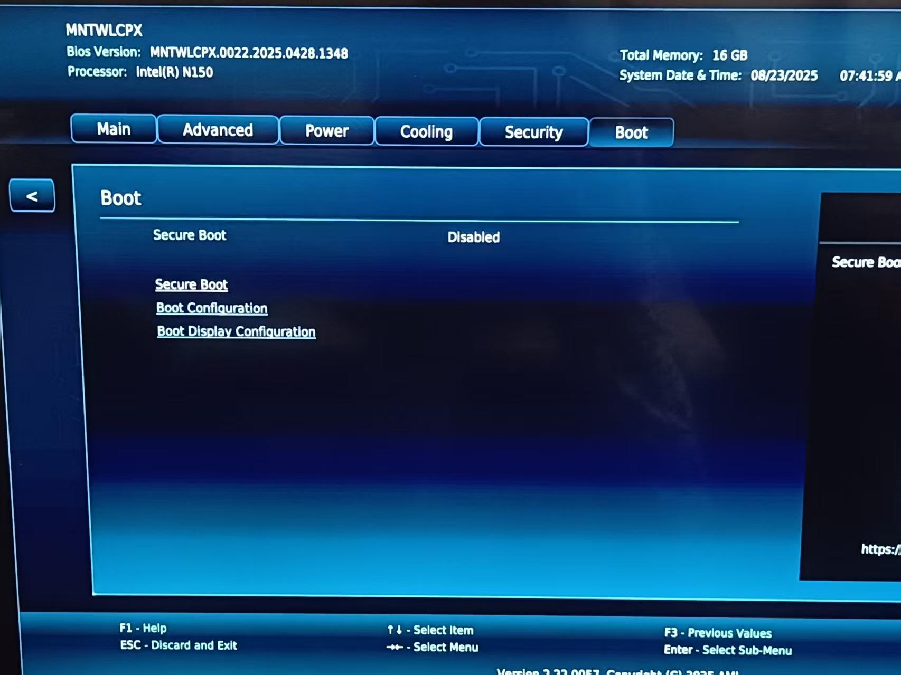
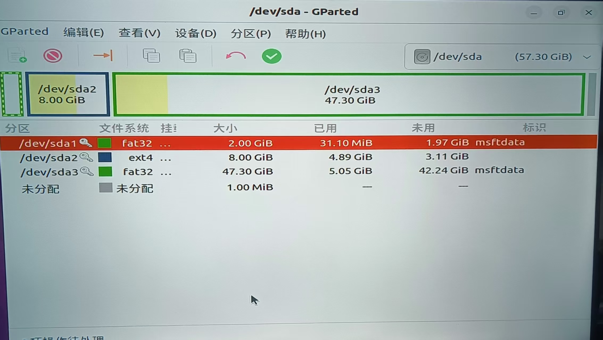

# 在 NUC 14 Essential x86_64 上运行 Hvisor

刘天弘（lzoi_lth@163.com）

## 一、BIOS 设置

NUC14 初始自带一个 BIOS，需要进行相应设置。

完成必要的连线工作后（电源、显示器、路由器），开机，按 F8（可能有所不同）进入 BIOS，打开 Boot 页面，关闭 Secure Boot。此后即可加载自制的镜像。

<div align="center">

</div>


## 二、编译 Linux 内核

在 Qemu X86_64 编译内核的基础上，增加下述配置项，然后重新编译：

```bash
# nvme 磁盘驱动
./scripts/config --enable CONFIG_NVME_CORE
./scripts/config --enable CONFIG_BLK_DEV_NVME
# vesafb 图形显示器驱动
./scripts/config --enable CONFIG_FB
./scripts/config --enable CONFIG_FB_CMDLINE
./scripts/config --enable CONFIG_FB_VESA
```


## 三、制作启动盘

为了测试方便，本文选择一块 U 盘作为 Hvisor 的启动盘，并且在上面安装 GRUB 作为 bootloader。

首先需要对 U 盘进行分区，推荐使用带有图形界面的 Linux 操作系统以及分区工具 GParted。U 盘插入后，会对应到一个设备节点，例如 `/dev/sda`。**在正式开始分区前，确保 U 盘内无重要数据或者已经备份**。

打开 GParted，选择 U 盘作为当前盘，然后点击 `Device → Create Partition Table...` 建立一个 GPT 分区表。如果提示无法建立分区表，需要使用 `umount` 卸载所有活动分区，然后重新启动 GParted。

建完 GPT 分区表后，新建一个 EFI 分区，该分区必须为 **FAT32** 格式。然后再新建一个文件系统分区作为 zone0 的根文件系统，分区格式为 **EXT4**。建立好分区后，点击绿色的 √，正式完成划分。在下图的示例中，FAT32 分区被命名为 `/dev/sda1`，EXT4 分区被命名为 `/dev/sda2`。不同环境下的命名可能有所不同，需要留意。

<div align="center">

</div>

接下来进行 GRUB 的编译。

```bash
# 下载 GRUB
wget https://ftp.gnu.org/gnu/grub/grub-2.06.tar.xz

# 解压并打开
tar -xf grub-2.06.tar.xz
cd grub-2.06/

# 配置并编译
mkdir EFI64
cd EFI64
../configure CFLAGS="-Wno-error" --target=x86_64 --with-platform=efi && make -j$(nproc)
```

然后将 GRUB 安装到 U 盘的 EFI 分区中。

```bash
# 将 EFI 分区 mount 到 mnt 文件夹
sudo mount /dev/sda1 /mnt

# 安装到 /mnt
cd ../EFI64/grub-core
sudo ../grub-install -d $PWD --force --removable --no-floppy --target=x86_64-efi --boot-directory=/mnt/boot --efi-directory=/mnt
```

## 四、编译 Hvisor

进入 Hvisor 所在路径，打开 `platform/x86_64/nuc14mnk/board.rs`，将 `ROOT_ZONE_CMDLINE` 中 `root=/dev/sda2` 参数修改为 EXT4 分区的名字。

由于 NUC14 未提供串口接口，若要打印调试日志，需要在 `platform/x86_64/nuc14mnk/cargo/features` 添加 `graphics` 这一特性，使得日志可以直接绘制在显示器上，这一特性仅供早期调试。

参考 QEMU 的步骤，将构建好的内核文件和根文件系统移动到指定位置。执行编译指令 `make ARCH=x86_64 BOARD=nuc14mnk`。

可以看到 `/platform/x86_64/nuc14mnk/image/iso/boot` 路径下有文件生成，将 `boot` 文件夹整个复制到第三步的 `/mnt` 中。此时 EFI 分区的大致布局如下：

```bash
.
├── boot
│   ├── grub
│   │   ├── fonts
│   │   ├── grub.cfg # 用于配置 GRUB 菜单的各个选项
│   │   ├── grubenv
│   │   ├── locale
│   │   └── x86_64-efi
│   │       ├── acpi.mod
│   │       ├── ...
│   │       └── zstd.mod
│   ├── hvisor
│   └── kernel
│       ├── boot.bin
│       ├── setup.bin
│       └── vmlinux.bin 
└── EFI
    └── BOOT
        └── BOOTX64.EFI
```

`grub.cfg` 可以配置 Hvisor 加载时的相关操作，其 menuentry 具体如下。`multiboot2` 会将 Hvisor 以 Multiboot2 协议加载入内存，`module2` 会将 Linux 内核镜像加载到内存中，Hvisor 再将其移动到末尾的十六进制数字所指定的内存位置。

```
menuentry "Hvisor" {
    multiboot2 /boot/hvisor # use multiboot spec to boot
    module2 /boot/kernel/boot.bin 0
    module2 /boot/kernel/boot.bin 5008000
    module2 /boot/kernel/setup.bin 500a000
    module2 /boot/kernel/vmlinux.bin 5100000
    boot
}
```

最后，将 zone0 的根文件系统通过 `sudo dd if=rootfs1.img的路径 of=/dev/sda2 bs=4M status=progress` 指令写入 EXT4 分区。

NUC14 开机后，按 F10 进入 U 盘启动模式，选择 U 盘的 EFI 分区。（或者修改 BIOS 将 U 盘作为第一启动项）进入 GRUB 后，选择 `Hvisor` 即可。

## 五、有线网卡驱动问题

首先在 Linux 源码文件夹下执行 `make modules` 以生成 `Module.symvers` 文件。

Linux 镜像自带的 r8169 驱动可能无法在 NUC14 上运行，导致无法正常联网。因此需要下载 Realtek 官方提供的 r8125 驱动：[Realtek PCIe FE / GbE / 2.5GbE / 5G / 10G Family Controller Software](https://www.realtek.com/Download/List?cate_id=584)，下载 2.5G Ethernet LINUX driver r8125 for kernel up to x.xx 这一项。

下载完成后，进入 `src` 文件夹，执行 `make -C linux所在路径 M=src所在路径 modules`，将生成的 `r8125.ko` 内核模块放入 zone0 的根文件系统的特定位置，例如 `/mnt/lib/modules/$(uname -r)/kernel/drivers/net/ethernet/realtek/`，然后执行 `depmod -a -b /mnt $(uname -r)` 更新模块依赖索引。这样在进入 Hvisor 时，就可以执行 `sudo modprobe r8125` 加载网卡驱动了。

## 六、无线网卡驱动问题

如果要让 zone0 或 zone1 使用无线网卡，需要给内核添加如下配置项，重新编译：

```bash
# iwlwifi 无线网卡驱动
./scripts/config --module CONFIG_IWLWIFI
```

然后把内核模块安装到 `/lib/modules/$(uname -r)`。

```bash
make -j$(nproc)
make modules
make modules_install INSTALL_MOD_PATH=/path/to/rootfs
```

这里编译成内核模块，是因为无线网卡驱动在加载时可能需要从 Linux 文件系统中读取固件（firmware）文件。因此要等到文件系统准备完毕，才能进行驱动的初始化。编译成内核模块可以更好地控制驱动初始化的时机。

如果未在 Linux 文件系统中放置合适的固件文件，执行 `sudo modprobe iwlwifi` 后，可能会显示如下类型的报错。

```
Direct firmware load for iwlwifi-so-a0-gf-a0-73.ucode failed with error -2
Direct firmware load for iwlwifi-so-a0-gf-a0-72.ucode failed with error -2
Direct firmware load for iwlwifi-so-a0-gf-a0-71.ucode failed with error -2
...
```

从网上下载 iwlwifi 所需的固件文件，将其移动到 Linux 文件系统的 `/lib/firmware` 路径下。本示例所需的固件包括 [`iwlwifi-so-a0-gf-a0.pnvm`](https://github.com/crojewsk-intel/linux-firmware/blob/main/iwlwifi-so-a0-gf-a0.pnvm) 以及 [`iwlwifi-so-a0-gf-a0-72.ucode`](https://github.com/crojewsk-intel/linux-firmware/blob/main/iwlwifi-so-a0-gf-a0-72.ucode)。

为 Linux 安装依赖：

```bash
sudo apt install wpasupplicant udhcpc
```

修改 `init`，添加如下内容：

```bash
modprobe iwlwifi
# wlan0 是无线网卡对应的接口
ip link set wlan0 up
# 连接 Wifi
wpa_passphrase "你的 Wifi 名称" "你的 Wifi 密码" > /etc/wpa_supplicant.conf
wpa_supplicant -B -i wlan0 -c /etc/wpa_supplicant.conf
# 获取 IP 地址
udhcpc -i wlan0
# 添加 DNS 解析服务器
echo "nameserver 114.114.114.114" > /etc/resolv.conf
echo "nameserver 8.8.8.8" >> /etc/resolv.conf
```