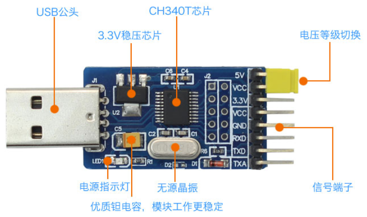

任航麒(2572131118@qq.com)

更新时间：2025.4.23
# 新板子需要的操作
如果板子为新到手的 RK3588，则可能板子内部未被烧写任何内容，包括引导，因此需要首先对板子进行初步烧写，为其烧写 Uboot、Linux、Rootfs 等内容。烧写推荐在 Windows 通过[RKDevTool](https://download.t-firefly.com/product/Board/RK3588/Tool/Window/RKDevTool_Release_v3.31.zip)完成。

可以直接下载[此链接](https://bhpan.buaa.edu.cn/link/AA6F31C943712347DEB8D04FF1E5975F86)中的 update.img。此镜像打包了上述所有内容。直接烧写此镜像即可一步到位，具体操作如下：

1. 用 USB 连接电脑和板子上的 Type-C 口。
2. 首先让板子处于 MaskRoom 或者 Loader 模式（可以在 RKDevTool 识别到）   
   + Loader 模式：在通电状态下同时按住 RST 和 BOOT 按键，或者在 Uboot、Linux 下输入 ```reboot loader```
   + MaskRoom 模式：新板子默认处于此模式。
3. 在 RKDevTool 中按照下图进行操作


# 获取 RK3588 内核镜像
RK3588 有着专用的内核镜像，源码可以通过[此链接](https://bhpan.buaa.edu.cn/link/AA7E3F2C1C703F48A7A6CE1FF74741753D)获取。

为了方便快速上手，这里的内核已经是经过编译的内核，因此文件较大。可以通过```kernel/arch/arm64/boot/Image```直接获取镜像，也可利用现成的```.config``` 重新定制所需镜像。

当然，如果不关心内核源码，可以通过[此链接](https://bhpan.buaa.edu.cn/link/AAAAF1803AEC0F4710BF322C54804F72DC)直接获取 Image。

# 串口连接

RK3588 的串口比较特殊，需要自行购买 USB转TTL 转换器进行连接




连接时 RT-TX、TX-RD、GND-GND，连接到电脑后串口波特率为1500000。

# 重新烧写 Uboot
要想启动 hvisor，原有的 Uboot 没有等待时间，会直接启动 Linux。需要对 Uboot 进行重新烧写，这里也已经准备好了一份 Uboot 及其烧写工具，通过[Uboot](https://bhpan.buaa.edu.cn/link/AA6220C0C619A840DEAC44F1F813FC0109)、[Upgrade-tool](https://bhpan.buaa.edu.cn/link/AA285131D2DDD14AD79A030AB2A38F4D63)即可获取。

在 Linux 系统下，同样用 Usb 连接板子和电脑，并使其处于 Loader 模式：

```
chmod +777 /path/to/upgrade_tool
sudo upgrade_tool di -u /path/to/uboot.img
```

# 编译 Hvisor 和设备树
1. 和其他开发板类似，拉取 hvisor 最新代码，仓库地址：https://github.com/syswonder/hvisor。进入目录后编译 hvisor：
    ```
    make BID=aarch64/rk3588
    ```
2. 进入```/images/aarch64/devicetree/```，```rk3588-root-aarch64-sdmmc.dts``` 是 RK3588 RootLinux 所使用的设备树，```rk3588-nonroot-aarch64.dts``` 是 RK3588 NonRootLinux 所使用的设备树。 可以使用下面的命令对其编译：
    ```
    dtc -I dts -O dtb rk3588-nonroot-aarch64.dts -o ./linux1.dtb
    dtc -I dts -O dtb rk3588-root-aarch64-sdmmc.dts -o ./zone0.dtb
    ```

# 制作文件系统
准备一个 SD 卡，分区两块，第一块 FAT32 格式，大小 1g；第二块 EXT4 格式。

下载[文件系统](https://bhpan.buaa.edu.cn/link/AA91FB720EDBF949FA909538CC6093C8D0),将此文件系统解压到 EXT4 格式分区下即可。

当然，也可以自行制作，参考[基于ubuntu_base构建文件系统](https://foreveryolo.top/posts/60156/)。
# 启动 RootLinux
# TFTP 
如果已经搭建了 TFTP 服务器，那么可以以方便的方式快速启动 RootLinux，具体而言：

1. 将 Image、zone0.dtb、hvisor.bin 复制到 ～/tftp 文件夹下
2. 用网线连接主机与开发板，配置主机ip为```192.168.137.2```，子网掩码```255.255.255.0```。
3. 直接开机并连接串口即可，uboot 将自动下载 tftp 文件夹下的内容并启动。

如果有搭建需求，可以参考[嵌入式平台快速开发-Tftp 服务器搭建与配置](https://foreveryolo.top/posts/17937/)。
# 无 TFTP
此时 SD 卡中第一块 FAT32 分区即派上了用场，将 Image、zone0.dtb、hvisor.bin 复制到此分区中

1. 启动开发板，连接串口。
2. 打断 Uboot 自动启动。
3. 输入下述指令启动 RootLinux
    ```
    fatload mmc 0:1 0x00480000 hvisor.bin;fatload mmc 0:1 0x10000000 zone0.dtb;fatload mmc 0:1 0x09400000 Image;bootm 0x00480000 - 0x10000000
    ``` 
# 启动 NonRootLinux
# 下载现成的配置文件
通过[此链接](https://bhpan.buaa.edu.cn/link/AAC7FF42BDBBE44ABEBB512459C379BCE4)可下载可用的 NonRoot 配置，包括 Image、配置文件、rootfs等，将其解压到 RootLinux 的文件系统中，其可以帮助快速启动Nonroot，主要启动的设备有virtio-blk和virtio-console，也可根据自己的需求直通设备。

<div class="warning">
    <h1> Tips: </h1>
    <p> 请不要随意修改 Image 为 Rootlinux 使用的 Image，此会导致 Nonroot 启动失败！ </p>
</div>

# 编译 hvisor-tool
拉取 Hvisor-tool 的最新代码：https://github.com/syswonder/hvisor-tool/tree/main，进行编译：
```
make all ARCH=aarch64 LOG=LOG_WARN KDIR=RK3588内核源码 VIRTIO_GPU=n
```
更多细节请参考 hvisor-tool 的 Readme.md。

注意，内核源码必须已经经过编译，否则hvisor-tool将会因为找不到编译产物而报错。

<div class="warning">
    <h1> Tips: </h1>
    <p> 编译 hvisor-tool 时所使用的 glibc 版本需要保证 Rootlinux 文件系统也支持，否则会导致 hvisor-tool 不能正常工作！ </p>
</div>

例如，本文给出的 Rootlinux Rootfs 为 Ubuntu 24.04。编译机的 Glibc 版本要不高于 Ubuntu24.04 的 Glibc 版本，这里由于 Ubuntu24.04 较新，一般是满足的。

当然，上述操作是通过对齐两个文件系统所用的 glibc 版本来完成的，也可以直接在 Rootlinux 文件系统中编译 hvisor-tool，或者在编译机指定 Rootlinux 的文件系统目录，使得编译链接时直接链接 Rootlinux 文件系统的 glibc，具体如下：

```
make all ARCH=aarch64 LOG=LOG_WARN KDIR=RK3588内核源码 VIRTIO_GPU=n \
ROOT=/path/to/target_rootfs
```
# 启动
在 Rootlinux 下执行下述命令
```
insmod hvisor.ko
nohup ./hvisor virtio start virtio_cfg.json &
./hvisor zone start zone1_linux.json
screen /dev/pts/0
```
即可看到第二个虚拟机（Nonroot）的输出。
<div class="warning">
    <h1> Tips: </h1>
    <p> 如果不按照上述流程配置 Rootlinux 的文件系统，或者随着版本迭代，可能会出现现成配置文件不可用的情况，此时需要自行更新配置，我们也会尽早跟进。
    <p> 具体最新配置格式可以参考 hvisor-tool 下的 example 进行。</p>
</div>
