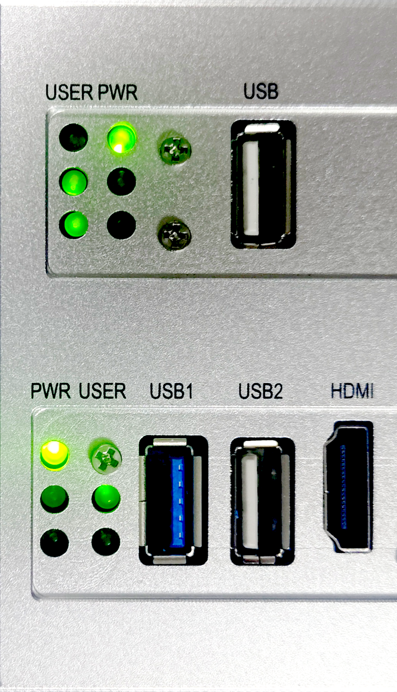

# 基于 RK3588 的 矽慧通 X3300 快速上手

本文档旨在为开发者详细介绍在 矽慧通 X3300 开发板上部署并启动 hvisor 的完整流程。

操作环境基于 Ubuntu 22.04 主机。我们假定已获取好 Rockchip Linux SDK 及 矽慧通 X3300 相应的配置文档 / 配置文件。文中所述的开发板特指基于 RK3588 的 矽慧通 X3300。

## 需要准备的器材

| 类别 | 器材名称 | 规格要求 | 数量 | 用途说明 |
| - | - | - | - | - |
| **核心设备** | 矽慧通 X3300 | | 1 块 | 主要开发平台 |
| **电源设备** | 电源适配器 | DC 9-36V | 1 个 | 供电 |
| **调试工具** | USB 转串口模块 | 支持 1.5 Mbps 波特率 | 1 个 | 串口调试和日志输出 |
| **连接线缆** | Type-C USB 线 | 数据线 | 1 条 | 连接 OTG 口用于烧录 |
| **网络设备** | 以太网线 | 标准网线 | 1 条 | 网络通信 |
| **显示设备** | HDMI 线 | 标准 HDMI 接口 | 1 条 | 连接显示器 |
| **主机环境** | Ubuntu 主机 | Ubuntu 22.04 系统 | 1 台 | 编译和烧录环境 |

## 开发板介绍

在开始之前，请确保开发板已备妥，并熟悉其基本接口布局。

本文档操作所涉及的接口均位于开发板的前后两端。

---


上图所示为开发板前侧接口，需要用到的有：

- OTG 口：Type-C USB 接口，用于烧录。
- BOOT 和 RST 按钮：下层标识 BOOT 和 RST 的按钮，用于进入 MaskROM 模式和复位开发板。

---


上图所示为开发板后侧接口，需要用到的有：

- 电源：位于右侧，DC 9-36 V 接入，中间为正，两侧为负，可接入任意两个 V+ / V- 接线柱；
- 调试串口：下层右侧标识有 DEBUG 的 RXD、TXD；
- 以太网口：ETH1，设备树配置中为 `ethernet@fe1c0000`；
- 图像输出 HDMI：设备树配置中为 `hdmi@fde80000`；

---

### 电源

请使用规格匹配的电源适配器连接至开发板的 DC 电源接口，以确保供电稳定。该开发板支持 9-36V 宽压输入。正确连接电源后，开发板后侧上下两层的电源指示灯 PWR 均应亮起，如下图所示。

<div align="center">
  
</div>

### 串口连接

为进行设备调试与查看启动日志，需要通过 USB 转串口模块连接到开发板的调试串口。

默认串口参数如下：

| 参数项 | 参数值 |
| - | - |
| **波特率 (Baud Rate)** | `1500000` |
| **数据位 (Data Bits)** | `8` |
| **停止位 (Stop Bits)** | `1` |
| **校验位 (Parity)** | `None` |

硬件连接正确后，可使用 `minicom` 等串口工具进行通信。

```sh
# 如果未安装 minicom，先执行下面的命令安装
# sudo apt update && sudo apt install minicom

# 定义串口参数
BAUD_RATE=1500000
SERIAL_DEVICE="/dev/ttyUSB0"

# 启动 minicom
sudo minicom -b "${BAUD_RATE}" -D "${SERIAL_DEVICE}"
```

> **接线提示**
>
> 1.  **标准接法（交叉连接）**：将模块的 `RXD` 连接到开发板的 `TXD`，`TXD` 连接到 `RXD`，`GND` 连接 `GND`。
> 2.  **特殊情况（直连）**：部分厂商（如 [Firefly](https://wiki.t-firefly.com/USB-TO-TTL-Serial/usb-to-ttl-serial.html)）的模块可能已在内部做了交叉处理，此时需要 `RXD` 接 `RXD`，`TXD` 接 `TXD`。
>
> 请务必参考模块说明书或咨询厂商以确认正确的接线方式。

### 进入 Loader / MaskROM 模式

开发者可通过以下方法，使开发板进入指定的烧录模式。

#### 进入 MaskROM 模式

**MaskROM 模式**是芯片内置的底层启动模式，主要用于设备首次烧录或系统固件损坏时进行修复。

1. 保持开发板处于**通电状态**。
2. 同时按住 **`BOOT`** 键与 **`RST`** 键。
3. 先松开 **`RST`** 键。
4. 稍等片刻后，再松开 **`BOOT`** 键，此时开发板即进入 MaskROM 模式。

#### 进入 Loader 模式

**Loader 模式**通过软件命令进入，是常规固件升级时使用的标准模式。

1. 在开发板已启动的系统 Linux / Android 或者 U-Boot 的终端中，执行以下命令：
    ```sh
    reboot loader
    ```
2. 命令执行后，开发板将自动重启并进入 Loader 模式。

## 烧录基础系统

新出厂的开发板可能未预装任何固件。在这种情况下，需要首次烧录基础系统，包括 U-Boot、Linux 内核和根文件系统 (Rootfs)，以便检验开发板是否正常工作。

### 编译固件

下面编译 Rockchip Linux SDK 以生成 `update.img`。

首先切换到 SDK 的目录，查看目录结构如下：

```sh
ROCKCHIP_LINUX_SDK_DIR="~/rockchip_linux_sdk"

cd "${ROCKCHIP_LINUX_SDK_DIR}"
tree -L 1
```

```plain
user@host:~/rockchip_linux_sdk$ tree -L 1
.
├── app
├── buildroot
├── build.sh -> device/rockchip/common/scripts/build.sh
├── debian
├── device
├── docs
├── external
├── kernel
├── Makefile -> device/rockchip/common/Makefile
├── output
├── prebuilts
├── README.md -> device/rockchip/common/README.md
├── rk3588_linux_release.xml
├── rkbin
├── rkflash.sh -> device/rockchip/common/scripts/rkflash.sh
├── rockdev -> output/firmware
├── tools
├── u-boot
├── uefi
└── yocto
```

在编译开始之前，需要修改 U-Boot 的配置，以将自动启动延迟从 0 调整为 10 秒，方便 U-Boot 启动 Debian 之前按下 `Ctrl` + `C` 停止启动。

```sh
sed -i 's/CONFIG_BOOTDELAY=0/CONFIG_BOOTDELAY=10/g' u-boot/configs/rk3588_defconfig
```

下面开始编译。通过环境变量 `RK_ROOTFS_SYSTEM` 指定编译的根文件系统类型为 Debian，然后调用 `build.sh` 即可即可开始编译。

```sh
export RK_ROOTFS_SYSTEM="debian"
./build.sh sysoul_x3300_defconfig && ./build.sh
```

编译结果为 `output/update/Image/update.img`。

### 配置烧录工具

Rockchip 在 Linux 平台下使用 `upgrade_tool` 进行烧录，编译完成之后，`upgrade_tool` 将位于 `tools/linux/Linux_Upgrade_Tool/` 目录下。

当然，也可以直接从 GitHub 仓库中下载。

```sh
# 安装依赖
sudo apt update && sudo apt install libudev-dev libusb-1.0-0-dev
# 克隆包含烧录工具的仓库
git clone https://github.com/vicharak-in/Linux_Upgrade_Tool.git

# 将工具路径添加到 PATH 环境变量，并使其立即生效
echo 'export PATH="$PATH:'$(pwd)/Linux_Upgrade_Tool'"' >> ~/.bashrc
source ~/.bashrc
```

### 连接设备并进入 MaskROM 模式

对于一块全新的开发板，我们需要手动使其进入 **MaskROM 模式**。

1.  请按照前述步骤，使开发板进入 MaskROM 模式。
2.  使用 USB 线缆将开发板的 **USB-OTG** 口连接到主机。
3.  执行以下命令，检查设备是否被正确识别：

```sh
sudo upgrade_tool ld    # ListDevice，查看设备
```

如果看到类似如下的输出，说明设备已准备就绪。

```plain
List of rockusb connected(1)
DevNo=1	Vid=0x2207,Pid=0x350b,LocationID=322	Mode=Maskrom	SerialNo=
```

> **注意**：`Vid=0x2207` 是 Rockchip 公司的 USB 厂商 ID。如果未检测到设备，请检查 USB 线缆连接或更换主机的 USB 端口。

### 烧录固件

接下来，使用 `upgrade_tool` 工具将 `update.img` 固件包烧录至开发板的闪存。

```sh
sudo upgrade_tool uf update.img -noreset    # UpgradeFirmware，更新固件，使用 -noreset 参数防止烧录后自动重启，便于我们手动控制
```

烧录过程将持续数分钟，终端会显示详细的进度日志。

```plain
Loading firmware...
Support Type:3588	FW Ver:<FW-Ver>	FW Time:<YYYY-MM-DD hh:mm:ss>
Loader ver:<Loader-ver>	Loader Time:<YYYY-MM-DD hh:mm:ss>
Start to upgrade firmware...
Download Boot Start
Download Boot Success
Wait For Maskrom Start
Wait For Maskrom Success
Test Device Start
Test Device Success
Check Chip Start
Check Chip Success
Get FlashInfo Start
Get FlashInfo Success
Prepare IDB Start
Prepare IDB Success
Download IDB Start
Download IDB Success
Download Firmware Start
Download Image... (100%)
Download Firmware Success
Upgrade firmware ok.
```

当看到 `Upgrade firmware ok.` 消息时，表示烧录成功。

### 重启并验证

烧录完成后，手动重启开发板以加载新系统。

```sh
sudo upgrade_tool rd    # ResetDevice，复位设备
```

终端应返回：

```plain
Reset Device OK.
```

此时，开发板将启动预装的 Debian 系统。可以将 HDMI 连接到显示器，稍等片刻即可看到图形化界面。


同时，在串口终端中也能观察到完整的启动日志以及控制台。

```plain
root@linaro-alip:/#
```

## 启动 hvisor

后续主机和开发板之间的文件传输均通过 IPv4 网络和 TFTP 协议进行。

### 配置主机网络并搭建 TFTP 服务器

> 参考 [嵌入式平台快速开发-Tftp 服务器搭建与配置](https://foreveryolo.top/posts/17937/)。

首先配置主机的 IPv4 网络。我们将主机与开发板配置在一个点对点的 `/30` 网络中，该网络仅包含两个可用的主机地址，适用于这种直连场景。

```sh
HOST_NET_DEVICE="enp49s0"   # 请根据实际情况修改为主机的网卡名称
HOST_IPV4="192.168.255.1"
NETMASK="255.255.255.252"   # /30 子网掩码

sudo ifconfig "${HOST_NET_DEVICE}" "${HOST_IPV4}" netmask "${NETMASK}"
```

在主机上同时安装 TFTP 服务器软件和 TFTP 客户端软件（用于测试服务器是否正常工作）。

```sh
sudo apt update && sudo apt install tftpd-hpa tftp-hpa
```

创建 TFTP 根目录并设置权限。

```sh
TFTP_DIR="/srv/tftp"

sudo mkdir -p "${TFTP_DIR}"
sudo chown tftp:tftp "${TFTP_DIR}"
sudo chmod -R ugo+rw,a+X "${TFTP_DIR}"
```

编辑 tftpd-hpa 配置文件。

```sh
sudo tee /etc/default/tftpd-hpa > /dev/null <<EOF
# /etc/default/tftpd-hpa

TFTP_USERNAME="tftp"
TFTP_DIRECTORY="/srv/tftp"
TFTP_ADDRESS=":69"
TFTP_OPTIONS="-l -c -s"
EOF
```

启动 TFTP 服务器。

```sh
sudo systemctl start tftpd-hpa.service
```

测试 TFTP 服务器是否正常工作。

```sh
TFTP_DIR="/srv/tftp"
TEST_SRC_FILE_NAME="testfile.txt"
TEST_DST_FILE_NAME="downloaded_testfile.txt"

echo "TFTP Automation Test" > "${TFTP_DIR}/${TEST_SRC_FILE_NAME}" && \
tftp localhost -c get "${TEST_SRC_FILE_NAME}" "${TEST_DST_FILE_NAME}" && \
diff -q "${TFTP_DIR}/${TEST_SRC_FILE_NAME}" "${TEST_DST_FILE_NAME}" && \
echo "TFTP Test PASSED" || echo "TFTP Test FAILED" ; \
rm -f "${TFTP_DIR}/${TEST_SRC_FILE_NAME}" "${TEST_DST_FILE_NAME}"
```

### 准备 root-linux

#### 提取 kernel

可以直接将原有 Rockchip Linux SDK 的编译结果中的 kernel（位于 `kernel/arch/arm64/boot/` 路径下）提取出来，复制到 TFTP 目录。

```sh
TFTP_DIR="/srv/tftp"
ROCKCHIP_LINUX_SDK_DIR="$HOME/rockchip_linux_sdk"

cp "${ROCKCHIP_LINUX_SDK_DIR}/kernel/arch/arm64/boot/Image" "${TFTP_DIR}"
```

#### 编译 device-tree

将开发板的 dts (例如 `sysoul_x3300.dts`) 复制一份，命名为 `zone0.dts`，并进行以下修改以划分资源给 GuestOS：

1.  **为 GuestOS 预留 CPU 核心**：
  hvisor 的设计中，root-linux 和 GuestOS 各使用一部分 CPU 核心。此处我们仅为 root-linux 保留 `cpu0` 和 `cpu1`。在设备树中找到其余的 `cpu` 节点，将其删去。

2.  **为 hvisor 和 GuestOS 预留内存空间**：
  在 `memory` 节点的 `reserved-memory` 区域下，添加两块保留内存。一块用于 hvisor 本身，另一块用于 GuestOS 的物理内存。`no-map` 属性确保 root-linux 内核不会映射和使用这些区域。

  ```diff
  --- a/sysoul_x3300.dts
  +++ b/zone0.dts
  ...
  reserved-memory {
      ...
  +
  +   hvisor@480000 {
  +       no-map;
  +       reg = <0x00 0x480000 0x00 0x400000>;
  +   };
  +
  +   nonroot@50000000 {
  +       no-map;
  +       reg = <0x00 0x50000000 0x00 0x25000000>;
  +   };
  };
  ...
  ```

3.  **添加 hvisor virtio 设备节点**：
  在根节点下添加一个设备节点，用于 hvisor 的 virtio 后端驱动与 root-linux 内核进行通信。中断号需要根据具体的硬件平台进行配置，此处配置为 `0x20`。

  ```diff
  --- a/sysoul_x3300.dts
  +++ b/zone0.dts
  ...
  };

  +	hvisor_virtio_device {
  +		compatible = "hvisor";
  +		interrupt-parent = <0x01>;
  +		interrupts = <0x00 0x20 0x01>;
  +	};
  ```

完成上述修改后，编译设备树文件，并将编译结果复制到 TFTP 目录。

```sh
ROOT_LINUX_DTS="zone0.dts"
TFTP_DIR="/srv/tftp"

dtc -I dts -O dtb -o zone0.dtb "${ROOT_LINUX_DTS}"
cp zone0.dtb "${TFTP_DIR}"
```

#### 配置 rootfs

rootfs 直接采用烧录好的即可，不需要修改。

### 编译 hvisor

配置好 Rust 编译环境之后，拉取 syswonder/hvisor 仓库的 main 分支，完成编译，将编译结果复制到 TFTP 目录。

```sh
TFTP_DIR="/srv/tftp"

git clone git@github.com:syswonder/hvisor.git
cd hvisor
cargo install cargo-binutils

make BID=aarch64/sysoul-x3300
cp target/aarch64-unknown-none/debug/hvisor.bin "${TFTP_DIR}"
```

> 编译 hvisor 之前，还需要根据开发板的具体情况按需修改对应 BID 的 `board.rs` 文件中的配置信息。
>
> 可以通过 Linux 的 `/proc/iomem` 获取内存信息，根据设备信息填写 root zone 的 memory region 信息。
>
> **注意**：中断控制器的地址不要与 root zone 的 memory region 重叠。
>
> `board.rs` 中所需的中断号可以通过设备树文件和下面的命令快速获得。
>
> ```sh
> DTS_FILE="zone0.dts"
>
> cat "${DTS_FILE}" \
> | tr -d '\n' \
> | sed 's/;/\n/g' \
> | grep "interrupts =" \
> | tr -d '=<>' \
> | awk '{for(i=3; i<=NF; i+=3) print $(i)}' \
> | while read hex; do printf "%d\n" "$((hex + 0x20))"; done \
> | sort -n \
> | while read dec; do printf "0x%x\n" "$dec"; done \
> | tr '\n' ','
> ```

### 启动 hvisor + root-linux

连接串口和电源，按下 RST 重启开发板。在串口终端中观察 U-Boot 启动信息，当看到倒计时提示时，立即按下 `Ctrl` + `C` 以中断自动启动流程，进入 U-Boot 命令行。

在 U-Boot 命令行中执行命令。首先配置 IPv4 网络，以访问主机 TFTP 服务器。在确认网络配置无误之后，使用 tftp 命令依次下载 hvisor kernel device-tree，并加载到对应地址，最后通过 `bootm` 指令启动。

```sh
# 配置网络
setenv ipaddr   192.168.255.2
setenv netmask  255.255.255.252
setenv serverip 192.168.255.1

# 为每个文件设置正确的内存地址变量
setenv board_dtb_addr       0x00400000
setenv hvisor_addr          0x00500000
setenv kernel_addr          0x09400000
setenv root_linux_dtb_addr  0x10000000

# 从 TFTP 服务器加载每个文件到对应的内存地址
tftp  ${board_dtb_addr}       sysoul_x3300.dtb
tftp  ${hvisor_addr}          hvisor.bin
tftp  ${kernel_addr}          Image
tftp  ${root_linux_dtb_addr}  zone0.dtb

# 从 hvisor_addr 启动
bootm ${hvisor_addr} - ${board_dtb_addr}
```

> 配置好网络之后，可以通过 ping 命令测试通断。
>
> ```sh
> ping ${serverip}
> ```
>
> 显示结果
>
> ```plain
> => ping ${serverip}
> ethernet@fe1c0000 Waiting for PHY auto negotiation to complete. done
> Using ethernet@fe1c0000 device
> host 192.168.255.1 is alive
> ```

看到 root-linux 正常启动，几乎与正常基础系统无差别。

## 启动 GuestOS

下面以 Ubuntu-22.04 搭配 Linux 5.10 内核 为例，在 zone1 上启动 Linux。配置好 zone1 所需文件后通过 TFTP 传输到开发板上再用 hvisor-tool 启动。

> root-linux 访问 TFTP 服务器需要安装 TFTP 客户端，此时通过主机 Linux 作为跳板，使得 root-linux 可以访问互联网，然后在其上通过包管理器 apt 安装 TFTP 客户端软件。
>
> 具体命令为：
>
> 开发板 root-linux 的 Debian 系统默认使用 NetworkManager 管理网络，因此我们使用 `nmcli` 工具进行配置：
>
> ```sh
> # 定义网络参数
> HOST_IPV4="192.168.255.1"
> BOARD_IPV4="192.168.255.2"
> NETMASK="30"
> DNS_SERVER="8.8.8.8"
> BOARD_NET_DEVICE="eth0"
>
> # 配置开发板的静态 IP 地址、子网掩码、网关和 DNS 服务器
> nmcli connection modify "${BOARD_NET_DEVICE}" 802-3-ethernet.mac-address ""
> nmcli connection modify "${BOARD_NET_DEVICE}" connection.interface-name "${BOARD_NET_DEVICE}"
> nmcli connection modify "${BOARD_NET_DEVICE}" ipv4.method manual
> nmcli connection modify "${BOARD_NET_DEVICE}" ipv4.addresses "${BOARD_IPV4}/${NETMASK}"
> nmcli connection modify "${BOARD_NET_DEVICE}" ipv4.gateway "${HOST_IPV4}"
> nmcli connection modify "${BOARD_NET_DEVICE}" ipv4.dns "${DNS_SERVER}"
> nmcli connection modify "${BOARD_NET_DEVICE}" connection.autoconnect yes
> ```
>
> 在主机上执行：
>
> ```sh
> BOARD_IPV4="192.168.255.2"
> NETMASK="30"
>
> # 开启内核的 IPv4 转发功能
> sudo sysctl -w net.ipv4.ip_forward=1
>
> # 配置防火墙，允许来自开发板的流量进行转发
> sudo iptables -A FORWARD -s "${BOARD_IPV4}" -j ACCEPT
> sudo iptables -A FORWARD -d "${BOARD_IPV4}" -j ACCEPT
>
> # 配置 NAT 规则
> sudo iptables -t nat -A POSTROUTING -s "${BOARD_IPV4}/${NETMASK}" -j MASQUERADE
> ```
>
> 此时开发板 root-linux 即可通过主机访问 Internet，即可执行命令安装 TFTP 客户端软件。
>
> ```sh
> sudo apt update && sudo apt install tftp-hpa
> ```
>
> 最后需要指出，上述所有在主机上执行的命令均为临时配置，在系统重启后会失效。若要实现永久生效，建议将这些配置写入系统的网络管理服务配置文件中或通过启动脚本固化。
>

### 编译 hvisor-tool

首先，安装交叉编译工具链。

```sh
sudo apt update && sudo apt install gcc-aarch64-linux-gnu
```

接下来，克隆并编译 `hvisor-tool`。

```sh
ROCKCHIP_LINUX_SDK_DIR="$HOME/rockchip_linux_sdk"

git clone git@github.com:syswonder/hvisor-tool.git
cd hvisor-tool
export PATH="$PATH:${ROCKCHIP_LINUX_SDK_DIR}/prebuilts/gcc/linux-x86/aarch64/gcc-arm-10.3-2021.07-x86_64-aarch64-none-linux-gnu/bin"
make all ARCH=arm64 LOG=LOG_INFO KDIR="${ROCKCHIP_LINUX_SDK_DIR}/kernel"
```

编译完成后，将结果放到 TFTP 目录里面。

```sh
HVISOR_TOOL_DIR="$HOME/hvisor-tool"
TFTP_DIR="/srv/tftp"

# 复制 hvisor-tool 的 driver/hvisor.ko 和 tools/hvisor
cp "${HVISOR_TOOL_DIR}/output/hvisor.ko" "${TFTP_DIR}"
cp "${HVISOR_TOOL_DIR}/output/hvisor" "${TFTP_DIR}"
```

### 准备 zone1-linux

为简化，zone1-linux 仅提供 virtio-console（提供控制台）和 virtio-vlk（提供根文件系统）。

#### 编译 kernel

编译完成后，将结果复制到 TFTP 目录。

```sh
ROCKCHIP_LINUX_SDK_DIR="$HOME/rockchip_linux_sdk"
TFTP_DIR="/srv/tftp"

# 下载 linux 5.10 源码
git clone https://github.com/torvalds/linux -b v5.10 --depth=1
cd linux
git checkout v5.10

# 生成默认的编译配置
CROSS_COMPILE_PATH="${ROCKCHIP_LINUX_SDK_DIR}/prebuilts/gcc/linux-x86/aarch64/gcc-arm-10.3-2021.07-x86_64-aarch64-none-linux-gnu/bin"
CROSS_COMPILE_PREFIX="${CROSS_COMPILE_PATH}/aarch64-none-linux-gnu-"
make ARCH=arm64 CROSS_COMPILE=${CROSS_COMPILE_PREFIX} defconfig

# 启用 CONFIG_BLK_DEV_RAM，以启用 RAM 块设备支持
./scripts/config --enable CONFIG_BLK_DEV_RAM

# 编译
make ARCH=arm64 CROSS_COMPILE=${CROSS_COMPILE_PREFIX} Image -j$(nproc)

# 编译结果复制
cp arch/arm64/boot/Image "${TFTP_DIR}/zone1-linux.kernel"
```

#### 编译 device-tree

zone1-linux 需要一个独立的设备树来描述 hvisor 为其提供的虚拟硬件环境，例如虚拟 CPU、内存布局以及 virtio 设备等。

```sh
HVISOR_DIR="$HOME/hvisor"
TFTP_DIR="/srv/tftp"

cd "${HVISOR_DIR}"
make BID=aarch64/sysoul-x3300 dtb
cp "${HVISOR_DIR}/platform/aarch64/sysoul-x3300/image/dts/zone1-linux.dtb" "${TFTP_DIR}/zone1-linux.dtb"
```

#### 下载 rootfs

使用 `wget` 命令下载预先定义的 Ubuntu 22.04.5 的根文件系统压缩包。这是一个最小化的 Ubuntu 环境，包含了运行一个基本系统所需的核心文件。

```sh
wget https://cdimage.ubuntu.com/ubuntu-base/releases/22.04/release/ubuntu-base-22.04.5-base-arm64.tar.gz
```

创建一个大小为 128 MiB 的空白的磁盘镜像文件，将其格式化为 ext4 文件系统，然后将下载的根文件系统解压进去。

```sh
ZONE1_ROOTFS_IMAGE="zone1-linux-rootfs.ext4"

dd if=/dev/zero of="${ZONE1_ROOTFS_IMAGE}" bs=1M count=128 oflag=direct
mkfs.ext4 "${ZONE1_ROOTFS_IMAGE}"
mkdir -p rootfs/
sudo mount -t ext4 "${ZONE1_ROOTFS_IMAGE}" rootfs/
sudo tar -xzf ubuntu-base-22.04.5-base-arm64.tar.gz -C rootfs/
sudo umount rootfs
rm -r rootfs
```

完成后，将该文件链接（节省空间）到 TFTP 目录。

```sh
TFTP_DIR="/srv/tftp"
ZONE1_ROOTFS_IMAGE="zone1-linux-rootfs.img"
ABSOLUTE_IMAGE_PATH=$(realpath "${ZONE1_ROOTFS_IMAGE}")

ln "${ABSOLUTE_IMAGE_PATH}" "${TFTP_DIR}"
```

#### 准备 JSON 配置文件

`hvisor-tool` 通过 JSON 文件来管理 zone 和 virtio 设备的配置。我们需要创建两个核心的配置文件：

- `zone1-linux.json`：用于定义 zone 本身的资源；
- `zone1-linux-virtio.json`：用于定义其所需的 virtio 设备。

`hvisor` 仓库中存放了本文对应的配置文件，位于 `platform/aarch64/sysoul-x3300/configs/` 目录下，使用下面的命令将其复制到 TFTP 目录下。

```sh
HVISOR_DIR="$HOME/hvisor"
TFTP_DIR="/srv/tftp"

cp "${HVISOR_DIR}/platform/aarch64/sysoul-x3300/configs/*.json" "${TFTP_DIR}"
```

### 启动 zone1-linux

在 root-linux 的 root 用户下，执行命令：

```sh
HOST_IPV4="192.168.255.1"

# 切换到 /root 目录
cd ~

# 从 TFTP 服务器上，下载 hvisor-tool 和 zone1-linux 所需内容
tftp "${HOST_IPV4}" <<EOF
get hvisor.ko
get hvisor
get zone1-linux.kernel
get zone1-linux.dtb
get zone1-linux-rootfs.ext4
get zone1-linux.json
get zone1-linux-virtio.json
quit
EOF

# 加载 hvisor.ko
insmod hvisor.ko

# 给 hvisor 添加可执行权限
chmod +x hvisor

# 启动 zone1-linux 所需的 virtio-console 和 virtio-blk
rm nohup.out
nohup ./hvisor virtio start zone1-linux-virtio.json &

# 启动 zone1-linux
./hvisor zone start zone1-linux.json
```

此时，执行命令

```sh
./hvisor zone list
```

输出为

```plain
|     zone_id     |       cpus        |      name       |     status |
|               0 |              0, 1 |      root-linux |    running |
|               1 |              2, 3 |     zone1-linux |    running |
```

说明 zone1-linux 已经启动成功。

此时输入命令 `cat nohup.out | grep "char device"` 即可查看 zone1-linux virtio-console 对应的 pts（一般是 `/dev/pts/0`），此时执行命令

```sh
screen /dev/pts/0
```

即可连接到 zone1-linux 的 console。

> **提示：如何在 minicom 中分离 (detach) screen 会话**
>
> `minicom` 和 `screen` 的默认转义键都是 `Ctrl` + `A`。因此，当在 `minicom` 窗口中与 `screen` 会话交互时，需要先发送一个转义字符给 `minicom`，再将下一个 `Ctrl` + `A` 传递给 `screen`。
>
> - **分离 `screen` 会话的步骤**：依次按下 `Ctrl` + `A`，`Ctrl` + `A`，`D`。
