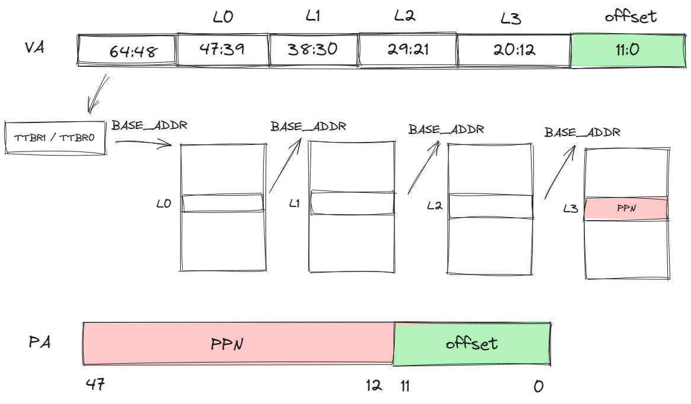
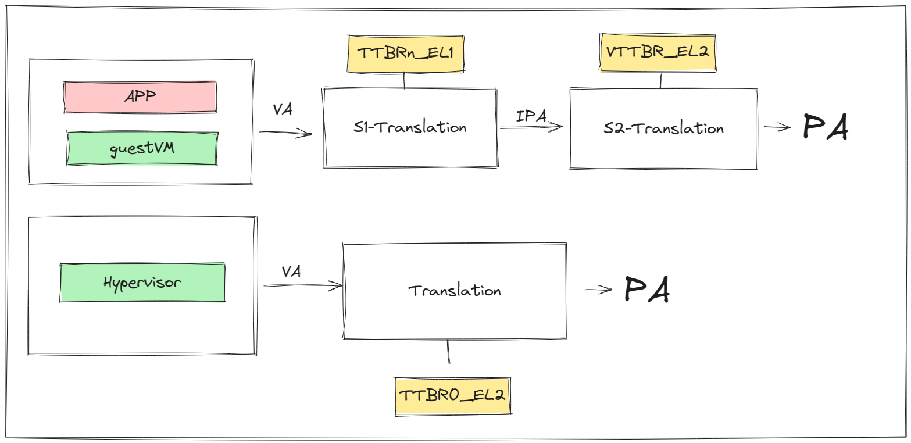

# 内存管理

## 堆上的内存分配

### 初始化分配器

平常在使用编程语言的时候，会遇到动态分配内存，比如在C语言中通过 `malloc` 或者 `new` 分配一块内存，再比如Rust中的 `Vec` 、`String` 等，都是在堆上分配内存。

为了能够在堆上分配内存，我们需要做以下这些事情：

- 初始化的时候提供一大块内存空间
- 提供分配和释放的接口
- 管理空闲块

总之，我们需要分配一大段空间，并且要设置一个分配器，将这段空间交给分配器管理，并且告诉Rust，我们现在有一个分配器了，请你把它用起来，允许我们使用 `Vec` 、`String` 这种在堆上分配内存的变量。也就是下面这几句在做的事情。

```
use buddy_system_allocator::LockedHeap;

use crate::consts::HV_HEAP_SIZE;

#[cfg_attr(not(test), global_allocator)]
static HEAP_ALLOCATOR: LockedHeap<32> = LockedHeap::<32>::new();

/// Initialize the global heap allocator.
pub fn init() {
    const MACHINE_ALIGN: usize = core::mem::size_of::<usize>();
    const HEAP_BLOCK: usize = HV_HEAP_SIZE / MACHINE_ALIGN;
    static mut HEAP: [usize; HEAP_BLOCK] = [0; HEAP_BLOCK];
    let heap_start = unsafe { HEAP.as_ptr() as usize };
    unsafe {
        HEAP_ALLOCATOR
            .lock()
            .init(heap_start, HEAP_BLOCK * MACHINE_ALIGN);
    }
    info!(
        "Heap allocator initialization finished: {:#x?}",
        heap_start..heap_start + HV_HEAP_SIZE
    );
}
```

`#[cfg_attr(not(test), global_allocator)]` 是条件编译的属性，仅当不在测试环境中时，将下一行定义的 `HEAP_ALLOCATOR`设置为Rust的全局内存分配器，现在Rust知道我们可以进行动态分配了。

`HEAP_ALLOCATOR.lock().init(heap_start, HEAP_BLOCK * MACHINE_ALIGN)` 将我们申请的一大段空间交给分配器管理。

### 测试

```
pub fn test() {
    use alloc::boxed::Box;
    use alloc::vec::Vec;
    extern "C" {
        fn sbss();
        fn ebss();
    }
    let bss_range = sbss as usize..ebss as usize;
    let a = Box::new(5);
    assert_eq!(*a, 5);
    assert!(bss_range.contains(&(a.as_ref() as *const _ as usize)));
    drop(a);
    let mut v: Vec<usize> = Vec::new();
    for i in 0..500 {
        v.push(i);
    }
    for (i, val) in v.iter().take(500).enumerate() {
        assert_eq!(*val, i);
    }
    assert!(bss_range.contains(&(v.as_ptr() as usize)));
    drop(v);
    info!("heap_test passed!");
}
```

在这段测试中，使用 `Box` 和 `Vec` 来检验我们分配的内存，是否在 `bss` 段中。

我们刚才交给分配器的一大段内存，是一个未初始化的全局变量，会被放在 `bss` 段，只需要测试我们获得变量的地址是否在这个范围内即可。

## Armv8的内存管理知识

### 寻址

地址总线默认48位，而发出的寻址请求是64位的，所以可以根据高16位将虚拟地址划分为2个空间：

- 高16位为1：内核空间
- 高16位为0：用户空间

站在guestVM的角度，在进行虚拟地址到物理地址的转换的时候，CPU会根据虚拟地址第63位的值选择TTBR寄存器，TTBR寄存器存的是一级页表的基地址，如果是用户空间，选择TTBR0，如果是内核空间，选择TTBR1。

### 四级页表映射（以页面大小为4K举例）

除了高16位是用来判断使用哪个页表基址寄存器外，后面的36位中，每9位作为每一级页表的页表项的索引，低12位为页内偏移。如下图所示。



### Stage-2页表机制

在开启虚拟化的环境下，系统中存在着两种地址映射过程：

- guestVM通过Stage-1地址转换，利用 `TTBR0_EL1` 或者 `TTBR1_EL1` ，将访问的VA转换为IPA，再通过Stage-2地址转换，利用 `VTTBR0_EL2` 将IPA转化为PA。
- Hypervisor上可能会跑自己的应用，该应用的VA到PA的转换只需要一次转换，利用 `TTBR0_EL2` 寄存器。



## hvsior的内存管理

### 物理页帧的管理

和上面关于堆的构造类似，页帧的分配也需要一个分配器，然后把我们用来分配的一段内存交给分配器管理。

**基于位图的分配器**

```
use bitmap_allocator::BitAlloc;
type FrameAlloc = bitmap_allocator::BitAlloc1M;

struct FrameAllocator {
    base: PhysAddr,
    inner: FrameAlloc,
}
```

`BitAlloc1M` 是一个基于位图的分配器，它通过管理页面编号，**提供哪些页面是空闲的、哪些是占用的信息**。

然后将位图分配器和用于页帧分配的起始地址封装成一个页帧分配器。

所以我们看到初始化函数如下：

```
fn init(&mut self, base: PhysAddr, size: usize) {
        self.base = align_up(base);
        let page_count = align_up(size) / PAGE_SIZE;
        self.inner.insert(0..page_count);
    }
```

传入页帧分配区域的起始地址，以及可供分配的空间大小，计算出这段空间中可供分配的页帧数 `page_size`，然后将所有页帧的编号通过 `insert` 函数告诉位图分配器。

**页帧的结构**

```
pub struct Frame {
    start_paddr: PhysAddr,
    frame_count: usize,
}
```

页帧的结构中包含了这个页帧的起始地址，这个页帧实例对应的页帧数，可能是0、1、或者大于1。

> 为什么存在页帧数为0的情况？
>
> 当hvisor希望访问通过 `Frame` 访问页帧内容时，这时需要一个临时的实例，不涉及页帧分配以及页帧回收，就以0作为一个标志。

> 为什么存在页帧数大于1的情况？
>
> 某些情况下，要求我们分配连续的内存，并且大小超过一个页，也就是分配多个连续页帧。

**分配alloc**

现在我们知道了页帧分配器可以分配一个空闲页帧的编号，把编号变为以一个 `Frame` 实例就完成了页帧的分配，单个页帧分配如下：

```
impl FrameAllocator {
    fn init(&mut self, base: PhysAddr, size: usize) {
        self.base = align_up(base);
        let page_count = align_up(size) / PAGE_SIZE;
        self.inner.insert(0..page_count);
    }
}

impl Frame {
    /// Allocate one physical frame.
    pub fn new() -> HvResult<Self> {
        unsafe {
            FRAME_ALLOCATOR
                .lock()
                .alloc()
                .map(|start_paddr| Self {
                    start_paddr,
                    frame_count: 1,
                })
                .ok_or(hv_err!(ENOMEM))
        }
    }
}
```

可以看到帧分配器帮助我们分配一个页帧，并返回起始物理地址，然后再创建 `Frame` 实例。

**页帧的回收**

`Frame` 结构和实际物理页联系在一起，遵循RAII设计规范，那么当一个 `Frame` 离开作用域，对应的内存区域也需要归还给hvisor。这要求我们实现 `Drop Trait` 中的 `drop` 方法，如下：

```
impl Drop for Frame {
    fn drop(&mut self) {
        unsafe {
            match self.frame_count {
                0 => {} // Do not deallocate when use Frame::from_paddr()
                1 => FRAME_ALLOCATOR.lock().dealloc(self.start_paddr),
                _ => FRAME_ALLOCATOR
                    .lock()
                    .dealloc_contiguous(self.start_paddr, self.frame_count),
            }
        }
    }
}

impl FrameAllocator{
    unsafe fn dealloc(&mut self, target: PhysAddr) {
        trace!("Deallocate frame: {:x}", target);
        self.inner.dealloc((target - self.base) / PAGE_SIZE)
    }
}
```

在 `drop` 中可以看到，帧计数为0的页帧不需要释放对应的物理页，帧计数大于1的说明是连续分配的页帧，需要回收不止一个物理页。

### 页表相关的数据结构

通过上面有关Armv8内存管理的知识，我们知道构建页表的过程分为两个部分，hvisor自己用的页表，以及Stage-2转换的页表，我们重点介绍Stage-2页表。

在此之前，我们还需要了解几个会用到的数据结构。

**逻辑段MemoryRegion**

逻辑段的描述，包括起始地址、大小、权限标志、映射方式。

```
pub struct MemoryRegion<VA> {
    pub start: VA,
    pub size: usize,
    pub flags: MemFlags,
    pub mapper: Mapper,
}
```

**地址空间MemorySet**

每个进程的地址空间的描述，包括了逻辑段的集合，以及该进程对应的页表。

```
pub struct MemorySet<PT: GenericPageTable>
where
    PT::VA: Ord,
{
    regions: BTreeMap<PT::VA, MemoryRegion<PT::VA>>,
    pt: PT,
}
```

**4级页表Level4PageTableImmut**

`root` 是L0页表所在的页帧。

```
pub struct Level4PageTableImmut<VA, PTE: GenericPTE> {
    /// Root table frame.
    root: Frame,
    /// Phantom data.
    _phantom: PhantomData<(VA, PTE)>,
}
```

### 构建Stage-2页表

我们需要为每个zone都构建一个Stage-2页表。

#### Stage-2页表需要映射的区域：

- guestVM所见的memory区域
- guestVM会访问的设备树的IPA
- guestVM所见的UART设备的内存区域

#### 向地址空间中添加映射关系

```
/// Add a memory region to this set.
    pub fn insert(&mut self, region: MemoryRegion<PT::VA>) -> HvResult {
        assert!(is_aligned(region.start.into()));
        assert!(is_aligned(region.size));
        if region.size == 0 {
            return Ok(());
        }
        if !self.test_free_area(&region) {
            warn!(
                "MemoryRegion overlapped in MemorySet: {:#x?}\n{:#x?}",
                region, self
            );
            return hv_result_err!(EINVAL);
        }
        self.pt.map(&region)?;
        self.regions.insert(region.start, region);
        Ok(())
    }
```

在地址空间中添加映射关系，除了上面的在我们的 `Map` 结构中添加虚拟地址和逻辑段的映射关系，还需要在页表中进行映射，如下：

```
fn map(&mut self, region: &MemoryRegion<VA>) -> HvResult {
        assert!(
            is_aligned(region.start.into()),
            "region.start = {:#x?}",
            region.start.into()
        );
        assert!(is_aligned(region.size), "region.size = {:#x?}", region.size);
        trace!(
            "create mapping in {}: {:#x?}",
            core::any::type_name::<Self>(),
            region
        );
        let _lock = self.clonee_lock.lock();
        let mut vaddr = region.start.into();
        let mut size = region.size;
        while size > 0 {
            let paddr = region.mapper.map_fn(vaddr);
            let page_size = if PageSize::Size1G.is_aligned(vaddr)
                && PageSize::Size1G.is_aligned(paddr)
                && size >= PageSize::Size1G as usize
                && !region.flags.contains(MemFlags::NO_HUGEPAGES)
            {
                PageSize::Size1G
            } else if PageSize::Size2M.is_aligned(vaddr)
                && PageSize::Size2M.is_aligned(paddr)
                && size >= PageSize::Size2M as usize
                && !region.flags.contains(MemFlags::NO_HUGEPAGES)
            {
                PageSize::Size2M
            } else {
                PageSize::Size4K
            };
            let page = Page::new_aligned(vaddr.into(), page_size);
            self.inner
                .map_page(page, paddr, region.flags)
                .map_err(|e: PagingError| {
                    error!(
                        "failed to map page: {:#x?}({:?}) -> {:#x?}, {:?}",
                        vaddr, page_size, paddr, e
                    );
                    e
                })?;
            vaddr += page_size as usize;
            size -= page_size as usize;
        }
        Ok(())
    }
```

我们大概解读一下上面这段函数，对于一个逻辑段 `MemoryRegion` ，我们以页为单位进行映射，每次映射一个页，直到覆盖整个逻辑段的大小。

具体的行为如下：

在对每一页映射之前，首先我们根据逻辑段的映射方式，确定这一页映射后对应的物理地址 `paddr` 。

然后确定页面的大小 `page_size` ，我们从1G的页面开始判断，如果物理地址能够对齐，剩下未映射的页面大小大于1G，并且没有禁用大页面映射，则选择1G作为页面大小，否则再检查2M页面大小，如果都不满足，则使用常规的4KB大小的页面。

目前我们获取了需要填充到页表项的信息了，我们将页面起始地址和页面大小合并为一个 `Page` 实例，在页表中进行映射，也就是修改页表项：

```
fn map_page(
        &mut self,
        page: Page<VA>,
        paddr: PhysAddr,
        flags: MemFlags,
    ) -> PagingResult<&mut PTE> {
        let entry: &mut PTE = self.get_entry_mut_or_create(page)?;
        if !entry.is_unused() {
            return Err(PagingError::AlreadyMapped);
        }
        entry.set_addr(page.size.align_down(paddr));
        entry.set_flags(flags, page.size.is_huge());
        Ok(entry)
    }
```

简单阐述这个函数的功能：首先我们根据VA，准确的说是根据这个VA对应的页号VPN，获取到对应的PTE，在PTE中填入控制位信息，以及物理地址（其实应该是PPN），具体可以在 `PageTableEntry` 中的set_addr方法看到，我们并没有把整个物理地址都填入，而是填入了除低12位以外的内容，因为我们的页表只关注页帧号的映射。

我们重点来看下如何获取PTE：

```
fn get_entry_mut_or_create(&mut self, page: Page<VA>) -> PagingResult<&mut PTE> {
        let vaddr: usize = page.vaddr.into();
        let p4 = table_of_mut::<PTE>(self.inner.root_paddr());
        let p4e = &mut p4[p4_index(vaddr)];

        let p3 = next_table_mut_or_create(p4e, || self.alloc_intrm_table())?;
        let p3e = &mut p3[p3_index(vaddr)];
        if page.size == PageSize::Size1G {
            return Ok(p3e);
        }

        let p2 = next_table_mut_or_create(p3e, || self.alloc_intrm_table())?;
        let p2e = &mut p2[p2_index(vaddr)];
        if page.size == PageSize::Size2M {
            return Ok(p2e);
        }

        let p1 = next_table_mut_or_create(p2e, || self.alloc_intrm_table())?;
        let p1e = &mut p1[p1_index(vaddr)];
        Ok(p1e)
    }
```

首先我们找到L0页表的起始地址，然后根据VA中L0的索引获取对应的页表项 `p4e` ，不过我们还不可以直接从 `p4e` 中获取下一级页表的起始地址，可能对应的页表还没创建，如果没有创建，就创建一个新的页表（这个过程也是需要分配页帧的），接着返回页表的起始地址，以此类推，我们获得了最后的L4页表中L4索引对应的页表项PTE。

**经过上面这样的过程对memory的映射（UART设备同理），我们还需要将L0页表基址填入VTTBR_EL2寄存器中，这个过程可以在Zone的MemorySet的Level4PageTable的activate函数中看到。**

> 在非虚拟化环境下，guestVM应该还可以访问MMIO和GIC等设备相关的内存区域，为什么没有进行映射？
>
> 这是因为虚拟化环境下，hvisor才是资源的管理者，不能随意让guestVM访问设备相关的区域，在前面异常处理中我们提过对MMIO/GIC的访问，实际上会由于没有进行地址映射而陷入EL2，由EL2进行访问后返回结果，如果在页表中进行了映射，那就会直接通过二阶段地址转换访问到资源，而没有经过EL2的控制。
>
> 所以在我们的设计中，只是对允许该Zone访问的MMIO在Zone中进行了注册，当发生相关异常的时候用来判断某个MMIO资源是否允许该Zone访问。
