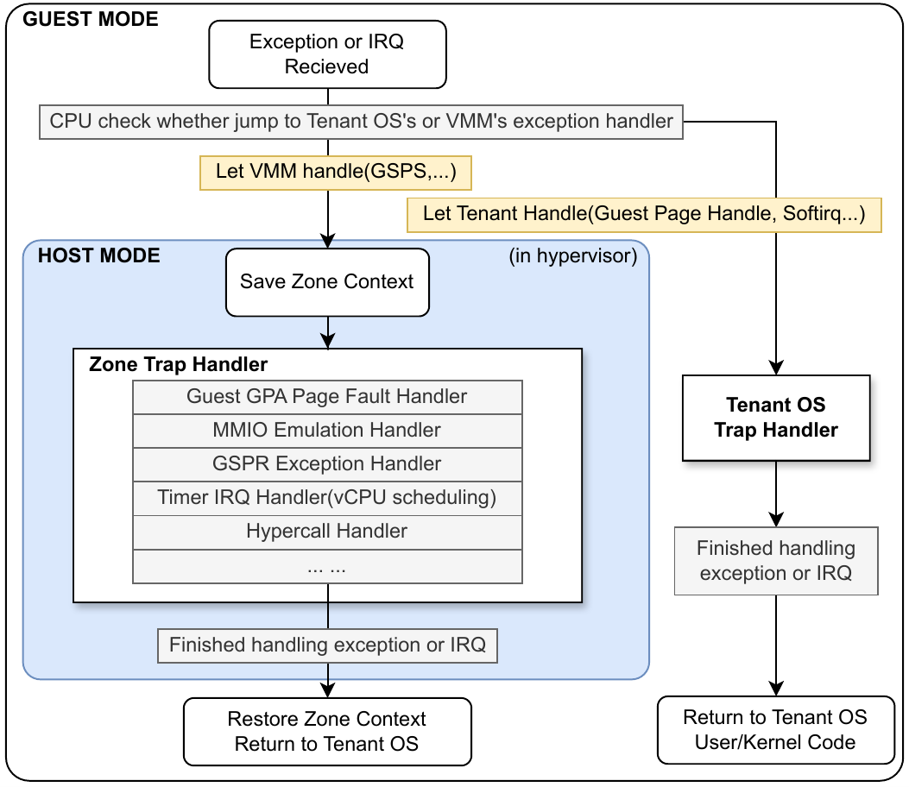

# LoongArch 处理器虚拟化

LoongArch指令集是中国龙芯中科公司于2020年发布的自主RISC指令集，包括基础指令集、二进制翻译拓展（LBT）、向量拓展（LSX）、高级向量扩展（LASX）和虚拟化拓展（LVZ）五个模块。

本文将主要对LoongArch指令集的CPU虚拟化设计进行简要介绍。

## LoongArch寄存器简介

### 通用寄存器使用约定[1]

| 名称          | 别名        | 用途                     | 在调用中是否保留 |
| ------------- | ----------- | ------------------------ | ---------------- |
| `$r0`         | `$zero`     | 常数 0                   | （常数）         |
| `$r1`         | `$ra`       | 返回地址                 | 否               |
| `$r2`         | `$tp`       | 线程指针                 | （不可分配）     |
| `$r3`         | `$sp`       | 栈指针                   | 是               |
| `$r4 - $r5`   | `$a0 - $a1` | 传参寄存器、返回值寄存器 | 否               |
| `$r6 - $r11`  | `$a2 - $a7` | 传参寄存器               | 否               |
| `$r12 - $r20` | `$t0 - $t8` | 临时寄存器               | 否               |
| `$r21`        | 保留        | （不可分配）             |                  |
| `$r22`        | `$fp / $s9` | 栈帧指针 / 静态寄存器    | 是               |
| `$r23 - $r31` | `$s0 - $s8` | 静态寄存器               | 是               |

### 浮点寄存器使用约定[1]

| 名称          | 别名           | 用途                     | 在调用中是否保留 |
| ------------- | -------------- | ------------------------ | ---------------- |
| `$f0 - $f1`   | `$fa0 - $fa1`  | 传参寄存器、返回值寄存器 | 否               |
| `$f2 - $f7`   | `$fa2 - $fa7`  | 传参寄存器               | 否               |
| `$f8 - $f23`  | `$ft0 - $ft15` | 临时寄存器               | 否               |
| `$f24 - $f31` | `$fs0 - $fs7`  | 静态寄存器               | 是               |

临时寄存器也被称为调用者保存寄存器。 静态寄存器也被称为被调用者保存寄存器。

### CSR寄存器

**控制状态寄存器（Control and Status Register, CSR）** 是LoongArch架构中一类特殊的寄存器，用于控制处理器的运行状态。
控制状态寄存器一览表（不包括LVZ虚拟化拓展中新的CSR）：

| 编号              | 名称                                  | 编号              | 名称                                  | 编号             | 名称                                  |
| ----------------- | ------------------------------------- | ----------------- | ------------------------------------- | ---------------- | ------------------------------------- |
| 0x0               | 当前模式信息 `CRMD`                   | 0x1               | 例外前模式信息 `PRMD`                 | 0x2              | 扩展部件使能 `EUEN`                   |
| 0x3               | 杂项控制 `MISC`                       | 0x4               | 例外配置 `ECFG`                       | 0x5              | 例外状态 `ESTAT`                      |
| 0x6               | 例外返回地址 `ERA`                    | 0x7               | 出错虚地址 `BADV`                     | 0x8              | 出错指令 `BADI`                       |
| 0xc               | 例外入口地址 `EENTRY`                 | 0x10              | TLB 索引 `TLBIDX`                     | 0x11             | TLB 表项高位 `TLBEHI`                 |
| 0x12              | TLB 表项低位 0 `TLBELO0`              | 0x13              | TLB 表项低位 1 `TLBELO1`              | 0x18             | 地址空间标识符 `ASID`                 |
| 0x19              | 低半地址空间全局目录基址 `PGDL`       | 0x1A              | 高半地址空间全局目录基址 `PGDH`       | 0x1B             | 全局目录基址 `PGD`                    |
| 0x1C              | 页表遍历控制低半部分 `PWCL`           | 0x1D              | 页表遍历控制高半部分 `PWCH`           | 0x1E             | STLB 页大小 `STLBPS`                  |
| 0x1F              | 缩减虚地址配置 `RVACFG`               | 0x20              | 处理器编号 `CPUID`                    | 0x21             | 特权资源配置信息 1 `PRCFG1`           |
| 0x22              | 特权资源配置信息 2 `PRCFG2`           | 0x23              | 特权资源配置信息 3 `PRCFG3`           | 0x30+n (0≤n≤15)  | 数据保存 `SAVEn`                      |
| 0x40              | 定时器编号 `TID`                      | 0x41              | 定时器配置 `TCFG`                     | 0x42             | 定时器值 `TVAL`                       |
| 0x43              | 计时器补偿 `CNTC`                     | 0x44              | 定时中断清除 `TICLR`                  | 0x60             | LLBit 控制 `LLBCTL`                   |
| 0x80              | 实现相关控制 1 `IMPCTL1`              | 0x81              | 实现相关控制 2 `IMPCTL2`              | 0x88             | TLB 重填例外入口地址 `TLBRENTRY`      |
| 0x89              | TLB 重填例外出错虚地址 `TLBRBADV`     | 0x8A              | TLB 重填例外返回地址 `TLBRERA`        | 0x8B             | TLB 重填例外数据保存 `TLBRSAVE`       |
| 0x8C              | TLB 重填例外表项低位 0 `TLBRELO0`     | 0x8D              | TLB 重填例外表项低位 1 `TLBRELO1`     | 0x8E             | TLB 重填例外表项高位 `TLBREHI`        |
| 0x8F              | TLB 重填例外前模式信息 `TLBRPRMD`     | 0x90              | 机器错误控制 `MERRCTL`                | 0x91             | 机器错误信息 1 `MERRINFO1`            |
| 0x92              | 机器错误信息 2 `MERRINFO2`            | 0x93              | 机器错误例外入口地址 `MERRENTRY`      | 0x94             | 机器错误例外返回地址 `MERRERA`        |
| 0x95              | 机器错误例外数据保存 `MERRSAVE`       | 0x98              | 高速缓存标签 `CTAG`                   | 0x180+n (0≤n≤3)  | 直接映射配置窗口 n `DMWn`             |
| 0x200+2n (0≤n≤31) | 性能监测配置 n `PMCFGn`               | 0x201+2n (0≤n≤31) | 性能监测计数器 n `PMCNTn`             | 0x300            | load/store 监视点整体控制 `MWPC`      |
| 0x301             | load/store 监视点整体状态 `MWPS`      | 0x310+8n (0≤n≤7)  | load/store 监视点 n 配置 1 `MWPnCFG1` | 0x311+8n (0≤n≤7) | load/store 监视点 n 配置 2 `MWPnCFG2` |
| 0x312+8n (0≤n≤7)  | load/store 监视点 n 配置 3 `MWPnCFG3` | 0x313+8n (0≤n≤7)  | load/store 监视点 n 配置 4 `MWPnCFG4` | 0x380            | 取指监视点整体控制 `FWPC`             |
| 0x381             | 取指监视点整体状态 `FWPS`             | 0x390+8n (0≤n≤7)  | 取指监视点 n 配置 1 `FWPnCFG1`        | 0x391+8n (0≤n≤7) | 取指监视点 n 配置 2 `FWPnCFG2`        |
| 0x392+8n (0≤n≤7)  | 取指监视点 n 配置 3 `FWPnCFG3`        | 0x393+8n (0≤n≤7)  | 取指监视点 n 配置 4 `FWPnCFG4`        | 0x500            | 调试寄存器 `DBG`                      |
| 0x501             | 调试例外返回地址 `DERA`               | 0x502             | 调试数据保存 `DSAVE`                  |                  |                                       |

对于实现了LVZ虚拟化拓展的处理器，还有一组用于控制虚拟化的CSR寄存器[3]。

| 编号 | 名称                     |
| ---- | ------------------------ |
| 0x15 | 客户机TLB控制 `GTLBC`    |
| 0x16 | TLBRD读Guest项 `TRGP`    |
| 0x50 | 客户机状态 `GSTAT`       |
| 0x51 | 客户机控制 `GCTL`        |
| 0x52 | 客户机中断控制 `GINTC`   |
| 0x53 | 客户机计数器补偿 `GCNTC` |

## CPU模式

实现了LVZ虚拟化拓展的CPU（即龙芯3系处理器）支持两个运行模式—— **Host模式和Guest模式** [3]，其中每个模式各自有四个特权级（PLV0-PLV3）。处理器核当前处于哪个特权等级由`CSR.CRMD`中`PLV`域的值唯一确定[2]。
对于无虚拟化的场景如在Host模式下启动一个Linux内核，其Linux内核态位于PLV0，用户态通常位于PLV3。
对于虚拟化场景，Host模式由Hypervisor使用，Guest模式则是Hypervisor所启动的虚拟机的运行模式。Guest模式在诸多方面受到Host模式下Hypervisor的控制，并且Guest模式下可以通过
Hypercall超级调用指令（hvcl）强制陷入Host模式下的Hypervisor。

下图是在loongarch架构下Hypervisor处理guest模式的异常的一种流程：

### GCSR寄存器组

在实现虚拟化的LoongArch处理器中会额外有一组 **GCSR（Guest Control and Status Register）** 寄存器，供Guest模式下的虚拟机内操作系统使用，这里需要和Host模式下的CSR寄存器区分开。
通过这一套GCSR寄存器可以让虚拟机有自己的特权资源和对应管理，同时避免和Hypervisor的特权资源冲突并减少虚拟机陷入Hypervisor的次数。需要注意的是虚拟机对GCSR寄存器的操作、对特权指令（`cpucfg`、`cacop`等）的执行等仍然可以被Hypervisor监控和控制，LVZ拓展允许Hypervisor自由选择是否对这些操作进行拦截。

### 进入Guest模式的流程（KVM）[4]

1. 【`switch_to_guest`】：

2. 清空`CSR.ECFG.VS`字段（设置为0，即所有异常共用一个入口地址）
3. 读取Hypervisor中保存的guest eentry（客户OS中断向量地址）-> GEENTRY
   1. 然后将GEENTRY写入`CSR.EENTRY`
4. 读取Hypervisor中保存的guest era（客户OS异常返回地址）-> GPC
   1. 然后将GPC写入`CSR.ERA`
5. 读取`CSR.PGDL`全局页表地址，存到Hypervisor中
6. 从Hypervisor中加载guest pgdl到`CSR.PGDL`
7. 读出`CSR.GSTAT.GID`和`CSR.GTLBC.TGID`，写入`CSR.GTLBC`
8. 将`CSR.PRMD.PIE`置1，打开Hypervisor级的全局中断
9. 将`CSR.GSTAT.PGM`置1，其目的是使ertn指令进入guest mode
10. Hypervisor将自己保存的该guest的通用寄存器（GPRS）恢复到硬件寄存器上（恢复现场）
11. **执行`ertn`指令，进入guest模式**

## 虚拟化相关的异常[2][3]

| code | subcode | 缩写 | 介绍                                                                                                                                               |
| ------ | ------- | ---- | -------------------------------------------------------------------------------------------------------------------------------------------------- |
| 22     | -       | GSPR | 客户机敏感特权资源异常，由`cpucfg`、`idle`、`cacop`指令触发，以及在虚拟机访问了不存在的GCSR和IOCSR时触发，强制陷入Hypervisor进行处理（如软件模拟） |
| 23     | -       | HVC  | hvcl超级调用指令触发的异常                                                                                                                         |
| 24     | 0       | GCM  | 客户机GCSR软件修改异常                                                                                                                             |
| 24     | 1       | GCHC | 客户机GCSR硬件修改异常                                                                                                                             |

### 处理Guest模式下异常的流程（KVM）[4]

1. 【`kvm_exc_entry`】：

2. Hypervisor首先保存好guest的通用寄存器（GPRS），保护现场。
3. Hypervisor保存`CSR.ESTAT` -> host ESTAT
4. Hypervisor保存`CSR.ERA` -> GPC
5. Hypervisor保存`CSR.BADV` -> host BADV，即触发地址错误例外时，记录出错的虚拟地址
6. Hypervisor保存`CSR.BADI` -> host BADI，该寄存器用于记录触发同步类例外的指令的指令码，所谓同步类例外是指除了中断（INT）、客户机CSR硬件修改例外（GCHC）、机器错误例外（MERR）之外的所有例外。
7. 读取Hypervisor保存好的host ECFG，写入`CSR.ECFG`（即切换到host下的异常配置）
8. 读取Hypervisor保存好的host EENTRY，写入`CSR.EENTRY`
9. 读取Hypervisor保存好的host PGD，写入`CSR.PGDL`（恢复host页表全局目录基址，低半空间）
10. 设置`CSR.GSTAT.PGM`关闭
11. 清空`GTLBC.TGID`域
12. 恢复kvm per cpu寄存器
    1. kvm汇编里涉及到KVM_ARCH_HTP, KVM_ARCH_HSP, KVM_ARCH_HPERCPU
13. **跳转到KVM_ARCH_HANDLE_EXIT位置处理异常**
14. 判断刚才的函数ret是否<=0
    1. 若<=0，则继续运行host
    2. 否则继续运行guest，保存percpu寄存器，因为可能会切换到不同的CPU继续运行guest。保存host percpu寄存器到`CSR.KSAVE`寄存器

15. 跳转到`switch_to_guest`

## vCPU上下文需要保存的寄存器

由LoongArch函数调用规范可知如果需要手动切换CPU函数运行上下文，需要保存的寄存器如下（不考虑浮点寄存器）：`$s0`-`$s9`、`$sp`、`$ra`

## 参考资料

[1] 龙芯中科技术股份有限公司.龙芯架构ELF psABI规范.Version 2.01.

[2] 龙芯中科技术股份有限公司.龙芯架构参考手册.卷一：基础架构.

[3] 龙芯中科技术股份有限公司.龙芯架构参考手册.卷三.

<!-- [4] https://github.com/torvalds/linux/blob/master/arch/loongarch/kvm/switch.S -->
[4] [https://github.com/torvalds/linux/blob/master/arch/loongarch/kvm/switch.S](https://github.com/torvalds/linux/blob/master/arch/loongarch/kvm/switch.S).