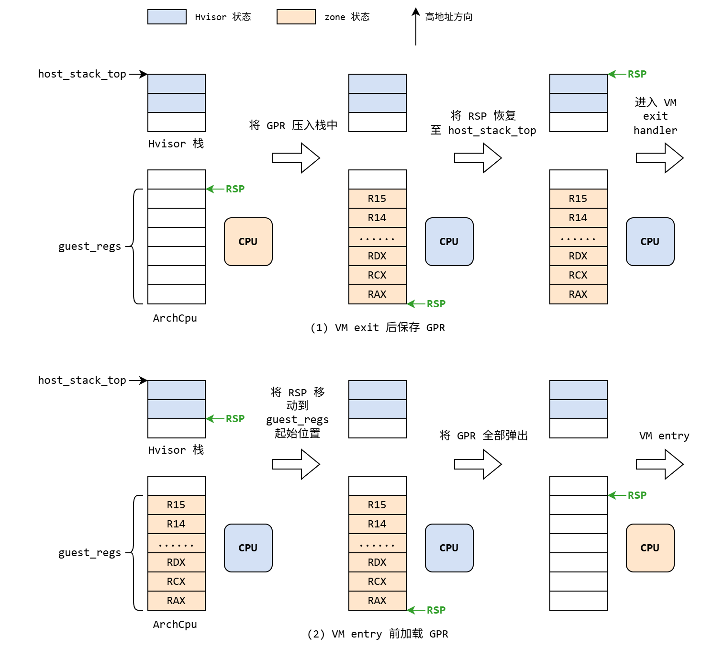

# X86_64 架构下的 CPU 虚拟化

## Intel VT-x

Intel 与 AMD 作为 x86 架构的两大厂商，分别推出了自己的硬件辅助虚拟化技术。Intel 将其命名为 VT-x 或 VMX，AMD 则称之为 AMD-V 或 SVM。Hvisor 实现了基于 Intel VT-x 的虚拟化，因此本小节重点围绕 VT-x 展开介绍。VT-x 引入了两种运行模式，统称为 VMX（Virtual Machine eXtension）操作模式，分别为：

- **根操作模式（VMX root operation）**，简称根模式，hypervisor 在此模式下运行。
- **非根操作模式（VMX non-root operation）**，简称非根模式，guest OS 在此模式下运行。

这两种模式均支持 Ring 0 至 Ring 3，guest OS 内核可以直接运行在非根模式下的 Ring 0 中，不再需要对特权级进行压缩。hypervisor 使用 `vmlaunch` 指令可将处理器从根模式切换到非根模式并进入 guest OS，这一过程被称为 VM entry。当 guest OS 执行某些需由 hypervisor 接管的操作时，会从非根模式返回到根模式，这一过程被称为 VM exit。相较于早期虚拟化机制以是否为特权指令作为陷入条件，VT-x 采用更灵活的策略，仅在 guest OS 执行敏感指令时才触发 VM exit。

在 CPU 虚拟化中，多个 vCPU 可以共享同一个 pCPU，其调度由 hypervisor 统一管理。当某个 vCPU 被分配到 pCPU 上运行时，基于该 vCPU 的 guest OS 就可以正常调度其内部的进程。也就是说，guest OS 内部的进程以时间片方式复用 vCPU，而多个 vCPU 又轮流使用底层的 pCPU。每当 vCPU 获得或释放 pCPU，或者在运行期间发生根模式与非根模式之间的切换，都会触发上下文切换。

VT-x 针对这种因资源复用引发的上下文切换，提供了底层硬件支持。每个 vCPU 都配备了一个独立的**虚拟机控制结构（virtual machine control structures，VMCS）**，可类比为进程调度使用的上下文结构。hypervisor 可在发生上下文切换时，借助 VMCS 保存或恢复 vCPU 的运行状态，从而实现高效的 pCPU 共享机制。每个 VMCS 占据一块大小为 4KB 的物理内存，称为 VMCS region，其内部依照功能不同被划分为多个区域：

- **Guest-state area**：用于保存 guest OS 的当前运行状态。在发生 VM exit 时，CPU 会自动将 guest OS 的相关状态写入此区域；而在 VM entry 时，则会从该区域加载并恢复 guest OS 的运行上下文。
- **Host-state area**：该区域仅在 VM exit 时使用，用于恢复 hypervisor 的预设状态。由于进入 hypervisor 类似于触发中断，因此每次 VM exit 直接使用固定的上下文即可，无需在 VM entry 时保存 hypervisor 的上下文。
- **VM-exit information fields**：由硬件在 VM exit 发生时自动填写，记录 guest OS 退出的原因，供 hypervisor 后续处理使用。
- **VM-execution/entry/exit control fields**：用于配置 CPU 在非根模式下的运行行为、进入与退出条件等控制信息。

## Hvisor 的 CPU 虚拟化实现

Hvisor 使用 `PerCpu` 结构体封装 pCPU 的虚拟化功能，该结构体内部包含一个名为 `arch_cpu` 的字段，类型为 `ArchCpu`，由各体系架构自行实现。x86 架构下的 `ArchCpu` 主要包含以下字段：

- `guest_regs`：用于在 VM exit 时保存 zone 的通用寄存器状态，并在 VM entry 时进行恢复。由于通用寄存器不包含在 VMCS 的 guest-state 区域中，因此需要由软件负责保存与恢复。
- `vmcs_region`：当前 vCPU 使用的 VMCS 区域。

Hvisor 在完成 `rust_main()` 中的初始化步骤后，会进入 `PerCpu` 提供的 `run_vm()` 方法，并最终由 `ArchCpu` 接管虚拟化的相关流程。在 x86 架构下的 `ArchCpu` 实现中，Hvisor 会首先检测当前 pCPU 是否支持 VT-x。如果支持，执行 `vmxon` 指令使能 VMX。随后，调用 `setup_vmcs()` 方法，将 `vmcs_region` 绑定至当前的 pCPU，并完成必要的 VMCS 配置。

虚拟化准备工作完成后，Hvisor 执行 `vmlaunch` 指令正式进入非根模式。如果当前 vCPU 是 zone0 的 BSP，控制流将跳转至 zone0 的入口地址，执行客户机操作系统的初始化流程；其余 vCPU 则进入一段循环的 guest 代码，等待被 zone0 BSP 唤醒。当 zone0 BSP 运行到多核启动阶段时，会向其余 vCPU 发送 `INIT` 和 `Start-up` 类型的 IPI。Hvisor 会在此时唤醒目标 vCPU，使其从 IPI 信号提供的入口地址进入 zone0。

如果 vCPU 在非根模式下触发 VM exit，控制流将返回根模式，并根据 VMCS 预先配置的 `host RIP` 字段跳转至 `ArchCpu::vmx_exit_handler()`，运行相应的处理程序。处理完成后，Hvisor 再执行 `vmresume` 指令，重新回到非根模式。

### 使能 VMX

在使能 VMX 之前，Hvisor 首先需通过 `cpuid` 指令确认 pCPU 是否支持 VT-x。若支持，则进一步检查 BIOS 是否启用了 `vmxon`。具体方法是读取 `IA32_FEATURE_CONTROL` 特定模块寄存器（model specific register, MSR），主要关注其中的第 0 位（`lock bit`）和第 2 位（`enable VMX outside SMX operation`）。如果第 2 位为 1，说明可以继续启用 VMX；反之，则需要将其置为 1。但该操作只能在第 0 位为 0 的情况下进行。若 `lock bit` 为 1 且第 2 位为 0，意味着 BIOS 已显式禁用了 `vmxon`，此时需要在 BIOS 设置中手动开启。

确认当前 pCPU 支持 VT-x 且未禁用 `vmxon` 后，Hvisor 会将控制寄存器 `CR4` 的第 13 位（`VMXE`）设置为 1，为 `ArchCpu::vmxon_region` 分配一块 4KB 的内存空间，最后执行 `vmxon` 指令并传入 `vmxon_region` 的地址，实现 VMX 的使能。由于 `vmxon` 指令仅对当前执行的 pCPU 生效，因此每个 pCPU 都必须分别执行一次 `vmxon`，并使用独立的 `vmxon_region` 内存区域。

### VMCS 配置

在执行 `vmlaunch` 首次进入非根模式之前，Hvisor 需要完成对 VMCS 的配置，该过程由 `setup_vmcs()` 方法负责。在该方法中，首先为 `ArchCpu::vmcs_region` 分配一块 4KB 内存，接着通过 `vmclear` 和 `vmptrld` 指令将其与当前 pCPU 绑定，并依次调用 `setup_vmcs_host()`、`setup_vmcs_guest()` 和 `setp_vmcs_control()` 完成对 VMCS 各区域的配置。需要注意的是，VMCS 的读写必须通过 `vmread` 和 `vmwrite` 指令完成，不能直接使用普通内存访问操作。

- `setup_vmcs_host()` 用于配置 VMCS 的 host-state 区域。大多数字段可以直接读取当前 Hvisor 的寄存器状态进行设置。而指令指针 `host RIP` 需要写入 `ArchCpu::vmx_exit_handler()` 的地址，使得 VM exit 时会自动跳转到处理程序中。栈指针 `host RSP` 也要进行特殊设置，以实现 vCPU 的上下文切换，下文将予以介绍。

- `setup_vmcs_guest()` 负责 guest-state 区域的初始化。Hvisor 选择以 16 位实模式启动 zone，因此需要关闭 `guest CR0` 中的保护模式位 `PE` 和分页位 `PG`，并配置 `guest CR0` 的 `guest/host mask` 及 `read shadow`，使得 zone 可以在之后自行修改 `guest CR0` 以进入保护模式和长模式。由于实模式下并没有段描述符与页表，Hvisor 无需为客户机进行 GDT 和页表的配置，在实现上更加简便。但若是希望从 32 位入口点进入 zone，则必须借助一段额外的 16 位跳板代码，在非根模式下完成 GDT 的初始化并切换至保护模式。

- `setp_vmcs_control()` 负责设置 VMCS 中的 VM-execution/entry/exit control 区域。对该区域的配置包括但不限于：在 `primary processor-based VM-execution controls`（以下简称 `primary controls`）中禁用对 `CR3` 的读写拦截，允许 zone 自由切换页表；在 `secondary processor-based VM-execution controls`（以下简称 `secondary controls`）中启用 `unrestricted guest`，允许 zone 在实模式下运行。

### vCPU 上下文切换

在 VM entry 与 VM exit 的过程中，硬件会利用 VMCS 自动完成 Hvisor 与 zone 的上下文切换。但这一机制并不涵盖 zone 的通用寄存器（general purpose registers, GPR），需由软件显式保存与恢复。因此，在执行 `vmlaunch` 或 `vmresume` 之前，需从内存中恢复 zone 的 GPR；而在 VM exit 后，尽管 VMCS 已完成状态切换，但通用寄存器中仍保留着 zone GPR，需在此时将其保存至特定内存区域，供后续 VM exit 处理程序访问。

Hvisor 使用 `ArchCpu::guest_regs` 字段专门保存 zone GPR，并将其末尾位置作为 VM exit 时的临时栈顶。同时，`ArchCpu::host_stack_top` 字段负责记录 Hvisor 的真实栈顶。在配置 VMCS 时，将 `host RSP` 设置为临时栈顶的地址。这样在发生 VM exit 时，硬件会首先将栈指针指向 `guest_regs` 的末尾，Hvisor 随即将 zone GPR 压入临时栈，即 `guest_regs` 所在内存区域。等到 zone GPR 保存完成后，再将栈指针恢复为 `host_stack_top` 的值，回到真实的 Hvisor 栈中。而在 VM entry 进入 zone 之前，Hvisor 还需将栈指针设置为 `guest_regs` 的起始地址，从该处依次弹出并恢复 zone GPR。

