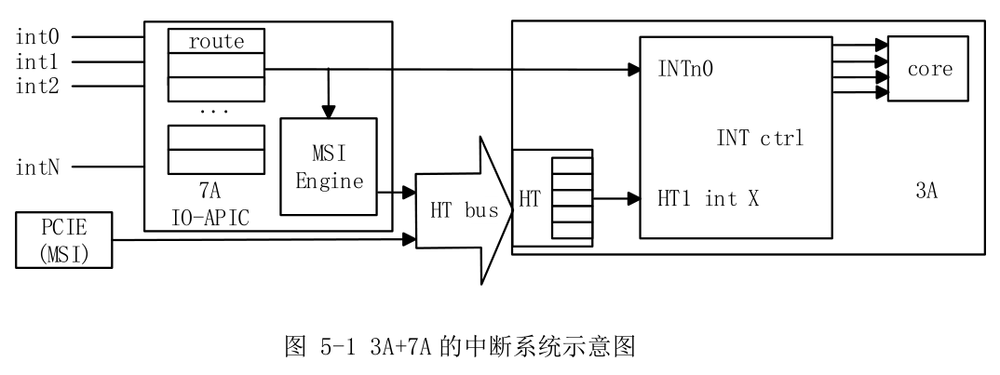
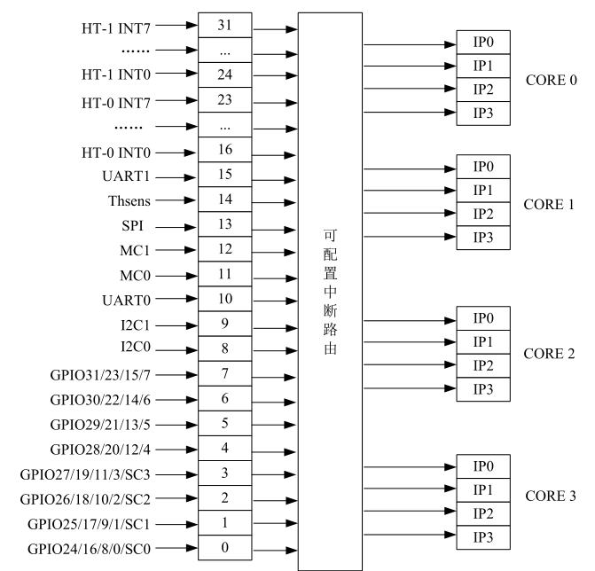

# LoongArch 中断控制

由于龙芯不同处理器/开发板的中断控制器各自设计不同（嵌入式处理器如2K1000有自己的中断控制器设计，3系处理器则有7A1000和7A2000桥片负责外部中断控制），本文IO中断部分主要对最新的**龙芯7A2000桥片**内的中断控制器进行介绍[1]。

## CPU中断

LoongArch的中断配置由`CSR.ECFG`控制，龙芯架构下的中断采用线中断的形式，每个处理器核内部可以记录 13 个线中断。这些中断包括：1 个核间中断（IPI），1 个定时器中断（TI），1 个性能监测计数溢出中断（PMI），8 个硬中断（HWI0~HWI7），以及 2 个软中断（SWI0~SWI1）。所有线中断均为电平中断，并且都是高电平有效[3]。

- **核间中断**：来自核外的中断控制器，被记录在 `CSR.ESTAT.IS[12]` 位。
- **定时器中断**：源自核内的恒定频率定时器，当计时至全 0 值时触发，并被记录在 `CSR.ESTAT.IS[11]` 位。清除方法是通过软件向 `CSR.TICLR` 寄存器的 `TI` 位写 1。
- **性能计数器溢出中断**：源自核内的性能计数器，当任一开启中断使能的性能计数器的第 63 位为 1 时触发，并记录在 `CSR.ESTAT.IS[10]` 位。清除方法是将引起中断的性能计数器的第 63 位清 0 或关闭该性能计数器的中断使能。
- **硬中断**：来自处理器核外部的中断控制器，8 个硬中断 `HWI[7:0]` 被记录在 `CSR.ESTAT.IS[9:2]` 位。
- **软中断**：来自处理器核内部，通过软件指令对 `CSR.ESTAT.IS[1:0]` 写 1 置起，写 0 清除。

中断在 `CSR.ESTAT.IS` 域中记录的位置的索引值也被称为中断号（Int Number）。例如，`SWI0` 的中断号为 0，`SWI1` 的中断号为 1，依此类推，`IPI` 的中断号为 12。

## 传统IO中断

上图是3A系列处理器+7A系列桥片的中断系统示意图。图中表示了两种中断方式的过程，上部表示的是通过中断线`INTn0`来中断，下部表示的是通过HT消息包来中断。

设备（除了工作在MSI模式的PCIe设备）发出的中断`intX`送给7A内部中断控制器，经过中断路由后送到桥片引脚或者转换成HT消息包发给3A的HT控制器，3A的中断控制器通过外部中断引脚或者HT控制器中断接收到该中断，并经过中断路由中断某个处理器核[1]。

龙芯3A5000芯片的**传统 IO 中断**支持32个中断源，以统一方式进行管理，如下图所示。
任意一个IO中断源可以被配置为是否使能、触发的方式、以及被路由的目标处理器核中断脚。传统中断*不支持*中断的跨片分发，只能中断同一个处理器片内的处理器核[2]。

## 拓展IO中断

除了兼容原有的传统 IO 中断方式，3A5000 开始支持**扩展 I/O 中断**，用于将 HT 总线上的 256 位中断直接分发给各个处理器核，而不再通过 HT 的中断线进行转发，提升 IO 中断使用的灵活性[2]。

## 参考资料

[1] 龙芯中科技术股份有限公司.龙芯7A2000桥片用户手册.V1.0.第5章.

[2] 龙芯中科技术股份有限公司.龙芯3A5000/3B5000处理器寄存器使用手册-多核处理器架构、寄存器描述与系统软件编程指南.V1.3.第11章.

[3] 龙芯中科技术股份有限公司.龙芯架构参考手册.卷一：基础架构.