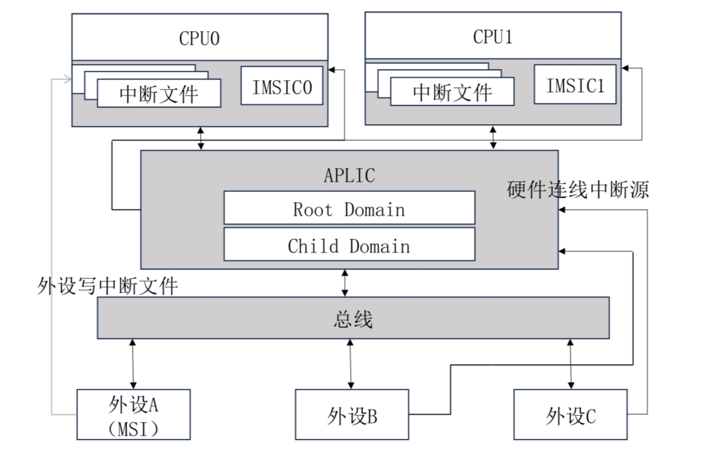
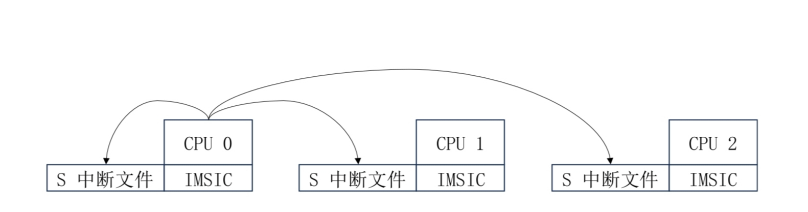

# 总体结构
AIA主要包括两个部分，消息中断控制器 IMSIC 和高级平台级中断控制器 APLIC ，总体结构如图所示

外设既可以选择发送消息中断，也可以选择通过线连接的方式发送有线中断。

如果外设 A 支持消息中断，那么只需要向指定 hart 的中断文件写入指定的数据，之后 IMSIC 就会向目标处理器投送一个中断。

对于所有设备，都可以通过中断线向 APLIC 发送中断，APLIC 将会根据配置，选择通过中断线向指定的处理器发送中断，还是通过写中断文件来发送一个消息中断。

在hvisor中，中断的投送模式为 MSI

在hvisor中使用 `IRQ=aia`开启 AIA 规范后，时钟中断的处理仍然一致，软件中断和外部中断的处理有些变化
# 外部中断
## IMSIC
IMSIC通过读写虚拟中断文件的方式来支持虚拟化，hvisor中一个物理 hart 对应一个虚拟 hart
## APLIC
虚拟机中的外部中断触发时，将访问 vPLIC 的地址空间，然而 PLIC 并不支持虚拟化，这个地址空间是未被映射的。因此会触发缺页异常，陷入到 hvisor 中来处理
```rs
pub fn guest_page_fault_handler(current_cpu: &mut ArchCpu) {
    ...
    if addr >= host_aplic_base && addr < host_aplic_base + host_aplic_size {
        let mut inst: u32 = read_csr!(CSR_HTINST) as u32;
        ...
        if let Some(inst) = inst {
                vaplic_emul_handler(current_cpu, addr, inst);
                current_cpu.sepc += ins_size;
            }
        ...
    }
}
```
# 软件中断
开启AIA规范后，虚拟机的linux内核会通过 msi 的方式来发送 IPI，不需要再使用 ecall 指令陷入到 hvisor 中

如图所示，向指定hart的中断文件写入，即可触发 IPI。

在虚拟机中，只需要向指定的虚拟中断文件写入，即可实现虚拟机中的 IPI，无需hvisor的模拟支持。