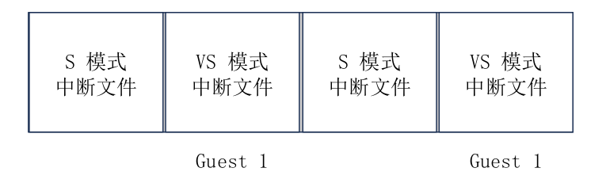
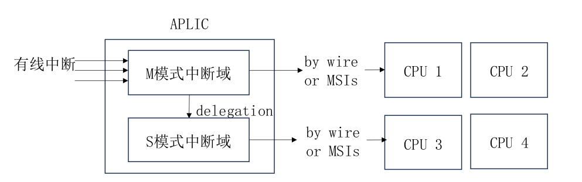

# 总体结构
AIA主要包括两个部分，消息中断控制器 IMSIC 和高级平台级中断控制器 APLIC ，总体结构如图所示


外设既可以选择发送消息中断，也可以选择通过线连接的方式发送有线中断。

如果外设 A 支持MSI，那么只需要向指定 hart 的中断文件写入指定的数据，之后 IMSIC 就会向目标处理器投送一个中断。

对于所有设备，都可以通过中断线与 APLIC 连接， APLIC 将会根据配置，选择中断投送模式为：
* 有线中断
* MSI

在hvisor中，中断的投送模式为 MSI

在hvisor中使用 `IRQ=aia`开启 AIA 规范后，时钟中断的处理仍然一致，软件中断和外部中断的处理有些变化
# 外部中断
## IMSIC

hvisor中一个物理 CPU 对应一个虚拟 CPU ，它们都拥有自己的中断文件



向某个中断文件写入，即可触发指定 hart 指定特权级别的外部中断

为 IMSIC 提供二阶段地址映射表
```rs
        let paddr = 0x2800_0000 as HostPhysAddr;
        let size = PAGE_SIZE;
        self.gpm.insert(MemoryRegion::new_with_offset_mapper(
            paddr as GuestPhysAddr,
            paddr + PAGE_SIZE * 1,
            size,
            MemFlags::READ | MemFlags::WRITE,
        ))?;
        ...
```

## APLIC
### 结构
全局只有一个 APLIC 

有线中断到来时，首先到达位于机器模式的根中断域（OpenSBI），之后中断路由到子中断域（hvisor），hvisor将中断信号按照 APLIC 配置好的 target 的寄存器，以 MSI 的方式发送给虚拟机对应的 CPU。



在 AIA 规范手册中指定了 APLIC 各个字段的字节偏移。定义 APLIC 结构体如下，通过以下方法实现对 APLIC 字段的读写
```rs
#[repr(C)]
pub struct Aplic {
    pub base: usize,
    pub size: usize,
}
impl Aplic {
    pub fn new(base: usize, size: usize) -> Self {
        Self {
            base,
            size,
        }
    }
    pub fn read_domaincfg(&self) -> u32{
        let addr = self.base + APLIC_DOMAINCFG_BASE;
        unsafe { core::ptr::read_volatile(addr as *const u32) }
    }
    pub fn set_domaincfg(&self, bigendian: bool, msimode: bool, enabled: bool){
        ...
        let addr = self.base + APLIC_DOMAINCFG_BASE;
        let src = (enabled << 8) | (msimode << 2) | bigendian;
        unsafe {
            core::ptr::write_volatile(addr as *mut u32, src);
        }
    }
    ...
}
```

### 初始化
根据设备树中的基地址和大小初始化 APLIC
```rs
pub fn primary_init_early(host_fdt: &Fdt) {
    let aplic_info = host_fdt.find_node("/soc/aplic").unwrap();
    init_aplic(
        aplic_info.reg().unwrap().next().unwrap().starting_address as usize,
        aplic_info.reg().unwrap().next().unwrap().size.unwrap(),
    );
}
pub fn init_aplic(aplic_base: usize, aplic_size: usize) {
    let aplic = Aplic::new(aplic_base, aplic_size);
    APLIC.call_once(|| RwLock::new(aplic));
}
pub static APLIC: Once<RwLock<Aplic>> = Once::new();
pub fn host_aplic<'a>() -> &'a RwLock<Aplic> {
    APLIC.get().expect("Uninitialized hypervisor aplic!")
}
```
APLIC全局只有一个，因此加锁避免读写冲突，使用 host_aplic() 方法进行访问

虚拟机启动时，将访问 APLIC 的地址空间进行初始化配置，这个地址空间是未被映射的。因此会触发缺页异常，陷入到 hvisor 中来处理
```rs
pub fn guest_page_fault_handler(current_cpu: &mut ArchCpu) {
    ...
    if addr >= host_aplic_base && addr < host_aplic_base + host_aplic_size {
        let mut inst: u32 = read_csr!(CSR_HTINST) as u32;
        ...
        if let Some(inst) = inst {
                vaplic_emul_handler(current_cpu, addr, inst);
                current_cpu.sepc += ins_size;
            }
        ...
    }
}
```
判断访问的地址空间属于 APLIC 的范围，解析访问指令，进入 vaplic_emul_handler 实现对虚拟机中 APLIC 的模拟

```rs
pub fn vaplic_emul_handler(
    current_cpu: &mut ArchCpu,
    addr: GuestPhysAddr,
    inst: Instruction,
) {
    let host_aplic = host_aplic();
    let offset = addr.wrapping_sub(host_aplic.read().base);
    if offset >= APLIC_DOMAINCFG_BASE && offset < APLIC_SOURCECFG_BASE {
        match inst {
            Instruction::Sw(i) => {
                ...
                host_aplic.write().set_domaincfg(bigendian, msimode, enabled);
            }
            Instruction::Lw(i) => {
                let value = host_aplic.read().read_domaincfg();
                current_cpu.x[i.rd() as usize] = value as usize;
            }
            _ => panic!("Unexpected instruction {:?}", inst),
        }
    }
    ...
}
```
## 中断过程
hvisor 通过缺页异常的方式完成对虚拟机模拟 APLIC 初始化后，进入到虚拟机中，以键盘按下产生的中断为例:中断信号首先来到 OpenSBI ，之后中断路由至 hvisor ,根据target寄存器的配置，向虚拟中断文件写入触发虚拟机的外部中断。
# 软件中断
开启 AIA 规范后，虚拟机的 linux 内核会通过 msi 的方式来发送 IPI，不需要再使用 ecall 指令陷入到 hvisor 中


如图所示，在hvisor中，向指定hart的中断文件写入，即可触发 IPI。

在虚拟机中，只需要向指定的虚拟中断文件写入，即可实现虚拟机中的 IPI，无需hvisor的模拟支持。