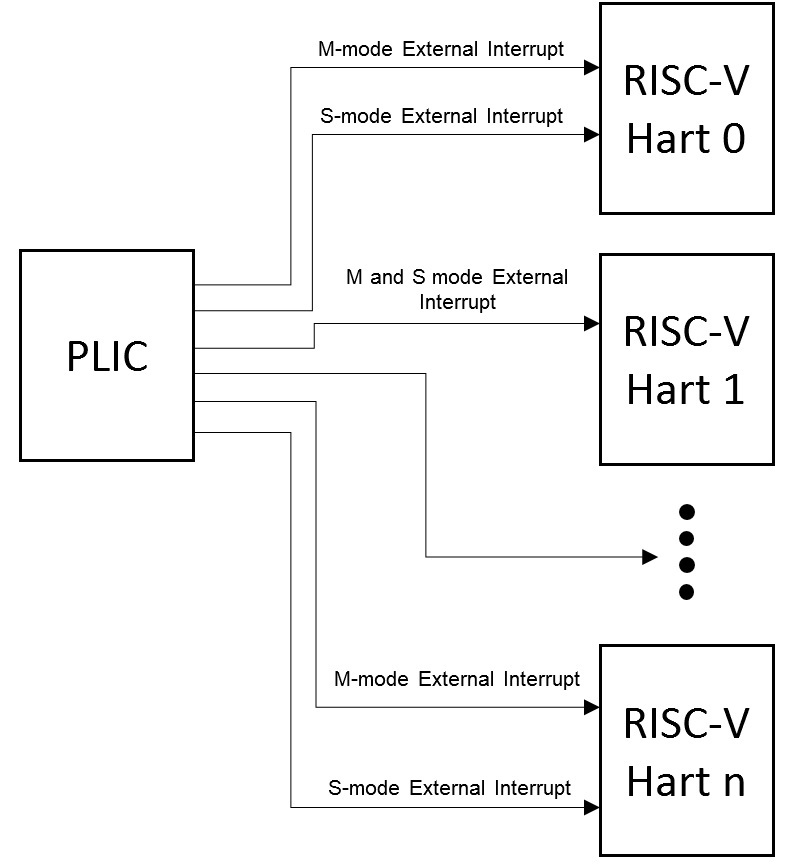
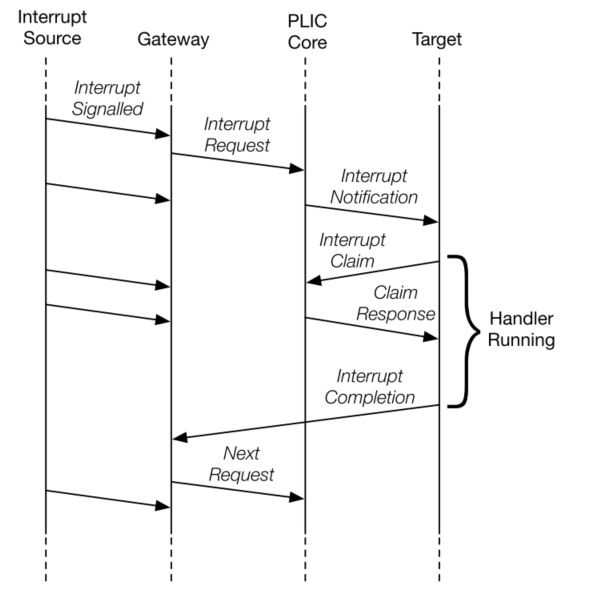

# 中断的来源
在 hvisor 中有三种中断类型：时钟中断，软件中断和外部中断。

时钟中断：当 time 寄存器变得大于 timecmp 寄存器时，产生一个时钟中断

软件中断: 在多核系统中，一个 hart 向另一个 hart 发送核间中断，通过SBI调用来实现

外部中断: 外部设备通过中断线将中断信号传给处理器

# 时钟中断
虚拟机需要触发时钟中断时，通过 ecall 指令陷入到 hvisor 中
```rust
        ExceptionType::ECALL_VS => {
            trace!("ECALL_VS");
            sbi_vs_handler(current_cpu);
            current_cpu.sepc += 4;
        }
        ...
pub fn sbi_vs_handler(current_cpu: &mut ArchCpu) {
    let eid: usize = current_cpu.x[17];
    let fid: usize = current_cpu.x[16];
    let sbi_ret;
    match eid {
        ...
            SBI_EID::SET_TIMER => {
            sbi_ret = sbi_time_handler(fid, current_cpu);
        }
        ...
    }
}
```
如果没有开启 sstc 扩展，则需要通过 SBI 调用陷入到机器模式，设置 mtimecmp 寄存器，清零虚拟机的时钟中断挂起位，打开 hvisor 的时钟中断使能位；如果开启了 sstc 扩展，则可以直接设置 stimecmp 。
```rs
pub fn sbi_time_handler(fid: usize, current_cpu: &mut ArchCpu) -> SbiRet {
...
    if current_cpu.sstc {
        write_csr!(CSR_VSTIMECMP, stime);
    } else {
        set_timer(stime);
        unsafe {
            // clear guest timer interrupt pending
            hvip::clear_vstip();
            // enable timer interrupt
            sie::set_stimer();
        }
    }
    return sbi_ret;
}
```
当 time 寄存器变得大于 timecmp 寄存器时，产生一个时钟中断

中断触发后，保存陷入上下文，并分发到相对应的处理函数中
```rs
        InterruptType::STI => {
            unsafe {
                hvip::set_vstip();
                sie::clear_stimer();
            }
        }
```
将虚拟机的时钟中断挂起位置为1，即向虚拟机注入时钟中断，将hvisor的时钟中断使能位清零，完成中断处理

# 软件中断
虚拟机需要发送 IPI 时，通过 ecall 指令陷入到 hvisor 中
```rs
        SBI_EID::SEND_IPI => {
            ...
            sbi_ret = sbi_call_5(
                eid,
                fid,
                current_cpu.x[10],
                current_cpu.x[11],
                current_cpu.x[12],
                current_cpu.x[13],
                current_cpu.x[14],
            );
        }
```
再通过 SBI 调用陷入到机器模式中向指定的 hart 发送 IPI ，设置 mip 寄存器的 SSIP 为1即可向hvisor注入核间中断

中断触发后，保存陷入上下文，并分发到相对应的处理函数中
```rs
pub fn handle_ssi(current_cpu: &mut ArchCpu) {
    ...
    clear_csr!(CSR_SIP, 1 << 1);
    set_csr!(CSR_HVIP, 1 << 2);
    check_events();
}
```
将虚拟机的软件中断挂起位置为1,向虚拟机中注入软件中断。之后判断核间中断的类型，唤醒或阻塞cpu，或是处理 VIRTIO 的相关的中断请求

# 外部中断
## PLIC
RISC-V 通过 PLIC 实现对外部中断处理，PLIC 不支持虚拟化，不支持 MSI



PLIC 架构框图

PLIC的中断流程示意图如下




中断源通过中断线向 PLIC 发送一个中断信号，只有当中断的优先级大于阈值的时候，才可以通过阈值寄存器的筛选。

之后读取 claim 寄存器得到 pending 的优先级最高的中断，之后清除对应的 pending 位。传给目标hart进行中断处理

处理完成后向 complete 寄存器写入中断号，可以接收下一个中断请求
## 初始化
初始化的过程与AIA类似
## 处理过程
虚拟机中的外部中断触发时，将访问 vPLIC 的地址空间，然而 PLIC 并不支持虚拟化，这个地址空间是未被映射的。因此会触发缺页异常，陷入到 hvisor 中来处理

异常触发后，保存陷入上下文，进入到缺页异常处理函数中

```rs
pub fn guest_page_fault_handler(current_cpu: &mut ArchCpu) {
    ...
    if addr >= host_plic_base && addr < host_plic_base + PLIC_TOTAL_SIZE {
        let mut inst: u32 = read_csr!(CSR_HTINST) as u32;
        ...
        if let Some(inst) = inst {
            if addr >= host_plic_base + PLIC_GLOBAL_SIZE {
                vplic_hart_emul_handler(current_cpu, addr, inst);
            } else {
                vplic_global_emul_handler(current_cpu, addr, inst);
            }
            current_cpu.sepc += ins_size;
        } 
        ...
    }
}
```
判断发生缺页异常的地址是否在 PLIC 的地址空间内，之后解析发生异常的指令，根据访问地址和访问指令，修改 PLIC 的地址空间来实现对于 vPLIC 的模拟配置
```rs
pub fn vplic_hart_emul_handler(current_cpu: &mut ArchCpu, addr: GuestPhysAddr, inst: Instruction) {
    ...
    if offset >= PLIC_GLOBAL_SIZE && offset < PLIC_TOTAL_SIZE {
        ...
        if index == 0 {
            // threshold
            match inst {
                Instruction::Sw(i) => {
                    // guest write threshold register to plic core
                    let value = current_cpu.x[i.rs2() as usize] as u32;
                    host_plic.write().set_threshold(context, value);
                }
                _ => panic!("Unexpected instruction threshold {:?}", inst),
            }
            ...
        }
    }
}
```