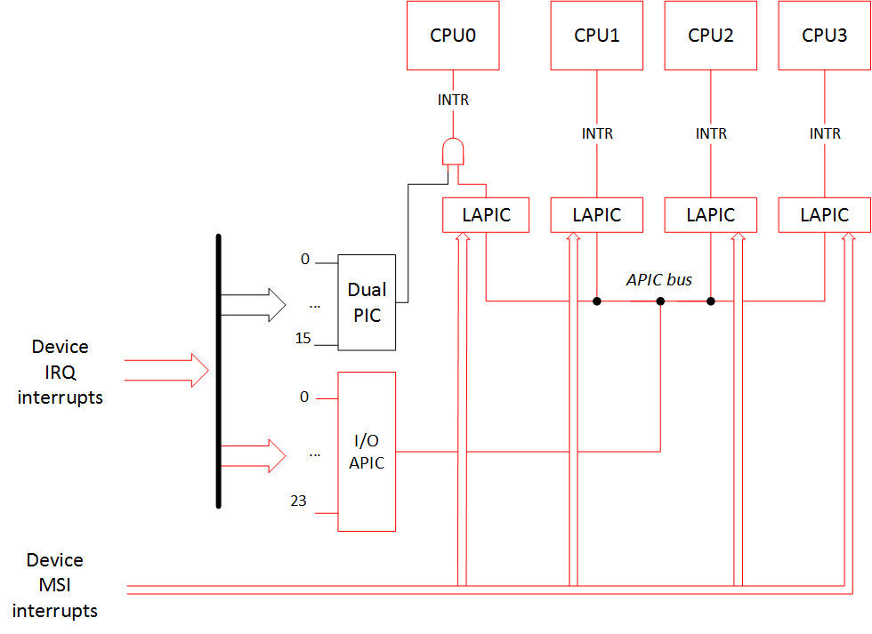

# X86_64 架构下的中断虚拟化

## X86_64 中断处理

中断（interrupt）是硬件或软件向 CPU 发出的一种异步信号。CPU 在收到中断后，会暂停当前运行的程序，保存上下文，转而执行中断处理程序。执行完毕后，继续运行原先的程序。中断分为硬件中断与软件中断，硬件中断由外部设备产生，软件中断则来自软件程序中的特定的指令。

x86 架构使用中断描述符表（interrupt descriptor table，IDT）记录所有中断处理程序的位置。每个中断处理程序在 IDT 中具有唯一索引，被称为向量号（vector）。IDT 支持的 vector 范围为 0-255，其中 0-31 号由架构预留，用于架构定义的异常和中断；32-255 号由用户自行使用，它们通常被分配给外部设备。

在中断机制发展的早期，外部设备需要与 CPU 的 INTR 引脚连通才能发送中断请求（interrupt request，IRQ）。然而 INTR 引脚在数量上受到限制，无法直接与大量设备相连。此时就需要中断控制器（interrupt controller）作为代理，在设备与 CPU 之间进行中断的传递。设备所使用的 IRQ 号与中断处理程序所使用的 vector 并不等价，因此中断控制器的作用之一就是将中断信号从 IRQ 号翻译为 vector。

x86 最早的中断控制器名为可编程中断控制器（programmable interrupt controller，PIC），单个 PIC 可支持 8 个 IRQ，通过级联的方式能扩展 IRQ 的数量。然而，PIC 只能往一个 CPU 发送中断，不能满足如今多核系统的需求。后来，高级可编程中断控制器（advanced programmable interrupt controller，APIC）出现并逐渐取代 PIC。APIC 由 Local APIC（LAPIC）和 I/O APIC 两部分组成。每个 CPU 有属于自己的 LAPIC，可以通过 APIC ID 对其进行区分。LAPIC 彼此之间通过 APIC 总线相连，可以互相发送核间中断（inter-process interrupt，IPI）。I/O APIC 负责接收设备的 IRQ，使用可配置的中断重定向表（redirection table）将 IRQ 翻译成 vector 后，沿 APIC 总线向 LAPIC 发送中断信号，最后再由 LAPIC 转发给 CPU。典型的 I/O APIC 支持 23 个 IRQ：IRQ 0-15 用于兼容 PIC 时代的 ISA 设备，IRQ 16-23 由 PCI 设备使用中断路由表进行共享。

PCIe 总线的出现引入了一种全新的中断传递机制：消息信号中断（message signaled interrupts，MSI）及其扩展版本 MSI-X。与传统中断方式不同，MSI/MSI-X 通过向 LAPIC 的 MMIO 区域指定位置写入特定数据即可触发中断，无需额外的中断引脚 INTR。这种机制允许通过 PCI 配置空间设置中断对应的 vector 和目标 LAPIC 的 APIC ID，实现更灵活的中断管理。在 Linux 的默认配置中，系统优先采用 MSI 或 MSI-X；对于不支持该机制的旧设备，则仍然依赖 I/O APIC 进行中断传递。

## 中断虚拟化

中断是一种由外部设备发起，用于异步通知 CPU 的事件机制。在非虚拟化环境中，当设备触发中断，CPU 会捕获该中断，并直接跳转至操作系统内核中预设的中断处理程序。而在虚拟化环境下，中断被划分为两种类型：一类是由物理设备产生的物理中断（pIRQ），另一类是 hypervisor 转发给 guest OS 的虚拟中断（vIRQ）。为了避免 guest OS 与 hypervisor 在 vector 使用上的冲突，pIRQ 通常由 hypervisor 统一接收和管理，而不会直接传递给 guest OS。hypervisor 在接收到 pIRQ 后，会利用硬件提供的中断虚拟化机制，将其转换为相应的 vIRQ 并传递至 guest OS。

Intel VT-x 提供了两种向 guest OS 传递中断的方法。第一种方法基于中断注入（interrupt injection）机制，虽然实现较为简单，但每次 pIRQ 到达时都需要触发一次 VM exit，由 hypervisor 负责将 pIRQ 转换为 vIRQ 并完成注入，因此在性能上存在一定开销；第二种方法则依赖包括 vAPIC page、VT-d 中断重映射、posted interrupt 在内的多种硬件机制协同配合，通过对硬件进行相应配置，实现 pIRQ 到 vIRQ 的自动转换与注入，几乎无需 hypervisor 干预，因而拥有更高的运行效率。然而，该方法要求宿主机的 CPU 支持相关扩展功能，且实现复杂度较高。

## Hvisor 的中断虚拟化实现

在 Hvisor 中，对于中断虚拟化的支持由硬件机制与软件实现协同配合、共同完成。其中硬件机制包括 VT-x 提供的中断注入机制，而软件层面的实现包括虚拟 LAPIC 以及虚拟 I/O APIC 等。

### 中断注入

Intel VT-x 提供了对注入虚拟中断的支持。为了使用该功能，Hvisor 在配置 VMCS 时需要设置 VM-execution control fields 中 `pin-based VM-execution controls` 字段的 `external-interrupt exiting` 位。当物理中断到达 pCPU 时，就会触发名为 external interrupt 的 VM exit。此外，还需在 VM-exit control fields 中设置 `VM-exit controls` 字段的 `acknowledge interrupt on exit` 位。使得每次物理中断触发 VM exit 时，相关中断信息会被保存到 VM-exit information fields 的 `VM-exit interruption information` 字段中。这些信息包括该中断的向量号（vector）、中断类型、错误码等，Hvisor 据此判断应将中断注入至哪个 zone，并将 vector 压入当前 vCPU 的 `pending_vectors` 队列中。

在每次即将 VM entry 前，Hvisor 都会调用 `check_pending_vectors()` 对 `pending_vectors` 队列进行检查。首先判断是否存在待注入的 vector。如果有，检查当前 vCPU 是否处于允许中断注入的状态。具体而言，需要 VMCS `guest RFLAGS` 字段的中断标志位 `IF` 为 1，且 `interruptibility state` 字段为 0，表明 vCPU 已开启中断且并未被其他中断阻塞。如果这些条件满足，就可以将 `pending_vectors` 队首的 vector 弹出，并写入 VM-entry control fields 的 `VM-entry interruption-information field` 字段，完成中断注入；反之，若当前无法注入中断，Hvisor 会利用 Intel VT-x 提供的中断窗口退出机制，即对 VMCS `primary controls` 字段中的 `interrupt-window exiting` 位进行设置。当 vCPU 返回非根模式后，只要一打开中断，就会立即触发名为 interrupt window 的 VM exit，Hvisor 便能在此时完成中断注入。这一机制能够确保中断在 vCPU 恢复响应能力时能够被及时注入。

### 虚拟 LAPIC

虽然 Hvisor 采用了 pCPU 与 vCPU 一一对应的设计，理论上可以让 zone 直通使用 LAPIC，但是这种做法在某些情况下会出问题，仍需对 LAPIC 的一部分寄存器进行拦截处理。

Hvisor 和 zone 目前藉由 x2APIC 模式访问 LAPIC 的寄存器，即以读写 MSR 寄存器的方式。而拦截特定 MSR 寄存器访问操作需通过 MSR bitmap 实现。MSR bitmap 占据 4KB 的内存，每一位代表一个 MSR 寄存器。在配置 VMCS 的 VM-execution control fields 时，设置 `primary controls` 的 `use MSR bitmaps` 位，然后将 `MSR-bitmap address` 字段设置为 MSR bitmap 的 hPA 即可。以下是主要的需要拦截的 LAPIC 寄存器：

- `End-of-Interrupt register`：当 zone 执行完一个中断的处理程序后，会往该寄存器中写一个 `0`，以此告知 LAPIC 中断已经处理完成。往真实的 LAPIC 中写 `EOI` 寄存器的任务已经由 Hvisor 负责，如果 zone 也往其中写就会产生重复，可能会带来副作用，因此需要拦截。
- `Interrupt Command register`：zone 通过该寄存器向其他 vCPU 发送 IPI。在大多数情况下，直接用真实的 `ICR` 发送 IPI 并不会产生问题。但在 zone 的多核启动流程中，作为 BSP 的 vCPU（以下简称 vBSP）会向同一 zone 的其余 vCPU 发送 `INIT` 和 `Start-up` 类型的 IPI，而这两类信号只对 pCPU 的启动有效。若要实现 vCPU 的启动，还需 Hvisor 在软件层面的介入：Hvisor 首先对 vBSP 发送启动信号的操作进行拦截，随后向目标 vCPU 发送 IPI 中断，目标 vCPU 收到中断后进入对应的 IPI 处理程序，并最终进入 zone 中。

### 虚拟 I/O APIC

在 Hvisor 的实现中，zone0 需要通过 I/O APIC 接收来自 UART 串口设备的中断。而对于 zoneU 而言，由于 Hvisor 所使用的 virtio-mmio 并非 PCI 设备，无法直接向 LAPIC 发送 MSI 中断，同样也依赖 I/O APIC 进行中断传递。因此，Hvisor 需为每个 zone 分别实现独立的虚拟 I/O APIC，以支持各自的中断管理需求。

实现虚拟 I/O APIC 的主要环节在于为每个 zone 维护独立的重定向表 `rt`，记录 IRQ 到 vector 的映射关系。zoneU 的 I/O APIC 仅用于记录 virtio 设备所使用的 vector，以便 Hvisor 进行中断注入。只有 zone0 的 I/O APIC 与真实外部设备相连，因此可以直接将 zone0 所使用的 `rt` 作为物理 I/O APIC 的中断重定向表。