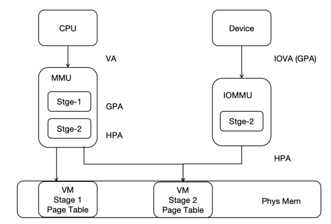
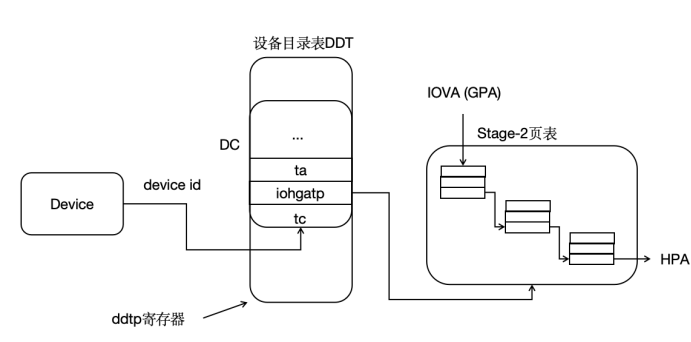

### RISC-V IOMMU 标准的实现

#### RISC-V IOMMU 工作流程

对于具有 DMA 设备的虚拟化系统来说，该系统有可能因为虚拟机配置 DMA 设备进行恶意的 DMA 从而破坏整个系统的稳定性，而 IOMMU 的引入可以进一步提高 Zone 间的隔离性，以保证系统的安全性。

IOMMU 支持两阶段地址翻译，提供了 DMA 重映射的功能，一方面可以对 DMA 操作进行内存保护，限制设备能够访问的物理内存区域，使得 DMA 操作更加安全，另一方面，设备的 DMA 操作只需要连续的 IOVA 即可，而无需连续的 PA，这样可以充分利用物理内存中分散的页。

为了执行地址转换和内存保护，RISC-V IOMMU 在第一阶段和第二阶段使用与 CPU 的 MMU 相同的页表格式。使用与 CPU MMU 相同的页表格式，可以消除 DMA 在内存管理方面的一些复杂性，并且使用相同的格式还允许 CPU MMU 和 IOMMU 使用相同的页表。

在 hvisor 中支持了 IOMMU 的第二阶段地址翻译过程，即设备端 IOVA（GPA）到 HPA 的翻译，并且在 CPU MMU 和 IOMMU 之间共享了第二阶段页表，功能示意如下所示：




IOMMU 在翻译前需要先根据设备标识符（device_id）在设备目录表中找到设备上下文（DC）。每个设备有唯一的 device_id，对于平台设备，device_id 在硬件实现时指定，对于 PCI/PCIe 设备，则将 PCI/PCIe 设备的 BDF 编号作为 device_id。DC 中包含了两阶段地址翻译的页表基地址等信息，以及一些翻译的控制信息。以两阶段地址翻译为例，I/O 设备的 IOVA 首先在 fsc 字段指向的 Stage-1 页表中翻译成 GPA，然后再在 iohgatp 字段指向的Stage-2 页表中翻译成 HPA，并以此访问内存。在 hvisor 中支持第二阶段翻译，即仅使用 iohgatp 字段进行地址翻译，如下图所示：




RISC-V IOMMU 作为一个物理硬件，可以使用 MMIO 方式进行访问，并且在 IOMMU 规范手册中指定了其各个字段的字节偏移，实现时需要能够按照规范指定的偏移和大小进行访问，才能正确获取各个字段的值。定义 IommuHw 结构体，其和物理 RISC-V IOMMU 对应，用以简化访问物理 IOMMU，定义如下：

```rust
#[repr(C)]
#[repr(align(0x1000))]
pub struct IommuHw {
    caps: u64,
    fctl: u32,
    __custom1: [u8; 4],
    ddtp: u64,
    cqb: u64,
    cqh: u32,
    cqt: u32,
    fqb: u64,
    fqh: u32,
    fqt: u32,
    pqb: u64,
    pqh: u32,
    pqt: u32,
    cqcsr: u32,
    fqcsr: u32,
    pqcsr: u32,
    ipsr: u32,
    iocntovf: u32,
    iocntinh: u32,
    iohpmcycles: u64,
    iohpmctr: [u64; 31],
    iohpmevt: [u64; 31],
    tr_req_iova: u64,
    tr_req_ctl: u64,
    tr_response: u64,
    __rsv1: [u8; 64],
    __custom2: [u8; 72],
    icvec: u64,
    msi_cfg_tbl: [MsiCfgTbl; 16],
    __rsv2: [u8;3072],
}
```

IOMMU 的 Capabilities 是一个只读寄存器，其报告了 IOMMU 支持的功能，在初始化 IOMMU 时，需要首先查看该寄存器，以确定硬件能够支持 IOMMU 功能。

IOMMU 在初始化时要先检查当前 IOMMU 是否和驱动匹配，实现时定义了 rv_iommu_check_features，检查对 Sv39x4、WSI 等的硬件支持情况，实现如下：

```rust
impl IommuHw {
    pub fn rv_iommu_check_features(&self){
        let caps = self.caps as usize;
        let version = caps & RV_IOMMU_CAPS_VERSION_MASK;
        // get version, version 1.0 -> 0x10
        if version != RV_IOMMU_SUPPORTED_VERSION{
            error!("RISC-V IOMMU unsupported version: {}", version);
        }
        // support SV39x4
        if caps & RV_IOMMU_CAPS_SV39X4_BIT == 0 {
            error!("RISC-V IOMMU HW does not support Sv39x4");
        }
        if caps & RV_IOMMU_CAPS_MSI_FLAT_BIT == 0 {
            error!("RISC-V IOMMU HW does not support MSI Address Translation (basic-translate mode)");
        }
        if caps & RV_IOMMU_CAPS_IGS_MASK == 0 {
            error!("RISC-V IOMMU HW does not support WSI generation");
        }
        if caps & RV_IOMMU_CAPS_AMO_HWAD_BIT == 0 {
            error!("RISC-V IOMMU HW AMO HWAD unsupport");
        }
    }
}
```

IOMMU 的 fctl 为功能控制寄存器，它提供了 IOMMU 的一些功能控制，包括 IOMMU 对内存数据访问是大端还是小端，IOMMU 产生的中断为 WSI 中断还是 MSI 中断以及对 Guest 地址转换方案的控制。

IOMMU 的 ddtp 为设备目录表指针寄存器，该寄存器包含了设备目录表的根页面的 PPN，以及 IOMMU Mode，其可以配置为 Off、Bare、1LVL、2LVL 或 3LVL，其中 Off 表示 IOMMU 不允许设备访问内存，Bare 表示 IOMMU 允许设备所有的内存访问，不进行翻译与保护，1LVL、2LVL、3LVL 表示了 IOMMU 采用的设备目录表的级数。

实现时定义了 rv_iommu_init 函数，用于对物理 IOMMU 的功能检查和控制，例如配置中断为 WSI、配置设备目录表等，具体实现如下：

```rust
impl IommuHw {
	pub fn rv_iommu_init(&mut self, ddt_addr: usize){
        // Read and check caps
        self.rv_iommu_check_features();
        // Set fctl.WSI We will be first using WSI as IOMMU interrupt mechanism
        self.fctl = RV_IOMMU_FCTL_DEFAULT;
        // Clear all IP flags (ipsr)
        self.ipsr = RV_IOMMU_IPSR_CLEAR;
        // Configure ddtp with DDT base address and IOMMU mode
        self.ddtp = IOMMU_MODE as u64 | ((ddt_addr >> 2) & RV_IOMMU_DDTP_PPN_MASK) as u64;    
    }
}
```

设备目录表中的表项格式在规范手册中给出，为了能够让硬件工作，需要结合规范进行实现，在实现时定义了 DdtEntry 结构体，表示设备目录表中的一个表项，代表一个DMA设备。其中 iohgatp 保存了第二阶段页表的 PPN、Guest 软件上下文 ID（GSCID）以及用于选择第二阶段地址转换方案的 Mode 字段，tc 包含了很多转换控制相关的位，其中大部分控制在 hvisor 中未使用到，其中有效位需要设置为 1，以便后续进行更高级的功能扩展。设备目录表项结构如下：

```rust
#[repr(C)]
struct DdtEntry{
    tc: u64,
    iohgatp: u64,
    ta: u64,
    fsc: u64,
    msiptp: u64,
    msi_addr_mask: u64,
    msi_addr_pattern: u64,
    __rsv: u64,
}
```

当前 hvisor 仅支持单级设备目录表，实现时定义了 Lvl1DdtHw 结构体，以方便访问设备目录表表项，单级设备目录表可以支持 64 个 DMA 设备，占据一个物理页，结构如下：

```rust
pub struct Lvl1DdtHw{
    dc: [DdtEntry; 64],
}
```

实现时定义了 Iommu 结构体，作为 IOMMU 更高级的抽象，其中 base 为 IommuHw 的基地址，即 IOMMU 的物理地址，可以借助其访问物理 IOMMU，ddt 为设备目录表，需要在 IOMMU 初始化时分配物理页，实现为支持单级设备目录表，故仅需一个物理页即可，定义如下：

```rust
pub struct Iommu{
    pub base: usize,
    pub ddt: Frame,		// Lvl1 DDT -> 1 phys page
}
```

IOMMU 的设备目录表和翻译的页表是存储在内存中的，需要根据实际所需进行分配，即要在 new 时分配设备目录表的内存。除此之外，在设备目录表中添加设备表项是一项非常重要的内容，因为 DMA 设备进行 DMA 操作，第一步即是从设备目录表中查找翻译需要的页表等信息，然后 IOMMU 根据页表相关的信息进行翻译，需要填充 tc、iohgatp 等内容，实现如下：

```rust
impl Iommu {
    pub fn new(base: usize) -> Self{
        Self { 
            base: base,
            ddt: Frame::new_zero().unwrap(),
        }
    }

    pub fn iommu(&self) -> &mut IommuHw{
        unsafe { &mut *(self.base as *mut _) }
    }

    pub fn dc(&self) -> &mut Lvl1DdtHw{
        unsafe { &mut *(self.ddt.start_paddr() as *mut _)}
    }

    pub fn rv_iommu_init(&mut self){
        self.iommu().rv_iommu_init(self.ddt.start_paddr());
    }

    pub fn rv_iommu_add_device(&self, device_id: usize, vm_id: usize, root_pt: usize){
        // only support 64 devices
        if device_id > 0 && device_id < 64{
            // configure DC
            let tc: u64 = 0 | RV_IOMMU_DC_VALID_BIT as u64 | 1 << 4;
            self.dc().dc[device_id].tc = tc;
            let mut iohgatp: u64 = 0;
            iohgatp |= (root_pt as u64 >> 12) & RV_IOMMU_DC_IOHGATP_PPN_MASK as u64;
            iohgatp |= (vm_id as u64) & RV_IOMMU_DC_IOHGATP_GSCID_MASK as u64;
            iohgatp |= RV_IOMMU_IOHGATP_SV39X4 as u64;
            self.dc().dc[device_id].iohgatp = iohgatp;
            self.dc().dc[device_id].fsc = 0;
            info!("{:#x}", &mut self.dc().dc[device_id] as *mut _ as usize);
            info!("RV IOMMU: Write DDT, add decive context, iohgatp {:#x}", iohgatp);
        }
        else{
            info!("RV IOMMU: Invalid device ID: {}", device_id);
        }
    }
}
```

由于 hvisor 支持 RISC-V 的 IOMMU 与 Arm 的 SMMUv3，实现时封装了两个供外部调用的接口，分别为 iommu_init 与 iommu_add_device，这两个函数与 Arm 架构下的公共调用接口的函数名与参数均一致，实现如下：

```rust
// alloc the Fram for DDT & Init
pub fn iommu_init() {
    let iommu = Iommu::new(0x10010000);
    IOMMU.call_once(|| RwLock::new(iommu));
    rv_iommu_init();
}

// every DMA device do!
pub fn iommu_add_device(vm_id: usize, device_id: usize, root_pt: usize){
    info!("RV_IOMMU_ADD_DEVICE: root_pt {:#x}, vm_id {}", root_pt, vm_id);
    let iommu = iommu();
    iommu.write().rv_iommu_add_device(device_id, vm_id, root_pt);
}
```

