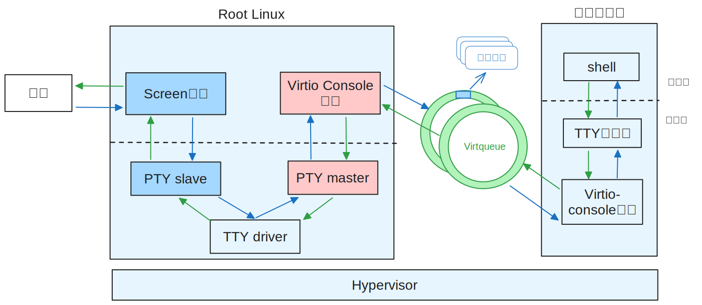

# Virtio Console

Virtio Console设备，本质上是一个虚拟控制台设备，用于数据的输入和输出，可作为虚拟终端供其他虚拟机使用。目前hvisor支持`VIRTIO_CONSOLE_F_SIZE`和`VIRTIO_F_VERSION_1`特性。

## Virtio Console设备的描述信息

对于Virtio控制台设备，VirtIODevice结构体中type字段为VirtioTConsole，vqs_len为2，表示共有两个Virtqueue，分别是receive virtqueue接收队列和transmit virtqueue发送队列，用于端口0的接收数据和发送数据。dev指针指向描述控制台设备具体信息的virtio_console_dev结构体，该结构体中config用来表示该控制台的行数和列数，master_fd为该设备连接的伪终端主设备的文件描述符，rx_ready表示接收队列是否可用，event则用于event monitor线程通过epoll监视伪终端主设备的可读事件。

```c
typedef struct virtio_console_dev {
    ConsoleConfig config;
    int master_fd;
    int rx_ready;
    struct hvisor_event *event;
} ConsoleDev;
```

## 伪终端

终端，本质上是一个输入输出设备。终端在计算机刚刚发展时，名叫电传打印机Teleprinter(TTY)。现在终端在计算机上成为了一种虚拟设备，由终端模拟程序连接显卡驱动和键盘驱动，实现数据的输入和输出。终端模拟程序有两种不同的实现形式，第一种是作为Linux的内核模块，并以`/dev/tty[n]`设备暴露给用户程序；第二种是作为一个应用程序，运行在Linux用户态，被称为伪终端（**pseudo terminal, PTY**）。

伪终端本身不是本文的重点，但伪终端使用的两种可互相传递数据设备——伪终端主设备`PTY master`和从设备`PTY slave`，被本文用来实现Virtio Console设备。

应用程序通过执行`posix_openpt`，可获取一个可用的`PTY master`，通过`ptsname`函数，可获取该`PTY master`对应的`PTY slave`。一个TTY驱动程序连接`PTY master` 和 `PTY slave`，会在 master 和 slave 之间复制数据。这样当程序向master（或slave）写入数据时，程序从slave（或master）可读到同样的数据。

## Virtio Console总体设计

Virtio Console设备作为Root Linux上的一个守护进程，会在设备初始化过程中打开一个`PTY master`，并向日志文件中输出master对应的`PTY slave`的路径`/dev/pts/x`，供screen会话连接。同时Virtio守护进程中的event monitor线程会监视`PTY slave`的可读事件，以便`PTY master`及时获取到用户的输入数据。

当用户在Root Linux上执行`screen /dev/pts/x`时，会在当前终端上创建一个screen会话，该会话会连接`PTY slave`对应的设备 `/dev/pts/x`，并接管当前终端的输入和输出。Virtio Console设备的实现结构图如下图所示。



### 输入命令

当用户在键盘上输入命令时，输入的字符会通过终端设备传递给Screen会话，Screen会话会将字符写入`PTY slave`。event monitor线程通过epoll发现`PTY slave`可读时，会调用`virtio_console_event_handler`函数。该函数会读取`PTY slave`，并将数据写入Virtio Console设备的`Receive Virtqueue`中，并向对应的虚拟机发送中断。

对应的虚拟机收到中断后，会将收到的字符数据通过TTY子系统传递给Shell，交由Shell解释执行。

### 显示信息

当使用Virtio Console驱动的虚拟机要通过Virtio Console设备输出信息时，Virtio Console驱动会将要输出的数据写入`Transmit Virtqueue`中，并写MMIO区域的`QueueNotify`寄存器通知Virtio Console设备处理IO操作。

Virtio Console设备会读取`Transmit Virtqueue`，获取要输出的数据，并写入`PTY master`。Screen会话就会从`PTY slave`获取要输出的数据，并通过终端设备在显示器上显示输出信息。

> 由于`PTY master`和`PTY slave`之间由TTY driver相连接，TTY driver包含一个line discipline，用于将`PTY master`写给`PTY slave`的数据回传给`PTY master`。由于我们不需要该功能，因此需通过函数`cfmakeraw`将line discipline功能关闭。
