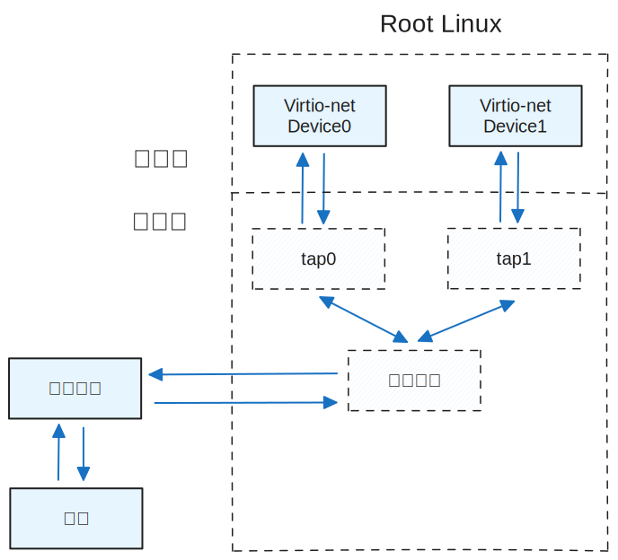

# Virtio Network设备

Virtio网络设备，本质上是一块虚拟网卡。目前支持的特性包括`VIRTIO_NET_F_MAC`、`VIRTIO_NET_F_STATUS`、`VIRTIO_F_VERSION_1`、`VIRTIO-RING_F_INDIRECT_DESC`、`VIRTIO_RING_F_EVENT_IDX`。

## Virtio Network设备的描述信息

对于Virtio网络设备，VirtIODevice中type字段为VirtioTNet，vqs_len为2，表示有2个Virtqueue，分别是Receive Queue接收队列和Transmit Queue发送队列，dev指针指向描述网络设备具体信息的virtio_net_dev结构体。Virtio_net_dev中config用来表示该网卡的MAC地址和连接状态，tapfd为该设备对应的Tap设备的文件描述符，rx_ready表示接收队列是否可用，event则用于接收报文线程通过epoll监视Tap设备的可读事件。

```c
typedef struct virtio_net_dev {
    NetConfig config;
    int tapfd;
    int rx_ready;   
    struct hvisor_event *event;
} NetDev;

struct hvisor_event {
    void		(*handler)(int, int, void *);
    void		*param;
    int			fd;
    int 		epoll_type;
};
```

## Tap设备和网桥设备

Virtio网络设备的实现基于两种Linux内核提供的虚拟设备：Tap设备和网桥设备。

Tap设备是一个由Linux内核用软件实现的以太网设备，通过在用户态读写Tap设备就可以模拟以太网帧的接收和发送。具体而言，当进程或内核执行一次对Tap设备的写操作时，就相当于将一个报文发送给Tap设备。对Tap设备执行一次读操作时，就相当于从Tap设备接收一个报文。这样，分别对Tap设备进行读和写操作，即可实现内核与进程之间报文的传递。

创建tap设备的命令为：`ip tuntap add dev tap0 mode tap`。该命令会创建一个名为tap0的tap设备。如果一个进程要使用该设备，需要首先打开/dev/net/tun设备，获得一个文件描述符tun_fd，并对其调用ioctl(TUNSETIFF)，将进程链接到tap0设备上。之后tun_fd实际上就成为了tap0设备的文件描述符，对其进行读写和epoll即可。

网桥设备是一个Linux内核提供的功能类似于交换机的虚拟设备。当其他网络设备连接到网桥设备时，其他设备会退化成网桥设备的端口，由网桥设备接管所有设备的收发包过程。当其他设备收到报文时，会直接发向网桥设备，由网桥设备根据MAC地址转发到其他端口。因此，连接在网桥上的所有设备可以互通报文。

创建网桥设备的命令为：`brctl addbr br0`。将物理网卡eth0连接到br0上的命令为：brctl addif br0 eth0。将tap0设备连接到br0上的命令为：brctl addif br0 tap0。

在Virtio网络设备启动前，Root Linux需要提前在命令行中创建和启动tap设备和网桥设备，并将tap设备和Root Linux上的物理网卡分别与网桥设备进行连接。每个Virtio网络设备都需要连接一个tap设备，最终形成一张如下图的网络拓扑图。这样，Virtio网络设备通过读写tap设备，就可以与外网进行报文的传输了。



## 发送报文

Virtio网络设备的Transmit Virtqueue用于存放发送缓冲区。当设备收到驱动写QueueNotify寄存器的请求时，如果此时QueueSel寄存器指向Transmit Queue，表示驱动告知设备有新的报文要发送。Virtio-net设备会从可用环中取出描述符链，一个描述符链对应一个报文，其指向的内存缓冲区均为要发送的报文数据。报文数据包含2部分，第一部分为Virtio协议规定的报文头virtio_net_hdr_v1结构体，该结构体包含该报文的一些描述信息，第二部分为以太网帧。发送报文时只需将以太网帧的部分通过writev函数写入Tap设备，Tap设备收到该帧后会转发给网桥设备，网桥设备根据MAC地址会通过物理网卡转发到外网。

## 接收报文

Virtio网络设备在初始化时，会将Tap设备的文件描述符加到event monitor线程epoll实例的interest list中。event monito线程会循环调用epoll_wait函数，监视tap设备的可读事件，一旦发生可读事件，说明tap设备收到了内核发来的报文，epoll_wait函数返回，执行接收报文处理函数。处理函数会从Receive Virtqueue的可用环中取出一个描述符链，并读取tap设备，将数据写入描述符链指向的内存缓冲区中，并更新已用环。处理函数将重复该步骤，直到读取tap设备返回值为负并且errno为EWOULDBLOCK，表明tap设备已经没有新的报文，之后中断通知其他虚拟机收报文。