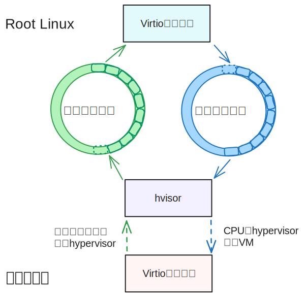
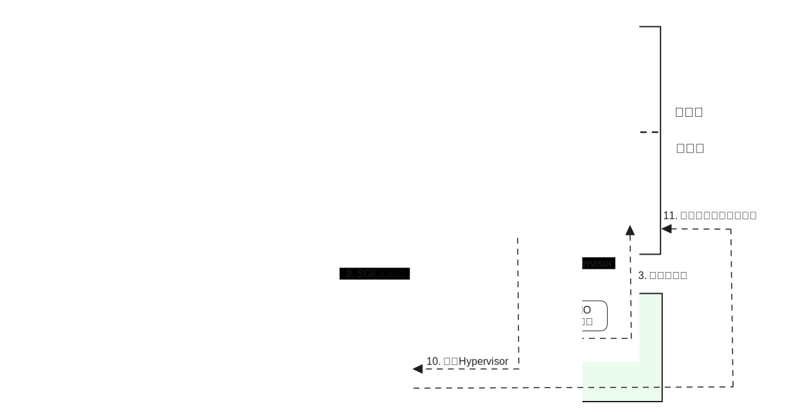
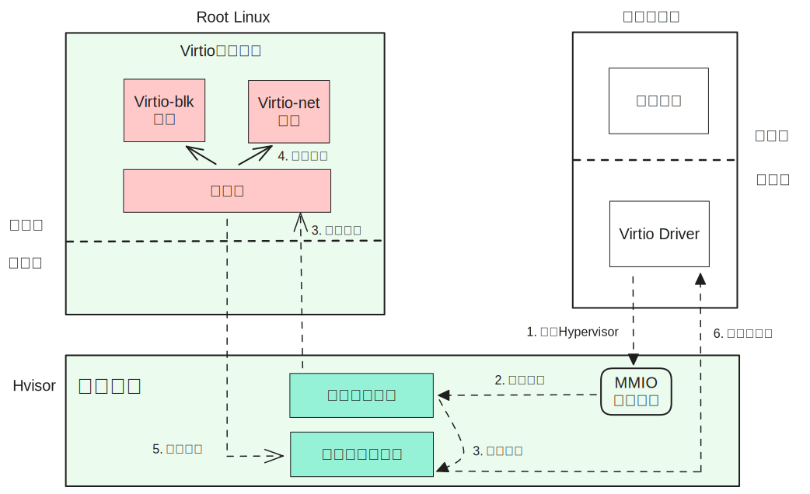
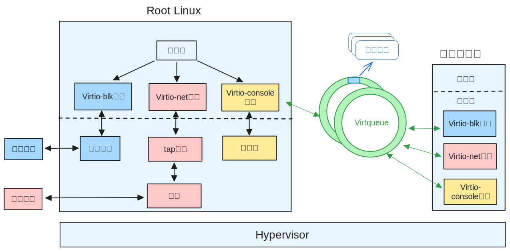

# Virtio

## Virtio简介

Virtio由Rusty Russell于2008年提出，是一个旨在提高设备性能, 统一各种半虚拟设备方案的设备虚拟化标准。目前，Virtio已囊括了十几种外设如磁盘、网卡、控制台、GPU等，同时许多操作系统包括Linux均已实现多种Virtio设备的前端驱动程序。因此虚拟机监控器只需实现Virtio后端设备，便可直接允许Linux等已实现Virtio驱动的虚拟机使用Virtio设备。 

Virtio协议定义了一组半虚拟IO设备的驱动接口，规定虚拟机的操作系统需要实现前端驱动，Hypervisor需要实现后端设备，虚拟机和Hypervisor之间通过数据面接口、控制面接口进行通信和交互。


### 数据面接口

数据面接口（Data plane）是指驱动和设备之间进行IO数据传输的方式。对于Virtio，数据面接口是指驱动和设备之间的一片共享内存Virtqueue。Virtqueue是Virtio协议中一个重要的数据结构，是Virtio设备进行批量数据传输的机制和抽象表示，用于驱动和设备之间执行各种数据传输操作。Virtqueue包含三大组成部分：描述符表、可用环和已用环，其作用分别是：

1. 描述符表（Descriptor Table）：是以描述符为元素的数组。每个描述符包含4个字段：addr、len、flag、next。描述符可以用来表示一段内存缓冲区的地址（addr）、大小（len）和属性（flag），内存缓冲区中可以包含IO请求的命令或数据（由Virtio驱动填写），也可以包含IO请求完成后的返回结果（由Virtio设备填写）。描述符可以根据需要由next字段链接成一个描述符链，一个描述符链表示一个完整的IO请求或结果。

2. 可用环（Available Ring）：是一个环形队列，队列中的每个元素表示Virtio驱动发出的IO请求在描述符表中的索引，即每个元素指向一条描述符链的起始描述符。
3. 已用环（Used Ring）：是一个环形队列，队列中的每个元素表示Virtio设备完成IO请求后，写入的IO结果在描述符表中的索引。


因此利用这三个数据结构就可以完整地描述驱动和设备之间进行IO数据传输请求的命令、数据和结果。Virtio驱动程序负责分配Virtqueue所在的内存区域，并将其地址分别写入对应的MMIO控制寄存器中告知Virtio设备，这样设备获取到三者的内存地址后，便可与驱动通过Virtqueue进行IO传输。

### 控制面接口

控制面接口(Control Plane)是指驱动发现、配置和管理设备的方式，在hvisor中，Virtio的控制面接口主要是指基于内存映射的MMIO寄存器。操作系统首先通过设备树探测基于MMIO的Virtio设备，并通过读写这些内存映射的控制寄存器，便可以与设备进行协商、配置和通知。其中较为重要的几个寄存器为：

* QueueSel：用于选择当前操作的Virtqueue。一个设备可能包含多个Virtqueue，驱动通过写该寄存器指示它在操作哪个队列。

* QueueDescLow、QueueDescHigh：用于指示描述符表的中间物理地址IPA。驱动写这两个32位寄存器告知设备描述符表的64位物理地址，用于建立共享内存。

* QueueDriverLow、QueueDriverHigh：用于指示可用环的中间物理地址IPA。

* QueueDeviceLow、QueueDeviceHigh：用于指示已用环的中间物理地址IPA。

* QueueNotify：驱动写该寄存器时，表示Virtqueue中有新的IO请求需要处理。

除了控制寄存器外，每个设备所在的MMIO内存区域还包含一个设备配置空间。对于磁盘设备，配置空间会指示磁盘的容量和块大小；对于网络设备，配置空间会指示设备的MAC地址和连接状态。对于控制台设备，配置空间提供控制台大小信息。

对于Virtio设备所在的MMIO内存区域，Hypervisor不会为虚拟机进行第二阶段地址翻译的映射。当驱动读写这片区域时，会因缺页异常发生VM Exit，陷入Hypervisor，Hypervisor根据导致缺页异常的访问地址即可确定驱动访问的寄存器，并做出相应处理，例如通知设备进行IO操作。处理完成后，Hypervisor通过VM Entry返回虚拟机。

### Virtio设备的IO流程

一个运行在虚拟机上的用户进程，从发出IO操作，到获得IO结果，大致可以分为以下4步：

1. 用户进程发起IO操作，操作系统内核中的Virtio驱动程序收到IO操作命令后，将其写入Virtqueue，并写QueueNotify寄存器通知Virtio设备。
2. 设备收到通知后，通过解析可用环和描述符表，得到具体的IO请求及缓冲区地址，并进行真实的IO操作。
3. 设备完成IO操作后，将结果写入已用环。如果驱动程序采用轮询已用环的方式等待IO结果，那么驱动可以立即收到结果信息；否则，则需要通过中断通知驱动程序。
4. 驱动程序从已用环中得到IO结果，并返回到用户进程。

## Virtio后端机制的设计与实现

hvisor中的Virtio设备遵循[Virtio v1.2](https://docs.oasis-open.org/virtio/virtio/v1.2/virtio-v1.2.pdf)协议进行设计和实现。为了在保证hvisor轻量的情况下维持设备较好的性能，Virtio后端的两个设计要点为：

1. 采用微内核的设计思想，将Virtio设备的实现从Hypervisor层移到管理虚拟机用户态。管理虚拟机运行Linux操作系统，称为Root Linux。物理磁盘和网卡等设备会直通给Root Linux，而Virtio设备会作为Root Linux上的守护进程，为其他虚拟机（Non Root Linux）提供设备模拟。这样可以保证Hypervisor层的轻量性，便于形式化验证。

2. 位于其他虚拟机上的Virtio驱动程序和位于Root Linux上的Virtio设备之间，直接通过共享内存进行交互，共享内存区域存放交互信息，称为通信跳板，并采用生产者消费者模式，由Virtio设备后端和Hypervisor进行共享。这样可以减小驱动和设备之间交互的开销，提升设备的性能。

根据以上两个设计要点，Virtio后端设备的实现将分为通信跳板、Virtio守护进程、内核服务模块三个部分：


### 通信跳板

为了实现分布在不同虚拟机上的驱动和设备之间的高效交互，本文设计了一个通信跳板作为驱动和设备传递控制面交互信息的桥梁，它本质上是一片共享内存区域，包含2个环形队列：请求提交队列和请求结果队列, 分别存放由驱动发出的交互请求和设备返回的结果。两个队列位于Hypervisor与Virtio守护进程共享的内存区域中，并采用生产者消费者模型，Hypervisor作为请求提交队列的生产者和请求结果队列的消费者, Virtio守护进程作为请求提交队列的消费者和请求结果队列的生产者。这样就便于Root Linux和其他虚拟机之间传递Virtio控制面交互的信息。需要注意的是，请求提交队列和请求结果队列与Virtqueue并不相同。Virtqueue是驱动和设备之间的数据面接口，用于数据传输，本质上包含了数据缓冲区的地址、结构等信息。而通信跳板则是用于驱动和设备之间的控制面进行交互和通信。

<div align=center></div>


* 通信跳板结构体

通信跳板由结构体virtio_bridge表示，其中req_list为请求提交队列，res_list和cfg_values共同组成请求结果队列。device_req结构体表示驱动发往设备的交互请求，device_res结构体表示设备要注入的中断信息，用于通知虚拟机驱动程序IO操作已完成。

```c
// 通信跳板结构体:
struct virtio_bridge {
	__u32 req_front;
	__u32 req_rear;
    __u32 res_front;
    __u32 res_rear;
    // 请求提交队列
	struct device_req req_list[MAX_REQ]; 
    // res_list、cfg_flags、cfg_values共同组成请求结果队列
    struct device_res res_list[MAX_REQ];
	__u64 cfg_flags[MAX_CPUS]; 
	__u64 cfg_values[MAX_CPUS];
	__u64 mmio_addrs[MAX_DEVS];
	__u8 mmio_avail;
	__u8 need_wakeup;
};
// 驱动发往设备的交互请求
struct device_req {
	__u64 src_cpu;
	__u64 address; // zone's ipa
	__u64 size;
	__u64 value;
	__u32 src_zone;
	__u8 is_write;
	__u8 need_interrupt;
	__u16 padding;
};
// 设备要注入的中断信息
struct device_res {
    __u32 target_zone;
    __u32 irq_id;
};
```

#### 请求提交队列

请求提交队列，用于驱动向设备传递控制面的交互请求。当驱动读写Virtio设备的MMIO内存区域时，由于预先Hypervisor不为这段内存区域进行第二阶段地址映射，因此执行驱动程序的CPU会收到缺页异常，陷入Hypervisor。Hypervisor会将当前CPU编号、缺页异常的地址、地址宽度、要写入的值（如果是读则忽略）、虚拟机ID、是否为写操作等信息组合成名为device_req的结构体，并将其加入到请求提交队列req_list，这时监视请求提交队列的Virtio守护进程就会取出该请求进行处理。

为了方便Virtio守护进程和Hypervisor之间基于共享内存的通信，请求提交队列req_list采用环形队列的方式实现，队头索引req_front仅由Virtio进程取出请求后更新，队尾索引req_rear仅由Hypervisor放入请求后更新。如果队头和队尾索引相等，则表示队列为空；如果队尾索引加1并取模后与队头索引相等，则表示队列已满，再加入请求时驱动需要原地阻塞，等待队列可用。为了保证Hypervisor和Virtio进程对共享内存的实时观察以及互斥访问，Hypervisor每次向队列增加请求后，需要执行写内存屏障，再更新队尾索引，保证Virtio进程观察到队尾索引更新时，可以正确获取队列中的请求；Virtio守护进程从队列中取出请求后，需要执行写内存屏障，保证Hypervisor可立刻观察到队头索引的更新。通过这种生产者消费者模型及环形队列的方式，加上必要的内存屏障，就解决了在不同特权级下共享内存的互斥问题。由于多虚拟机情况下可能有多个CPU同时向请求提交队列加入请求，因此CPU需要首先获取互斥锁，才能操作请求提交队列；而Virtio守护进程只有主线程操作请求提交队列，因此无需加锁。这样就解决了同一特权级下共享内存的互斥问题。

#### 请求结果队列

当Virtio守护进程完成请求的处理后，会将与结果相关的信息放入请求结果队列，并通知驱动程序。为了提升通信效率，根据Virtio交互信息的分类，请求结果队列分为了两个子队列：

* 数据面结果子队列

数据面结果队列，由res_list结构体表示，用于存放注入中断的信息。当驱动程序写设备内存区域的Queue Notify寄存器时，表示可用环有新的数据，需要设备进行IO操作。由于IO操作耗时过长，Linux为了避免不必要的阻塞，提高CPU利用率，要求Hypervisor将IO请求提交给设备后，CPU需要立刻从Hypervisor返回到虚拟机，执行其他任务。这要求设备在完成IO操作后通过中断通知虚拟机。因此Virtio进程完成IO操作并更新已用环后，会将设备的中断号irq_id和设备所属的虚拟机ID组合成device_res结构体，加入到数据面结果子队列res_list中，并通过ioctl和hvc陷入到Hypervisor。数据面结果队列res_list类似于请求提交队列，是一个环形队列，通过队头索引res_front和队尾索引res_rear可确定队列长度。Hypervisor会从res_list中取出所有元素，并将其加入到中断注入表VIRTIO_IRQS。中断注入表是一个基于B树的键值对集合，键为CPU编号，值为一个数组，数组的第0个元素表示该数组的有效长度，后续的各个元素表示要注入到本CPU的中断。为了防止多个CPU同时操作中断注入表，CPU需要首先获取全局互斥锁才能访问中断注入表。通过中断注入表，CPU可以根据自身CPU编号得知需要为自己注入哪些中断。之后Hypervisor会向这些需要注入中断的CPU发送IPI核间中断，收到核间中断的CPU就会遍历中断注入表，向自身注入中断。下图描述了整个过程，图中黑色实心三角箭头表示运行其他虚拟机CPU执行的操作，黑色普通箭头表示运行Root Linux的CPU执行的操作。



* 控制面结果子队列

控制面结果队列，由cfg_values和cfg_flags两个数组共同表示，数组索引为CPU编号，即每个CPU都唯一对应两个数组的同一个位置。cfg_values用于存放控制面接口交互的结果，cfg_flags用于指示设备是否完成控制面交互请求。当驱动程序读写设备内存区域的寄存器时（除Queue Notify寄存器），发出配置和协商相关的控制面交互请求，当该交互请求加入到请求提交队列后，由驱动陷入到Hypervisor的CPU需要等待结果返回后才能回到虚拟机。由于Virtio守护进程无需对这种请求进行IO操作，只需查询相关信息，因此可以迅速完成请求的处理，且无需更新已用环。完成请求后，守护进程会根据驱动的CPU编号id将结果值写入cfg_values[id]（对于读请求），并执行写内存屏障，随后递增cfg_flags[id]，再执行第二次写内存屏障，保证驱动侧CPU观察到cfg_flags[id]变化时，cfg_values[id]已保存正确的结果值。驱动侧的CPU观察到cfg_flags[id]改变时，便可确定设备已返回结果，直接从cfg_values[id]取出值并返回到虚拟机即可。这样Virtio设备就可以避免执行ioctl和hvc，造成不必要的CPU上下文切换，从而提升设备的性能。下图描述了整个过程，图中黑色实心三角箭头表示运行其他虚拟机的CPU执行的操作，黑色普通箭头表示运行Root Linux的CPU执行的操作。



### 内核服务模块

由于位于Root Linux用户态的Virtio守护进程需要与hvisor进行通信，因此本文将Root Linux中的内核模块hvisor.ko作为通信的桥梁。该模块除了被命令行工具使用外，还承担了如下工作：

1. 在Virtio设备初始化时，为Virtio守护进程和Hypervisor之间建立通信跳板所在的共享内存区域。

在Virtio守护进程初始化时，会通过ioctl请求内核模块分配通信跳板所在的共享内存，此时内核模块会通过内存分配函数`__get_free_pages`分配一页连续的物理内存作为共享内存，并通过`SetPageReserved`函数设置页面属性为保留状态，避免因Linux的页面回收机制导致该页面被交换到磁盘。之后，内核模块需要让Virtio守护进程和Hypervisor均能获取到这片内存。对于Hypervisor，内核模块会执行hvc通知Hypervisor，并将共享内存的物理地址作为参数传递。对于Virtio守护进程，进程会对/dev/hvisor调用mmap，内核模块会在hvisor_map函数中将共享内存映射到Virtio进程的一片空闲的虚拟内存区域，该区域的起始地址会作为mmap的返回值返回。

2. 当Virtio后端设备需要为其他虚拟机注入设备中断时，会通过ioctl通知内核模块，内核模块会通过hvc命令向下调用Hypervisor提供的系统接口，通知Hypervisor进行相应的操作。

3. 唤醒Virtio守护进程。

当驱动访问设备的MMIO区域时，会陷入EL2，进入mmio_virtio_handler函数。该函数会根据通信跳板中的need_wakeup标志位判断是否需要唤醒Virtio守护进程。如果标志位为1, 则向Root Linux的第0号CPU发送event id为IPI_EVENT_WAKEUP _VIRTIO_DEVICE的SGI中断，0号CPU收到SGI中断后，会陷入EL2，并向自身注入Root Linux设备树中hvisor_device节点的中断号。当0号CPU返回虚拟机时，会收到注入到自身的中断，进入内核服务模块提前注册的中断处理函数。该函数会通过send_sig_info函数向Virtio守护进程发送SIGHVI信号。Virtio守护进程事先阻塞在sig_wait函数，收到SIGHVI信号后，便会轮询请求提交队列，并设置need_wakeup标志位为0。

### Virtio守护进程

为了保证Hypervisor的轻量，本文没有采用传统的Virtio设备实现方式，将其实现在Hypervisor层，而是将其移动到了Root Linux的用户态，作为守护进程提供设备模拟服务。守护进程包含两个部分，分发器和各种Virtio设备。其中分发器负责轮询请求提交队列，当队列不为空时取出交互请求并根据类型分发给对应的后端设备进行处理。Virtio设备的实现均遵循Virtio规范，控制面采用MMIO方式呈现, 数据面通过VirtQueue与其他客户机驱动进行数据传输。当守护进程完成一个交互请求的处理后，会将结果信息加入请求结果队列，并通过ioctl通知内核服务模块。



hvisor在启动后，会将物理设备如磁盘、网卡、串口以直通的形式提供给Root Linux。Virtio守护进程最终会操作这些真实设备进行IO操作。具体而言，守护进程中的每个Virtio磁盘设备会绑定一个物理磁盘上的磁盘镜像文件，该镜像作为Virtio磁盘的存储介质，所有对Virtio磁盘的IO操作最终都会对应到这个磁盘镜像。每个Virtio网络设备都会绑定一个Tap设备，由网桥设备连接所有Tap设备与真实网卡，从而与外网进行通信。每个Virtio控制台设备则会绑定一个伪终端，由Root Linux的控制台与用户交互。

* 休眠与唤醒机制

为了避免分发器持续轮询造成的CPU占用率过高的问题，本文还对守护进程实现了休眠机制。当分发器轮询请求提交队列时，发现队列一段时间内一直为空，表明后续可能很长一段时间都没有新的请求了，此时进入休眠模式。当Virtio驱动向请求提交队列提交新的请求时，如果发现分发器处于休眠状态，则通过中断和信号唤醒分发器线程，使其进入轮询状态。

* event monitor线程

为了便于实现Virtio net和console设备，需要一个独立的线程监视`tap`设备和`PTY slave`设备的可读事件，因此Virtio守护进程启动时，会启动一个名为event monitor的线程，通过epoll监控这些设备，当发现设备可读时，会调用提前注册的处理函数，进行处理。
